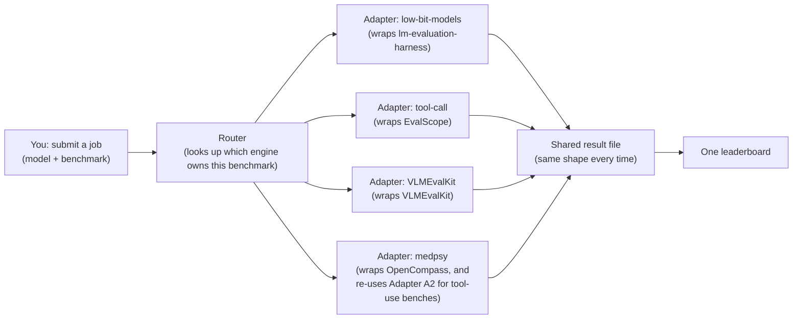

# Unifying Benchmarks Across Our Teams — Research Notes

**Date:** Aug 2026 (revised)
**Scope:** `qvac-research-medpsy` (analyzed on its `eval` branch — see note below), `qvac-research-one-bit-models`, `qvac-research-tool-call`, `qvac-visionpsy-nano`, `tether_VLMEvalKit`
**Goal of this doc:** Understand how each team currently runs benchmarks, figure out what's already shared, what's different, and lay out a plan (with risks) for one place to submit any benchmark job, have it run with the right tool automatically, and get results back in one consistent format on one leaderboard.

This is a research/notes document, not a build plan yet. Nothing here changes any code in any repo.

> **Revision note:** The first version of this doc treated `qvac-research-medpsy` as an empty repo, because its `main` branch really is just a placeholder README. It turns out the real work lives on separate, not-yet-merged branches (`eval`, `sft`, `rl`, `synth_data_gen`) — a different setup from the other four repos, where `main` is where the action is. This version re-analyzes `medpsy` using its `eval` branch, which turns out to be a fourth, fully-built evaluation system — arguably the most feature-rich of the four. Every section below has been updated accordingly. This is also a useful lesson on its own: see [Section 7, risk #12](#7-risks-and-how-to-lower-them).

---

## Table of contents

1. [The basics — plain-English glossary](#1-the-basics--plain-english-glossary)
2. [The five repos, in plain English](#2-the-five-repos-in-plain-english)
3. [How each eval system actually works today](#3-how-each-eval-system-actually-works-today)
4. [What's already common](#4-whats-already-common)
5. [What's different](#5-whats-different)
6. [What needs to be done — the proposed approach](#6-what-needs-to-be-done--the-proposed-approach)
7. [Risks, and how to lower them](#7-risks-and-how-to-lower-them)
8. [Other things worth thinking about](#8-other-things-worth-thinking-about)
9. [Suggested next steps](#9-suggested-next-steps)
10. [Appendix: quick reference tables](#10-appendix-quick-reference-tables)

---

## 1. The basics — plain-English glossary

Before we get into the details, here are the core ideas in plain words. Skip this if you already know it.

- **Benchmark** — a fixed test with questions and known correct answers (e.g. "MMLU" is a set of multiple-choice knowledge questions, "GSM8K" is grade-school math word problems). You run a model against it and get a score. Think of it like a standardized exam for a model.

- **Eval harness / eval engine** — the *software* that actually knows how to run a benchmark: it loads the questions, asks the model, checks the answers, and produces a score. It's the "exam proctor + grader," not the exam itself. In our repos there are **four** different ones in use today: **lm-evaluation-harness**, **EvalScope**, **VLMEvalKit**, and **OpenCompass**.

- **Leaderboard** — a table that lists models down the side and benchmark scores across the top, so you can compare models at a glance. The whole point of this project is to get one leaderboard that works no matter which eval engine produced the number.

- **Checkpoint** — a saved copy of a trained model's weights (the numbers that make the model work). Could be a folder on disk, or an ID on the Hugging Face Hub (e.g. `Qwen/Qwen3-0.6B`) which is basically "GitHub for models."

- **SLURM** — the job scheduler used on the shared GPU cluster. When you don't have a GPU free right now, you write a small job description and hand it to SLURM (`sbatch job.sh`), and it runs your job when a GPU becomes free. Every eval system in this workspace submits its work to SLURM.

- **Serving a model / vLLM** — instead of writing code that calls the model directly, you can start the model as a little web server (this is called "serving") and then talk to it over HTTP, the same way you'd talk to OpenAI's API. **vLLM** is the tool everyone here uses to serve models fast on GPUs. Once a model is "served," any tool that speaks the standard OpenAI-style API can send it questions.

- **LLM-as-judge** — some benchmark questions don't have a single exact right answer (e.g. "describe this image well," or "was this a safe, helpful answer to a health question?"), so instead of exact-match checking, you use a *second*, usually bigger, language model to read the answer and grade it. That grading model is the "judge."

- **Arena / pairwise ranking** — a different style of evaluation you'll see in one of our four systems: instead of grading one model's answer in isolation, you show a judge two different models' answers to the *same* question and ask "which is better?" Do this enough times across enough model pairs, and a ranking method (here, one called **Bradley-Terry** — the same math used to rank chess players from head-to-head game results) turns all those "A vs B" votes into one overall rating per model. It answers "which model is better, relatively" rather than "how many points did this model score."

- **Config file / manifest** — a file (usually YAML or JSON) that describes *what* to run, without needing to write code: which model, which benchmark, how many GPUs, etc. The goal of "one input interface" is that this file should look the same no matter which team's benchmark you're running.

- **Adapter / wrapper** — a small piece of code whose only job is translating between two things that don't naturally speak the same language — a bit like a power plug adapter when you travel to a different country. We'll use this idea a lot in the proposal: instead of rewriting each team's eval system, we put a thin adapter in front of each one. (Spoiler, covered in Section 3.4: one of our teams already built exactly this, on their own, to reuse another team's harness — a great sign the idea fits how people already think about the problem.)

- **Schema** — a fancy word for "the agreed shape of a piece of data." A "results schema" just means: everyone agrees a result file will always have a field called `score`, a field called `model_id`, etc., in the same place, so any other program can read it without guessing.

---

## 2. The five repos, in plain English

| Repo | What it actually is | Does it run benchmarks itself? |
|---|---|---|
| `qvac-research-one-bit-models` | A benchmark harness for "low-bit" models (extreme quantization / ternary / BitNet — models shrunk down to use very few bits per number). | **Yes** — this is an eval engine repo. |
| `qvac-research-tool-call` | Training + evaluation for small models that are good at "tool calling" (an AI deciding to call a function/API, e.g. "check the weather"). | **Yes** — this is an eval engine repo (plus training code, which we mostly ignore here). |
| `tether_VLMEvalKit` | Tether's fork of the open-source **VLMEvalKit** project, used to evaluate vision-language models (models that take an image + text and answer questions about it). | **Yes** — this is an eval engine repo. |
| `qvac-visionpsy-nano` | The actual model + code to *run* ("infer with") a small vision-language model called VisionPsy Nano, in three different runtimes (Transformers, vLLM, llama.cpp). | **No** — it's a model/product repo. Its own README says its benchmark numbers come from being evaluated *by* `tether_VLMEvalKit`. |
| `qvac-research-medpsy` | A medical/psychology-domain model project (training + evaluation for a model family called "MedPsy", benchmarked against things like MedQA, MedXpertQA, HealthBench, and general models like MedGemma). **Important:** the `main` branch only has a placeholder README — all the real work, including evaluation, lives on separate branches (`eval`, `sft`, `rl`, `synth_data_gen`) that haven't been merged yet. | **Yes, on the `eval` branch** — a fourth eval engine repo, once you look past `main`. |

So we actually have **4 working eval engines**, **1 model repo that is a "customer" of one of those engines** (`visionpsy-nano`, via `tether_VLMEvalKit`), and **0 truly empty repos** — the thing that looked empty just had its work on unmerged branches. That's a meaningfully different picture from the first pass at this doc, and it's worth remembering as a general lesson: "what's on the default branch" and "what a team is actually running" aren't always the same thing.

---

## 3. How each eval system actually works today

For each engine, here's the same four questions answered: **How do you start a job? How does the model actually run? How is it graded? Where do results end up?**

### 3.1 `qvac-research-one-bit-models` — "low-bit-eval"

- **Engine underneath:** [lm-evaluation-harness](https://github.com/EleutherAI/lm-evaluation-harness) (`lm_eval`), the most widely-used open-source tool for standard text-LLM benchmarks (MMLU, GSM8K, ARC, HellaSwag, IFEval, etc.).
- **How you start a job:** you write (or pick) a small JSON file listing the models to test, then run a Python script that submits one SLURM job per model:

  ```bash
  python3 scripts/submit_lbe.py configs/reference_models.json
  ```

  The JSON just needs a model `id` and a `path` (a Hugging Face Hub ID or a local folder):

  ```json
  { "models": [{ "id": "ref_qwen3_0.6B", "path": "Qwen/Qwen3-0.6B", "tokenizer_path": "Qwen/Qwen3-0.6B" }] }
  ```

- **How the model runs:** the model is loaded **in-process** by `lm_eval` itself (via vLLM or plain Hugging Face Transformers) — there's no separate running "server" to talk to over HTTP. lm_eval calls the model directly and checks the output.
- **How it's graded:** mostly exact-match style checks built into lm_eval (did the model output the right multiple-choice letter, the right number, etc.). There's one clever local addition: `grade_think_aware.py` re-grades reasoning-model answers by stripping out the `<think>...</think>` "internal thoughts" text first, so a model isn't unfairly marked wrong just because the right answer is buried inside its thinking.
- **Where results land:** everything stays inside the repo's own `reports/` folder — a `leaderboard.jsonl` file (one line appended per run) plus a `leaderboard_table.json` (a friendlier pivoted table: rows = models, columns = benchmark scores). No database, no external service.

### 3.2 `qvac-research-tool-call` — the `qvac-eval` harness

- **Engine underneath:** [EvalScope](https://github.com/modelscope/evalscope) (pinned to one exact version), a newer framework built for more complex/"agentic" benchmarks — things like an AI actually calling tools, or holding a multi-turn conversation as a simulated customer.
- **How you start a job:** a custom command-line tool, `qvac-eval`, built specifically by this team:

  ```bash
  ./qvac-eval submit -m Qwen3.5-2B-Think -b bfcl_v3 -c my_run
  ```

  `-m` picks the model (by a short "tag" name from a catalog file), `-b` picks the benchmark, `-c` is just a label for this batch of runs so you can find it later. Every **(model, benchmark)** pair becomes its own SLURM job — so testing 5 models on 7 benchmarks submits 35 separate jobs.
- **How the model runs:** the harness starts the model as a real running server using vLLM ("`vllm serve ...`"), then EvalScope talks to it over the same kind of HTTP API that OpenAI's API uses. This is important because tool-calling benchmarks need the model to be "live" and interactive, not just called once.
- **How it's graded:** depends on the benchmark — some are rule-based (did it call the right function with the right arguments), and the more conversational ones (like `tau-bench`, which simulates a customer-service chat) use a second model as a "user simulator" that plays the customer and judges how the conversation went.
- **Where results land:** every single run writes one very well-defined `summary.json` file (it literally has a `schema_version` number baked in already — a good sign this team already thinks about this problem). Example of a real one from this repo:

  ```json
  {
    "schema_version": 3,
    "framework": "evalscope",
    "bench": "ifeval",
    "model_tag": "Qwen3-4B-allternary-ep03",
    "status": "ok",
    "headlines": [{ "name": "prompt_level_strict", "value": 0.65 }],
    "metrics": { "prompt_level_strict": 0.65, "prompt_level_loose": 0.7 }
  }
  ```

  There's a command (`qvac-eval report`) to combine many `summary.json` files into a table (markdown/CSV), and a separate, external Flask web app (living outside this repo, on shared storage) that people use as a browsable leaderboard.

  **This system turns out to be a hub for the others, too** — see 3.4 below, where a different team's evaluation stack (`medpsy`) plugs straight into this one instead of building its own tool-calling benchmarks.

### 3.3 `tether_VLMEvalKit`

- **Engine underneath:** [VLMEvalKit](https://github.com/open-compass/VLMEvalKit) (an actively-maintained open-source project, forked here), built specifically for vision-language models — the questions include images.
- **How you start a job:** one shell command, with settings passed as environment variables:

  ```bash
  NODES=3 bash scripts/eval.sh MyModel
  ```

  With no benchmark list given, it runs the **entire leaderboard suite by default** — 22 main benchmarks plus 39 sub-parts of one particular OCR benchmark (61 "runs" total). This single command kicks off exactly one big SLURM job.
- **How the model runs:** this is the most elaborate setup of the four. The one SLURM job:
  1. Starts the model as a vLLM server on **every GPU across every node it was given** (so `NODES=3` with 8 GPUs each = 24 GPUs all serving the same model as one pool).
  2. Fires benchmark questions at whichever server is free (no benchmark "owns" a GPU — it's a shared pool, load-balanced).
  3. Once inference is mostly done, it shuts the model servers down and **reuses the same GPUs** to start a judge model instead (a locally-hosted `Qwen3.6-27B`, pretending to be `gpt-4o-mini` so existing code doesn't need to change) — like re-purposing the same room for a different meeting right after the first one ends.
  4. Scores everything, some benchmarks by rules, some by asking the judge.
  5. It watches itself for hung servers and automatically restarts them, and retries failed questions.
  6. At the end it double-checks every benchmark actually produced a score, and prints `V2_DONE unscored=0` if everything worked.
- **How it's graded:** mixed — simple multiple-choice benchmarks are graded by rules (did it pick the right letter), open-ended ones go through the LLM judge described above.
- **Where results land:** a folder per model, with a timestamped sub-folder per run attempt, containing spreadsheets (`.xlsx`) of the raw predictions and various `*_acc.csv` / `*_score.json` files. At the very end, a script (`collect_board.py`) reads all of those and writes one clean `scores.csv` per model with three columns: `benchmark, score, metric`.
- **Extra:** re-running the exact same command is the *official* way to recover from a failure — it automatically skips anything already scored and only redoes what's missing or broken. That's a genuinely good, low-tech idea worth keeping.

### 3.4 `qvac-research-medpsy` — the `eval` branch (its own dual-engine system)

This one is different from the others in an interesting way: it doesn't pick *one* engine, it runs *two*, side by side, for two different kinds of benchmarks — and it's the only one of the four that already reuses another team's harness instead of rebuilding it.

- **Engine A — a vendored fork of [OpenCompass](https://github.com/open-compass/opencompass)**, used for medical-knowledge and safety benchmarks. Worth noting: OpenCompass and VLMEvalKit (3.3) come from the *same* open-source organization (`open-compass`), and it shows — both tools are driven by a very similar `python run.py --mode infer|eval|...` command shape.
- **Engine B — `qvac-research-tool-call`'s own harness, reused as-is**, for instruction-following and tool-calling benchmarks (IFEval, IFBench, BFCL). This is pulled in as a real **git submodule** pointing at a fork of the tool-call repo, kept read-only, with a small translator script bridging the two.

**How you start a job (medical benchmarks):**

```bash
bash scripts/eval_launcher.sh --model-abbr MedPsy-4B --suite healthbench --mode all
```

Models live in a YAML catalog with shared "profiles" (very similar in spirit to `tool-call`'s family/sampling profiles):

```yaml
models:
  medpsy-4b:
    abbr: MedPsy-4B
    path: qvac/MedPsy-4B
    profile: qwen3_4B
```

Suites (benchmark groups) are declared once and reused:

```yaml
suites:
  - name: healthbench
    path: ${PROJECT_DIR}/opencompass/configs/custom/suites/healthbench.py
    judge: "Gemma4_31B"
```

**How you start a job (tool-calling benchmarks) — the interesting part:**

```bash
bash scripts/submit_toolcall_from_medpsy.sh --model-abbr MedPsy-4B --submit
```

This doesn't reimplement IFEval or BFCL at all. It runs a small script (`medpsy_to_toolcall.py`) that reads a MedPsy model entry and rewrites it as a row in `tool-call`'s own model format, then calls `tool-call`'s **unmodified** submission script to actually do the work. Straight from that script's own description:

> "This script keeps those responsibilities separate. It resolves the MedPsy model, maps its profile to the readonly tool-call overlay names, adds the bridge-owned IF-only lm_eval overlay... guards BFCL submissions that cannot resolve to a BFCL registry key, and emits shell-safe assignments for `submit_toolcall_from_medpsy.sh`."

That is, in miniature, **exactly the "adapter" idea** this whole document is about to propose in Section 6 — one team already built a working example of it, for one pair of systems, because it was clearly the easier and smarter path versus reimplementing tool-calling benchmarks from scratch. It's a great sign, and a great reference point.

- **How the model runs:** vLLM again, OpenAI-style server — but this is the first of the four systems where **containers are the default**. The model server normally launches inside a pre-built `enroot`/`pyxis` container image (a `.sqsh` file) rather than a bare conda/venv environment.
- **How it's graded:** three different styles, depending on the benchmark:
  1. **Cascade extraction** for closed-ended medical QA (MedQA, MedMCQA, PubMedQA, MedXpertQA, MMLU/MMLU-Pro): try a simple pattern-matching rule first, and only call the judge model as a fallback if the rule can't find an answer. Cheaper and faster than always using a judge, while still catching messy answers.
  2. **Judge-graded rubrics** for HealthBench and the safety benchmarks (MedHallu, MedSafety, MEDEC) — a judge model scores the answer against a detailed rubric.
  3. **Arena / pairwise ranking** (see glossary) for open-ended consumer-health questions — this is a genuinely different *kind* of result than "model X scored 72 on benchmark Y." It's "model X was rated 1400 relative to a pool of other models," using the Bradley-Terry method mentioned above.
- **Where results land:** the medical-benchmark side writes a cumulative `summary-latest.csv` (one column per model, refreshed every time a new model finishes) plus a JSON-lines status log for monitoring progress. The tool-calling side writes results in **the exact same `summary.json` format `tool-call` itself uses** — because it's literally the same code — and a separate script then converts those into a CSV shaped like the medical side's own output, so the two halves at least look similar to each other.
- **Extra good habits worth copying elsewhere:** submitting to SLURM defaults to a **dry run** unless you explicitly pass `--submit`/`--dry-run` is dropped; and there are three written guides (as [Cursor agent skills](https://github.com/tetherto/qvac-research-medpsy)) for the three common workflows (smoke test, full eval, results summary), each explicitly stating the automation must never submit a real cluster job without the person confirming first.

---

## 4. What's already common

The good news first — these four teams didn't coordinate with each other, but they independently converged on a lot of the same good habits:

1. **Everyone uses the same cluster and the same scheduler (SLURM).** No one built their own scheduler. This is a huge head start — we're not unifying four different infrastructures, just four different sets of scripts on top of the same one.
2. **Everyone serves or loads the model with vLLM.** vLLM has become the de facto standard here for running models fast on GPUs, whether it's used as a library (one-bit-models) or as a real running server (tool-call, VLMEvalKit, medpsy).
3. **Nobody reinvented the grading logic.** All four lean on an existing, actively-maintained open-source project to actually know *how* to run and score a benchmark (lm-evaluation-harness / EvalScope / VLMEvalKit / OpenCompass), instead of writing their own scorer for GSM8K or MMBench from scratch. This is exactly the right instinct, and it's one we should keep, not throw away.
4. **Two of the four engines are close cousins.** VLMEvalKit and OpenCompass are both built by the same open-source organization and share a near-identical `run.py --mode infer/eval/...` command pattern. That's a head start if we ever want to share adapter code between those two specifically.
5. **One team already reuses another team's harness, on their own initiative.** `medpsy` doesn't have its own tool-calling benchmark code — it calls into `tool-call`'s harness through a small bridge script and a git submodule (Section 3.4). This is real, working, first-hand evidence that the "wrap, don't rewrite" approach in Section 6 isn't just a nice theory — someone already found it to be the practical choice.
6. **Every model is identified by a short, stable name plus a path.** Whether it's called `id`, `tag`, or `abbr`, the underlying idea is always "give this checkpoint a nickname, and say where the weights live (a folder, or a Hugging Face Hub ID)." Two systems (`tool-call` and `medpsy`) go a step further with reusable **profiles** — shared serving/sampling settings a model can opt into instead of repeating them.
7. **Every system supports a "smoke test" / limited run.** A quick way to run just a handful of samples per benchmark to check that the wiring works, before committing hours of GPU time to a full run (`LIMIT=1`, `--limit 20`, `--smoke-test-size 20%` — same idea, different spelling).
8. **Every system is rerun-safe.** If a job dies halfway, re-submitting the same job skips what's already done and only redoes the missing/broken part. Nobody's job randomly duplicates work or corrupts old results on a retry (mostly — see risks below).
9. **Every system produces *some* per-run result file plus *some* rolled-up table/leaderboard file.** The concept "one file per run, then a combined table" exists everywhere already — we're not introducing a new idea, just standardizing the shape of it.
10. **Nobody uses containers as the primary story, except medpsy, which defaults to them.** The other three rely on shared conda/virtualenv Python environments. Worth flagging early since it means our unification plan needs to work with *both* container-based and bare-environment execution, not assume one or the other.

---

## 5. What's different

This is where the real work is. Same job ("evaluate a model"), but four different vocabularies for every step.

| Step | one-bit-models | tool-call | VLMEvalKit | medpsy |
|---|---|---|---|---|
| **How you describe a model** | JSON: `{id, path, tokenizer_path}` | YAML catalog: `{tag, path, family, thinking, sampling}` | **Python code** — you add a line to `vlmeval/config.py` in the source code itself | YAML catalog: `{abbr, path, profile}` |
| **How you start a job** | `python3 submit_lbe.py config.json` | `./qvac-eval submit -m X -b Y -c Z` (custom CLI) | `MODEL=X bash scripts/eval.sh` (env vars + shell) | `bash eval_launcher.sh --model-abbr X --suite Y` |
| **What "one job" covers** | one model, all benchmarks | one model **×** one benchmark (many small jobs) | one model, whole 61-benchmark suite, many GPUs (one huge job) | one model **×** one benchmark suite |
| **How the model is reached** | loaded in-process, no server | vLLM HTTP server, one job talks to its own server | vLLM HTTP server, but a **shared pool** across many GPUs/nodes at once | vLLM HTTP server, usually inside a container |
| **Grading style** | exact-match (lm-eval built-ins) | rules + "user-simulator" model for chat-style tests | rules + LLM-judge (`Qwen3.6-27B`) depending on benchmark | rules-with-judge-fallback, judge rubrics, **and** pairwise arena ranking |
| **Per-run result file** | `summary_<mode>.json` (custom shape) | `summary.json` (has a version number!) | no single file — a scattered set of `.xlsx` / `*_acc.csv` / `*_score.json` | `summary-latest.csv` (medical side) + reused `summary.json` (tool-call side) |
| **Combined leaderboard** | `leaderboard.jsonl` + `leaderboard_table.json` | none in-repo; external Flask app reads `summary.json` files | `scores.csv` per model (no single cross-model file) | `summary-latest.csv` per "track," plus an arena Bradley-Terry leaderboard |
| **Field names for "the score"** | nested under `scores` with 20+ custom column names like `"MMLU-Redux (gen)"` | `metrics` / `headlines`, using the benchmark's own metric name | a `score` column plus a separate `metric` column naming what it is | `dataset,version,metric,mode,<model>` wide table |
| **SLURM partition used** | `main` | `toolCall` | `VLM` | `health` |
| **Execution environment** | 2 separate conda envs, *deliberately incompatible* (`transformers` 4.x vs 5.x) | several `uv`-managed venvs, one per benchmark family | one shared venv, hardcoded to a specific person's home folder | container images (`.sqsh`) by default, bare venv optional |
| **Config-as-code risk** | no — plain JSON | no — plain YAML | **yes** — new models need a Python source edit | **partially** — suites are Python files; models are YAML |

**A concrete example of the risk this creates:** three different engines already run benchmarks with overlapping or identical names:

- **IFEval** — run directly by `one-bit-models` (via lm-evaluation-harness) and by `tool-call` (via EvalScope). `medpsy` also gets IFEval, but through the `tool-call` bridge, so that one is at least the *same* implementation, not a third variant.
- **GPQA-Diamond** — `one-bit-models` calls it `gpqa_diamond_zeroshot` (lm-evaluation-harness); `tool-call` calls it `gpqa_diamond` (EvalScope). Likely close, but not guaranteed to be prompted and scored identically.
- **MMLU-Pro** — run by both `tool-call` (EvalScope) and `medpsy` (OpenCompass), independently implemented in each.
- **MMLU itself is the sharpest example**, because it isn't just "different engine, maybe different details" — it's **different questions entirely**. `one-bit-models` runs the full, standard 57-subject MMLU. `medpsy` runs MMLU too, but by default only **six medical subjects** of it (anatomy, clinical knowledge, etc. — a deliberate, sensible choice for a medical model, but it means "MMLU" on one leaderboard row and "MMLU" on another could be two different exams with the same name.)

If we put any of these on one leaderboard column without saying which engine (and which exact subset/settings) produced each number, we'd be quietly comparing different exams and calling them the same test. This is the clearest illustration of why "same output schema" isn't enough by itself — the recipe behind the number matters too. More on this in the risks section.

**Two more structural differences worth calling out:**
- VLMEvalKit requires editing a Python source file to register a new model; medpsy's OpenCompass side requires a Python file to add a new *suite* (though models themselves are plain YAML). Two of the four engines have some "you must write Python to extend this" surface — worth softening for self-serve use.
- Only `medpsy` produces "arena" pairwise-ranking results. Its shape (a rating relative to a pool of other specific models, not a standalone score) genuinely doesn't fit the same mental model as the other three. We come back to this in Sections 6 and 7 — it's a real design question, not just a formatting detail.

---

## 6. What needs to be done — the proposed approach

### The big idea

Don't rewrite any of the four engines. Each one already works, is actively used, and encodes real domain knowledge (how to grade a tool-calling test like BFCL, how to tile images for a VLM — a vision-language model, how to think-strip a reasoning model's answer, how to cascade-extract a medical MCQ answer). Rewriting that is expensive and risky, and this project doesn't need to.

And, as Section 3.4 showed, we don't even need to invent the core idea from scratch — `medpsy` already built a small, working version of it for one pair of systems (their own OpenCompass-based stack bridging into `tool-call`'s harness). The plan below is really "take what `medpsy` already proved works for one pair of systems, and generalize it to all pairs."

Concretely, borrow the "universal remote control" idea: one remote, many devices, a small adapter inside the remote for each device's protocol.

1. One shared way to **describe a job** (what model, what benchmark, what settings) — the same shape no matter which engine ends up running it.
2. A small **lookup table** that knows which benchmark belongs to which engine, so the system can automatically pick the right one — this directly answers "the system should choose the appropriate framework."
3. One thin **adapter per engine** (4 today, more later) that translates the shared job description into that engine's native config, kicks it off the normal way (still via SLURM, still via each team's own scripts underneath), and then translates that engine's native output back into one shared result shape.
4. One shared **result schema** that every adapter must fill in, alongside (not instead of) each engine's full native output — so nothing is lost, but everything is also comparable.
5. One shared **leaderboard** that only ever reads the shared result shape, so it doesn't care or even know which of the four engines actually produced a given row.



Nothing about this requires the four teams to stop using their own tools day-to-day. A tool-call team member can keep typing `./qvac-eval submit ...` exactly as today; the adapter is what plugs their existing output into the shared leaderboard. Unification happens *around* the existing tools first, and only becomes the primary way people submit jobs once it's trusted.

### 6.1 The shared job description ("what to run")

The one thing every current system already has, just spelled differently: a model, a benchmark, and a few settings. Draft shape:

```yaml
# job.yaml — same shape regardless of benchmark
model:
  id: my-model-v1              # short, stable nickname
  source: hf_hub                # hf_hub | local_path | served_endpoint
  location: Qwen/Qwen3-0.6B     # HF Hub id, or a folder path, or a URL
  modality: text                # text | vision  (helps the router, see below)

benchmark: ifeval                # or a named suite, e.g. "core" or "healthbench"

run:
  limit: null                    # set to e.g. 20 for a smoke test
  seed: 42
  notes: "sanity check before full run"

submitted_by: naresh
```

This is deliberately close to what `tool-call`'s `models.yaml` and `medpsy`'s model YAML (`abbr`/`path`/`profile`) already look like — we're standardizing the shape that already nearly exists, not inventing something foreign.

### 6.2 The benchmark registry (how the system "chooses the appropriate framework")

A single, version-controlled table (a YAML or small SQLite file works fine — no need for anything fancy) that says, for every benchmark name: which engine owns it, what modality it needs, roughly how long/how many GPUs it needs, and whether it needs a judge model. For example:

```yaml
ifeval:
  engine: evalscope               # medpsy already picked this as canonical via its own bridge — follow that lead
  modality: text
  needs_judge: false

bfcl_v3:
  engine: evalscope
  modality: text
  needs_judge: false

mmlu_pro:
  engine: evalscope                # picking ONE canonical engine, even though OpenCompass can also run it
  modality: text
  needs_judge: false

healthbench:
  engine: opencompass
  modality: text
  needs_judge: true

MMBench_DEV_EN_V11:
  engine: vlmevalkit
  modality: vision
  needs_judge: false

open_ended_arena:
  engine: opencompass
  modality: text
  needs_judge: true
  result_shape: pairwise_ranking     # flagged specially — see 6.4
```

This is the piece that removes all guesswork: you ask for `ifeval`, the router looks it up, sees `evalscope`, and hands your job to that adapter automatically. You never need to know or care which underlying tool actually does the work — that's the whole point.

Where a benchmark exists in more than one engine today (like IFEval, GPQA-Diamond, or MMLU-Pro — see Part 5), this registry is also where we make the call on which one is the "official" source of that number going forward, so there's never a silent duplicate. Good news: for IFEval, `medpsy` already made this call themselves, by routing through `tool-call`'s implementation instead of building their own — the registry just needs to write that decision down centrally instead of it living only inside one team's bridge script.

### 6.3 The adapters (the translation layer)

One per engine. Each adapter has exactly two jobs and nothing else:

- **In:** take the shared job description, write out whatever config file or command that engine actually expects, and call that engine's *existing, unmodified* submission script.
- **Out:** once the engine finishes, read its native output (whatever shape it already produces) and write one shared result file (next section) alongside it.

Because each adapter is thin and only translates, adding a fifth engine later means writing one new adapter, not touching the other four. And per Section 3.4, we already have a real, running reference for what one of these adapters looks like in practice (`medpsy_to_toolcall.py`) — worth reading before designing the general version from a blank page.

### 6.4 The shared result schema ("same output schema")

Every adapter, regardless of engine, must produce one file with at least these fields. Everything else an engine natively produces can still be kept too (as a `raw` field or a linked folder) — we're adding a common layer on top, not deleting the rich detail underneath.

```json
{
  "schema_version": 1,
  "run_id": "2026-08-29T12-00-00_ifeval_my-model-v1",
  "model_id": "my-model-v1",
  "benchmark": "ifeval",
  "engine": "evalscope",
  "modality": "text",
  "result_shape": "score",
  "status": "ok",
  "metrics": [
    { "name": "prompt_level_strict", "value": 0.65, "is_primary": true }
  ],
  "num_samples": 541,
  "judge_model": null,
  "started_at": "2026-08-29T12:00:00Z",
  "finished_at": "2026-08-29T12:14:00Z",
  "raw_output_path": "/shared/bench/runs/.../native_output/",
  "submitted_by": "naresh"
}
```

Worth calling out: `tool-call`'s existing `summary.json` already has a `schema_version` field and is very close to this shape. That's the best existing starting point to build the shared schema from — we'd be standardizing *toward* the most mature of the four, not inventing a fifth new format from nothing.

**One open design question this raises:** `medpsy`'s arena benchmark doesn't naturally produce "one score for one model" — it produces "one rating for one model, relative to whichever other models were in the same pool of battles." The `result_shape: "pairwise_ranking"` field above is a placeholder for handling this honestly rather than forcing it into a `metrics` list that implies an absolute, standalone score. This needs a real conversation with whoever owns the arena code before we lock the schema down — flagged here, not solved here.

### 6.5 The shared ledger (knowing what's running, from one place)

A single append-only log (literally could start as one shared file or a tiny SQLite database) that every adapter writes one line to, the moment a job is submitted and again the moment it finishes: job id, model, benchmark, engine, SLURM partition, status, timestamps. This is what actually delivers "submit jobs from one place" on the backend — one place to look up "what have I got running or finished," even though the real work still happens through each team's own SLURM partition and scripts underneath.

### 6.6 The leaderboard

A leaderboard that reads *only* the shared result schema (6.4), never the native per-engine output directly. That guarantees it automatically works for any current or future engine without being taught about each one individually. Practically, this doesn't need to be built from zero — `tool-call` already has a working Flask leaderboard app reading a similar JSON tree; extending that is very likely faster and lower-risk than building a new one.

One important framing point: "one leaderboard" should mean *one consistent tool and look-and-feel*, with filters for modality/benchmark/team — not literally one single ranking number that mixes a vision-language model's score with a medical-QA model's score. Those aren't comparable to each other no matter how well we standardize the plumbing; only same-benchmark numbers are meant to be compared directly.

### 6.7 Suggested rollout order (small steps, not a big-bang rewrite)

| Phase | What happens | Risk level |
|---|---|---|
| **0. Agree** | Circulate this doc, confirm the schema and registry shape with all teams, and specifically ask `medpsy` whether `eval` (or a successor branch) is about to merge to `main`. | very low |
| **1. Read-only unification** | Write small converters that translate each engine's *existing* output files into the shared result schema, without changing how anyone submits jobs today. Immediately gives one combined leaderboard view. | low — touches nothing teams depend on |
| **2. Shared submission** | Build the job description format + router + adapters that call each team's *existing* submit scripts underneath. Study `medpsy_to_toolcall.py` first as a working template. Now there's one place to submit from, but the real work is unchanged. | medium |
| **3. Ledger + governance** | Turn on the shared ledger, formalize the benchmark registry as a reviewed/version-controlled file, agree on a schema-versioning policy for when it needs to change, and settle the pairwise-ranking question from 6.4. | medium |
| **4. Onboard remaining edge cases** | Fully wire `visionpsy-nano`'s results through the VLMEvalKit adapter so its README numbers come from the same shared leaderboard automatically. Fold in `medpsy`'s `sft`/`rl`/`synth_data_gen` branches' needs if/when they also touch evaluation. | low, once 1–3 are stable |

---

## 7. Risks, and how to lower them

| # | Risk | Why it happens | How to reduce it |
|---|---|---|---|
| 1 | **"Same benchmark name" ≠ "same test."** Multiple engines can claim to run "IFEval," "GPQA-Diamond," "MMLU-Pro," or even plain "MMLU" with different prompts, settings, or — in MMLU's case — a genuinely different subset of questions underneath. | Independent teams picked independent engines for good reasons, and those engines don't agree on implementation details for shared benchmarks. | Pick one canonical engine per benchmark in the registry (Part 6.2), following precedent where a team already made that call (e.g. `medpsy` → `tool-call` for IFEval). Record the engine name and a "recipe" identifier on every result row, so it's always visible when two numbers might not be directly comparable. |
| 2 | **Hidden personal dependencies, in more than one place.** `tether_VLMEvalKit` hardcodes paths under a specific person's home directory for its shared Python environment. `medpsy`'s tool-call bridge points its git submodule at a personal fork (`ExalFabu/qvac-research-tool-call`) rather than the team's canonical repo. This is now a *pattern*, not a one-off. | Built for one person's workflow first, then grown into the team default; personal forks are the natural byproduct of active feature development. | Move shared paths and submodule URLs to team-owned locations before wiring in an adapter, with the current path/fork kept as a fallback during migration. Treat "does this point at a person instead of a team?" as a standard check before any repo becomes part of the shared system. |
| 3 | **Environment conflicts if we're not careful.** `one-bit-models` explicitly keeps two conda environments apart because mixing them breaks (`transformers` 4.x vs 5.x). `medpsy` defaults to containers while the other three default to bare conda/venv environments. Different engines need different, sometimes conflicting, package versions and even different execution styles. | Each engine's dependencies evolved independently. | The unifying layer must **never** try to install everything into one shared Python environment. Each adapter should call out to each engine's own isolated environment (its existing conda env / venv / container image), the same way it does today. The router/ledger itself can be a very small, dependency-light tool that just shells out. |
| 4 | **Judge-model drift.** If the LLM-as-judge model changes version (or is swapped out) at some point, old and new scores for judged benchmarks quietly stop being comparable, even from the same engine. This applies to at least three of the four systems (`tool-call`'s user-sim, `VLMEvalKit`'s judge, `medpsy`'s several named judges). | Judge models get upgraded over time for quality/cost reasons. | Record the exact judge model name/version on every judged result (already partly done — `judge_model` field in the proposed schema). Treat a judge upgrade like a new "leaderboard season": keep old scores labeled with the old judge, don't silently merge them with new ones. |
| 5 | **Resource contention on the shared cluster.** Each team already has its own SLURM partition (`main`, `toolCall`, `VLM`, `health`). A central submission point could accidentally start competing for the same GPUs, or make it look like there's one shared queue when there isn't. | The unification is at the software layer; the cluster's partition/quota policy is separate and shouldn't be assumed away. | Keep each benchmark's existing partition as metadata in the registry — the router picks the right partition automatically, it doesn't invent a new shared one. Roll out team-by-team rather than switching everyone over at once. |
| 6 | **Breaking real, active workflows.** These aren't toy scripts — `tool-call` alone has 80+ merged pull requests and real production runs happening right now; `medpsy`'s `eval` branch is clearly under active, sophisticated development too. A heavy-handed replacement risks real disruption and push-back. | Success so far has been "each team builds their own tool that works for them." | The adapter pattern in Part 6 is specifically designed so nobody has to change their day-to-day commands. Validate every adapter by re-running a handful of already-known results through it and confirming the numbers match before that engine's results ever become "official" on the shared leaderboard. |
| 7 | **Dataset/version drift.** Benchmark datasets themselves get silently updated upstream over time (new dataset revision, cache refresh). A score from January and a score from June might quietly be graded on slightly different questions. | Normal open-source project lifecycle; nobody's fault, easy to miss. | Record the dataset revision/version alongside every result where the engine exposes one. Prefer a shared, version-pinned dataset cache over an always-latest one where possible. |
| 8 | **Secrets sprawl.** Multiple engines already handle Hugging Face tokens, judge API-style keys, W&B keys, etc. A central system that submits on everyone's behalf now touches more credentials than before, in more places. | Centralizing convenience also centralizes access. | Keep secrets exactly where they already live per engine (no new shared "god credential"); the unifying layer should orchestrate, not hold keys itself. Keep (and expand) the secret-scanning habit `one-bit-models` already has (`scripts/scan_secrets.py`) as a shared practice. |
| 9 | **No clear owner for the shared parts.** Once there's a shared schema and a shared registry, someone needs to say yes/no to changes, or it silently forks again into per-team variants — recreating exactly the problem we're solving. | Shared infrastructure without a named owner tends to decay. | Name one small owning group and a lightweight change-proposal process (even just "open a PR to the registry repo, one reviewer from each team signs off") before phase 2 of the rollout. |
| 10 | **Treating "unified" as "identical shape of job."** VLMEvalKit's one-job-serves-a-whole-node-pool-for-hours model, tool-call's one-job-per-cell model, and medpsy's suite-per-job model are all genuinely different in shape. Forcing them into an identical job shape could make one of them much slower or much more wasteful of GPUs. | Real, justified engineering differences between modalities and use cases. | The shared *job description* (6.1) and *result* (6.4) should stay small and generic. The *adapter* is exactly the place allowed to be as elaborate as the underlying engine needs — unify the interface, not the internal execution shape. |
| 11 | **Not every result is "a single score."** `medpsy`'s arena benchmark produces a relative rating from pairwise battles, not a standalone number — the odd one out among everything else in this doc. | Some evaluation methods are inherently comparative (arena/Bradley-Terry), not absolute. | Don't force it into the same `metrics` shape as everything else and call it done — flag it explicitly (`result_shape: pairwise_ranking` in 6.4) and get the schema reviewed by whoever owns that code before finalizing. |
| 12 | **Assuming "the default branch is the truth."** This very document got this wrong on the first pass — `medpsy`'s real evaluation code lives on an unmerged `eval` branch, not `main`. Any tooling (or research) that only looks at a repo's default branch could miss entire systems. | Not every team merges work-in-progress to `main` on the same cadence; some use long-lived feature branches. | Before onboarding a repo into the unified system (or writing about it!), explicitly ask "which branch is actually active/production for this?" rather than assuming. Cheap to check, expensive to build on a wrong assumption. |

---

## 8. Other things worth thinking about

A few things that aren't strictly "risks" but will come up and are worth deciding on early:

- **Containers vs. bare environments, as a first-class design axis.** `medpsy` defaults to enroot/pyxis container images; the other three default to conda/venv. Any shared adapter layer needs to support launching either way, since we shouldn't ask any team to change how they package their own environment just to join the shared system.

- **Live-training integration.** `medpsy`'s smoke-test path can attach a run's metrics directly to a specific W&B/Weave training run and step number, so you can watch eval scores move alongside a training curve. None of the other three systems do this today, but it's a genuinely useful feature — worth deciding whether the shared schema/ledger should support "this eval run belongs to training run X, step Y" as an optional, first-class link, rather than leaving it as one team's special case.

- **Visibility into compute usage.** A nice side effect of a shared ledger is that it becomes very easy to see how many GPU-hours each team/benchmark is using. That's genuinely useful for planning, but worth introducing transparently (as a shared benefit, "so we can all plan capacity better") rather than it feeling like surprise surveillance.

- **Privacy of raw outputs.** The shared leaderboard should probably show *scores* by default, without necessarily exposing every team's raw model predictions/transcripts to everyone else unless they choose to share them. Scores can be public internally; raw predictions might be more sensitive (e.g. containing unreleased checkpoint behavior, or in medpsy's case, model outputs on sensitive health questions).

- **A "publish" step, not just a "run" step.** It's worth keeping a small manual (or automatic-but-checked) gate between "a job finished" and "this number appears on the official leaderboard," so one broken run doesn't temporarily corrupt a shared view everyone trusts. This mirrors what VLMEvalKit already does internally (it only prints `V2_DONE` once every benchmark is verified scored), and what medpsy's Cursor skills already do (never submitting a real job without explicit confirmation).

- **Naming consistency for models across repos.** Right now, the same physical model can have a different nickname in every repo — e.g. a VisionPsy Nano checkpoint is just a file path in `qvac-visionpsy-nano`, but needs its own registration name inside `tether_VLMEvalKit`'s `config.py`. A shared, simple model-ID convention (e.g. always `<org>/<model-name>-<variant>`) would make it much easier to trace "this exact checkpoint" across repos, without needing tribal knowledge of who renamed what.

- **This doc's proposal is intentionally low-tech.** The registry could be a YAML file. The ledger could start as a single shared file or SQLite. The leaderboard could be an extension of the Flask app that already exists. None of this needs a database cluster, a message queue, or containers-everywhere to get started — matching the simplicity the existing systems already use keeps the barrier to adoption low.

- **This is a good moment to also standardize *decoding settings* reporting**, not just scores. Things like temperature, max tokens, and "thinking on/off" already materially change scores (three of the four engines have some version of a think/no-think toggle). The proposed schema's `metrics`/`raw` fields should always carry these alongside the score, so a viewer can tell *how* a number was produced, not just what it was.

---

## 9. Suggested next steps

Small, low-risk, and useful even if the bigger project stalls:

1. Share this document with a point person from each of the four active eval teams. Confirm the facts above are accurate (this was reconstructed by reading the repos — including checking out `medpsy`'s `eval` branch directly — not by asking the teams themselves).
2. Specifically ask the `medpsy` team about their branch structure: is `eval` (and `sft`/`rl`/`synth_data_gen`) on track to merge into `main`, and is there a reason they haven't yet that we should design around?
3. Pick 3–4 benchmarks that exist in more than one engine today (IFEval, GPQA-Diamond, and MMLU-Pro are already confirmed examples, and note IFEval already has a team-chosen answer) and decide, together, which engine is the canonical source for each — this alone resolves the biggest comparability risk before any tooling exists.
4. Draft the shared result schema (Part 6.4) as a real, tiny, reviewed file (not just this doc), starting from `tool-call`'s existing `summary.json` shape since it's already the closest match, and get the arena/pairwise-ranking question (also 6.4) in front of whoever owns that code early.
5. Read `medpsy_to_toolcall.py` end to end as a working reference before designing the general adapter interface — it's a real, tested example of the exact translation layer Section 6 proposes, for one pair of systems.
6. Only after step 5's lessons are folded in, start on the router + adapters for real submission (Phase 2 in 6.7).

---

## 10. Appendix: quick reference tables

### Where things live today

| Repo | Config/manifests | Submission entry point | Results |
|---|---|---|---|
| `qvac-research-one-bit-models` | `configs/*.json` | `scripts/submit_lbe*.py`, `scripts/submit_full_mat_sweep.sh` | `reports/low_bit_eval/`, `reports/full_mat/` |
| `qvac-research-tool-call` | `evaluation/configs/*.yaml`, `simple_eval/models.yaml`, `simple_eval/benches.yaml` | `simple_eval/qvac-eval` (CLI), `simple_eval/submit.sh` | `simple_eval/results/<bench>/<model>/<config_id>/latest/summary.json` |
| `tether_VLMEvalKit` | `vlmeval/config.py` (Python, not data) | `scripts/eval.sh` → `scripts/eval.slurm` → `run.py` | `<WORKDIR>/<MODEL>/T<timestamp>/...`, `<WORKDIR>/<MODEL>/scores.csv` |
| `qvac-visionpsy-nano` | n/a (not an eval repo) | n/a | consumes `tether_VLMEvalKit`'s results |
| `qvac-research-medpsy` (**`eval` branch**, not `main`) | `evaluation/configs/{suites.yaml, models/*.yaml, datasets/}` | `evaluation/scripts/eval_launcher.sh` (medical suites), `evaluation/scripts/submit_toolcall_from_medpsy.sh` (tool-use bridge) | `${OUTPUT_ROOT}/results/<suite>/` + `summary-latest.csv`; tool-use side reuses `tool-call`'s `summary.json` tree |

### Engines and what they're best at

| Engine | Used by | Best suited for |
|---|---|---|
| lm-evaluation-harness | `one-bit-models` | Classic text-LLM academic benchmarks (MMLU, GSM8K, ARC...) |
| EvalScope | `tool-call` (and, via bridge, `medpsy`) | Agentic / tool-calling / conversational benchmarks (BFCL, tau-bench, ACEBench) |
| VLMEvalKit | `tether_VLMEvalKit` | Vision-language benchmarks (image + text) |
| OpenCompass | `medpsy` | Knowledge/QA benchmarks with judge-fallback parsing, rubric-graded safety benchmarks, and pairwise "arena" ranking. Same upstream family as VLMEvalKit. |

### Benchmarks confirmed to exist in more than one engine today

| Benchmark | Seen in | Engine A name | Engine B name |
|---|---|---|---|
| Instruction following | `one-bit-models` + `tool-call` (`medpsy` reuses `tool-call`'s) | `ifeval` (lm-eval-harness) | `ifeval` (EvalScope) |
| Grad-level science QA | `one-bit-models` + `tool-call` | `gpqa_diamond_zeroshot` (lm-eval-harness) | `gpqa_diamond` (EvalScope) |
| General knowledge (MMLU-Pro) | `tool-call` + `medpsy` | `mmlu_pro` (EvalScope) | `mmlu_pro` (OpenCompass) |
| General knowledge (plain MMLU) | `one-bit-models` + `medpsy` | `mmlu`, all 57 subjects (lm-eval-harness) | `mmlu`, **6 medical subjects by default** (OpenCompass) — same name, genuinely different question set |

---

*Everything above is based on reading the actual code, configs, scripts, and sample output files in each of the five repos — including checking out `qvac-research-medpsy`'s `eval` branch in a separate worktree, since its `main` branch alone doesn't reflect its real evaluation setup — not on assumptions. Where something couldn't be confirmed from the repo alone (mainly the exact behavior of the external leaderboard app that lives outside these repos on shared storage, and whether/when medpsy's feature branches will merge to `main`), it's flagged as such rather than guessed.*
