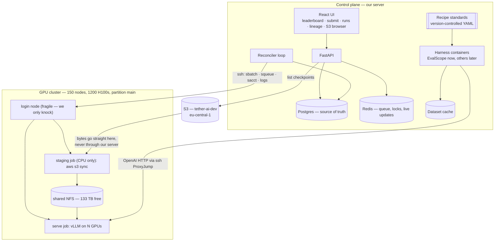
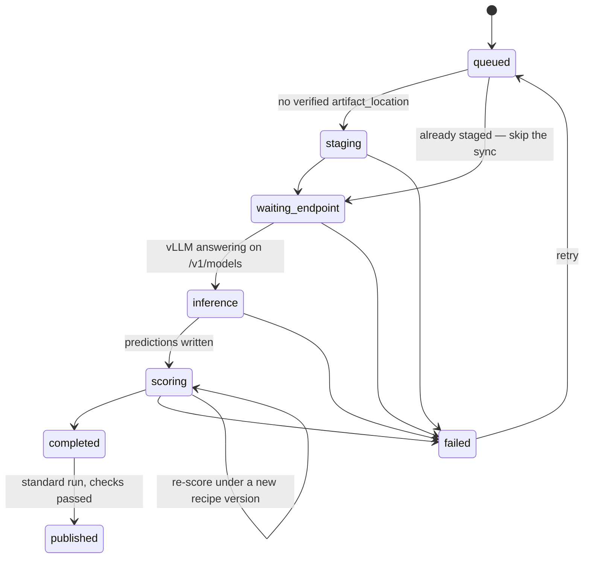
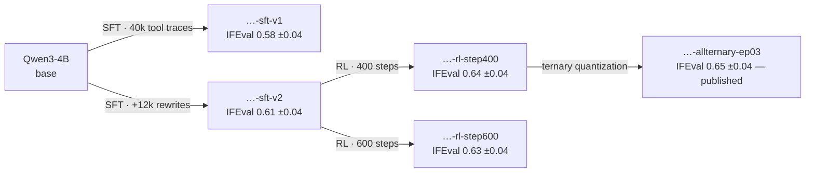

# A Shared Evaluation Service — How We'd Actually Build It

**Date:** Sep 2026 (revision 4)
**Companion to:** [`BENCHMARK_UNIFICATION_RESEARCH.md`](./BENCHMARK_UNIFICATION_RESEARCH.md) · [`CLUSTER_VALIDATION.md`](./CLUSTER_VALIDATION.md)
**What this is:** a design/plan doc. Nothing here changes any code in any repo yet.

The research doc answered *"what do the four teams do today?"*. This one answers *"if we built one evaluation service that nobody owns except us, what would it look like, and where do we start?"*

I've tried to keep the language plain. Where I'm unsure, or where something depends on a decision only a human can make, I say so rather than papering over it.

> **What changed in this revision.** Everything about the cluster has now been verified by hand rather than assumed — I submitted real jobs, served a real model, and wrote the results up in [`CLUSTER_VALIDATION.md`](./CLUSTER_VALIDATION.md). Three things changed as a result.
>
> **First, the recipe is no longer a single fixed thing — it's a fixed protocol plus an explicitly chosen, explicitly recorded set of resolution policies.** Serving Qwen3-4B revealed that the checkpoint's own `generation_config.json` silently supplies sampling defaults, and that this model spends its entire token budget inside a `<think>` block and never answers. Neither is something a single global standard can paper over. So sampling, think-handling and `max_tokens` each become a three-way choice in the UI — benchmark default, user-provided, or from the checkpoint — and **every run stores the fully resolved values and a hash of them**, so comparisons are only ever made between runs that were actually produced the same way. Section 5 is rewritten around this and remains the most important section here.
>
> **Second, two things are explicitly out of scope for now.** Reaping orphaned model servers will be handled later by a periodic sweeper that looks for allocated-but-idle GPU nodes, not by TTLs and heartbeats built into the MVP. And the control plane's geographic distance from the cluster is noted but deferred — we'll revisit it if it actually bites.
>
> **Third, staging is confirmed viable and gets an explicit skip path.** Compute nodes do reach S3, which was the open question blocking Section 7. A run stages weights only when they aren't already on the cluster; otherwise it goes straight to serving.
>
> The earlier decisions still stand: the service lives entirely on its own server and reaches the cluster over SSH, and nothing of ours runs on the login node.

---

## Table of contents

1. [The one-paragraph version](#1-the-one-paragraph-version)
2. [What this service is not](#2-what-this-service-is-not)
3. [What we now know about the cluster](#3-what-we-now-know-about-the-cluster)
4. [The shape of the system](#4-the-shape-of-the-system)
5. [The standard recipe — we decide it, not the teams](#5-the-standard-recipe--we-decide-it-not-the-teams)
6. [Talking to the cluster over SSH](#6-talking-to-the-cluster-over-ssh)
7. [Weights: S3 to the cluster, without passing through us](#7-weights-s3-to-the-cluster-without-passing-through-us)
8. [Test data: the harness owns it](#8-test-data-the-harness-owns-it)
9. [Where the harness actually runs](#9-where-the-harness-actually-runs)
10. [The data model](#10-the-data-model)
11. [The MVP — what to build, in order](#11-the-mvp--what-to-build-in-order)
12. [How we add benchmark number three, four, five…](#12-how-we-add-benchmark-number-three-four-five)
13. [The UI](#13-the-ui)
14. [The leaderboard, and the lineage graph](#14-the-leaderboard-and-the-lineage-graph)
15. [Good ideas worth stealing](#15-good-ideas-worth-stealing)
16. [Tech stack](#16-tech-stack)
17. [Challenges — now, later, or never](#17-challenges--now-later-or-never)
18. [Questions we still need humans to answer](#18-questions-we-still-need-humans-to-answer)
19. [The first two weeks](#19-the-first-two-weeks)

---

## 1. The one-paragraph version

We build a small web service on its own server, with its own database and its own UI. You open it, browse the checkpoints sitting in S3, register one with a note about where it came from, pick a benchmark, and hit run. Behind the scenes it SSHes into the cluster, tells it to pull those weights from S3, starts a model server, runs the eval harness against it **using our standard recipe for that benchmark**, collects the score, and puts it on a shared leaderboard next to everyone else's numbers. It also remembers where every checkpoint came from, so you can look at a model and see the whole family tree that led to it. Teams keep their own harnesses and their own repos — we don't take those away. We're the place you go when you want a number that's genuinely comparable to somebody else's number.

The closest public thing is Artificial Analysis, with one difference: they call other people's hosted APIs, and we host the models ourselves. Harder, but it means we can report things they can't — how fast our own checkpoint is on our own hardware, and what it cost in GPU-hours to find out.

---

## 2. What this service is not

Being clear about this early saves a lot of arguing later.

- **It is not a replacement for the four team harnesses.** EvalScope, lm-evaluation-harness, VLMEvalKit and OpenCompass stay where they are. We call them; we don't rewrite them. Every time somebody rewrites a scoring function they introduce a subtle difference, and the number stops meaning what everyone thinks it means.
- **It is not a training platform.** We read checkpoints, we don't produce them.
- **It is not a production model-serving platform.** We start model servers, but only for the duration of an evaluation.
- **It is not a place to run your own custom evaluation config.** That's a change from the earlier draft and it's deliberate — see Section 5. If you need a one-off with different settings, run it in your own harness like you do today. What we offer is *the* number, not *a* number.
- **It is not mandatory on day one.** A team that ignores us should lose nothing. That's how we get adoption: by being useful first, not by being the only option.

---

## 3. What we now know about the cluster

I went and looked instead of assuming. Several of these change the design. Everything below has now been re-confirmed by actually submitting jobs rather than reading config — the full write-up, including the measurements, is in [`CLUSTER_VALIDATION.md`](./CLUSTER_VALIDATION.md).

**The hardware.** 150 nodes, 8× H100 80GB each — 1200 GPUs, 33,600 CPUs. The nodes are cloud instances (`State=IDLE+CLOUD`) on private addresses in `172.16.x.x`.

**`main` is not a separate pool — it's the whole cluster.** It contains `health-[0-49]`, `toolcall-[0-49]` and `vlm-[0-49]`: every node, including all the ones the three teams use. It's also the default partition.

**Nothing preempts anything.** All four partitions sit at `PriorityTier=10`, and `preempt/partition_prio` only preempts across *different* tiers. So our jobs on `main` won't be killed by a team's job, and won't kill theirs. We just queue for the same physical GPUs.

**There is no time limit, so we must impose our own.** `main` has `MaxTime=UNLIMITED` and `DefaultTime=NONE`. A vLLM server we forget about runs until someone notices. Every job needs an explicit `--time`.

**SLURM is 25.11.3 with JWT auth already switched on** (`AuthAltTypes=auth/jwt`); `scontrol token` works. **But `slurmrestd` isn't deployed** — the binary isn't installed and nothing is listening. So the REST API is a small admin ask away, not something we have today.

**Accounting is on** (`accounting_storage/slurmdbd`), so `sacct` gives us GPU-hours.

**One big shared filesystem.** A VAST NFS mount, 586 TB with 133 TB free, visible cluster-wide. Model stores at `/home/shared/models` and `/home/shared/agentic_slm/models` — the latter already holds `Qwen3-4B`, `Qwen3-4B-allternary-ep03` and a dozen others. There's also `/home/shared/containers`. Space is not a constraint.

**We can SSH straight to compute nodes.** `ssh toolcall-12 hostname` works from the login node without an active job. That's useful: it means we can `ProxyJump` through the login node directly to whichever node is serving vLLM, rather than chaining port-forwards.

**The login node is a Kubernetes pod, and it's fragile.** `/proc/1/cgroup` shows `kubepods-burstable.slice/…/crio-….scope`, and PID 1 is `sshd`, not `systemd`. Its root filesystem — not just `/home`, but `/` — is NFSv3 (`vers=3,hard,timeo=600,local_lock=none`). User namespaces are blocked, so rootless containers won't run. Burstable QoS means it can be evicted under node pressure and restarted by the operator at any time.

That last one is why **nothing of ours runs there.** Postgres on NFSv3 with `local_lock=none` is a corruption risk rather than a performance nit; there's no service manager to restart anything; and we'd be sharing CPU and RAM with everyone's interactive work. The login node is a door we knock on, not a place we live.

**Both the login node and the compute nodes have internet egress.** This was the open question; it's now settled. From inside a CPU job on `health-24`: `s3.eu-central-1.amazonaws.com` returns 307, the `tether-ai-dev` bucket returns 403 — meaning the hostname resolves and answers, we're simply unauthenticated — and `huggingface.co` and `pypi.org` both return 200. The **`aws` CLI is already installed** on compute nodes at `/usr/local/bin/aws`. `s5cmd` is absent, as expected. So Section 7's design, where bytes go from S3 straight to the cluster without passing through us, is viable and needs no fallback.

**The shared filesystem is roomy but slow, and that shapes more than it looks.** Reading an 8 GB safetensors shard took 79.8 seconds — about 100 MB/s. A `find -maxdepth 4` over the eval tree took 47 seconds. A recursive `grep` over two subdirectories never returned at all and had to be killed. Python imports for vLLM out of the NFS-hosted venv left the process in uninterruptible disk wait for roughly two minutes before it produced its first log line. Space is not a constraint; throughput and metadata operations are. Anything we run that walks this filesystem needs a hard timeout, and the Milestone 0 importer should not be written as a naive recursive scan.

**SLURM control commands have wildly variable latency.** `sbatch` took 29 seconds once and 974 milliseconds another time. `scontrol show job` took 27 seconds. A `sacct` query took 47 seconds. This is independent support for the reconciler design in Section 10 — one bulk `squeue` per tick, never a per-job poll — and it means every SSH call needs a generous timeout and a retry that doesn't assume a slow call was a failed one.

**A cold SSH connection takes 16 seconds; a reused one takes about 1.** Connection pooling is load-bearing, not an optimization.

**The cluster is physically in Portugal** (Sines, AS59437 Northern Data AG), not in `eu-central-1` where the S3 bucket lives. This has latency implications for where our server sits, which are measured in `CLUSTER_VALIDATION.md` — **deliberately deferred for now.** We'll revisit if it becomes a real problem in practice.

**AWS is Identity Center (SSO), not static keys.** Account `833707431398`, region `eu-central-1`, role `Tether_S3_RW_tether-ai-dev`. The AWS CLI is on the login node; `s5cmd` isn't. SSO credentials are short-lived and refreshed by an interactive browser login, which **an unattended service cannot do.** We'll need a non-interactive identity. Small ask, real blocker if nobody asks.

---

## 4. The shape of the system

Two halves, cleanly separated.

**The control plane** — our own server, entirely outside the cluster. FastAPI, Postgres, Redis, the React UI, the harness containers, the dataset cache, the recipe standards. This holds all the state and all the credentials. It's a normal machine with a normal filesystem, which after Section 3 is worth appreciating.

**The compute plane** — the GPU cluster, reached only over SSH. We submit jobs, poll them, read logs, and talk HTTP to model servers. We install nothing and leave nothing running there except the jobs themselves.



Three things to notice.

**The model server and the eval harness are separate processes that only talk over HTTP.** That's the decoupling you asked for, and it buys more than it costs: one served model can be hit by five benchmarks instead of loaded five times, an external endpoint plugs into the same slot with no special-casing, and if the harness crashes the model is still up. The cost is that we manage server lifetimes, and with no cluster time limit there's no safety net under us.

**Model weights never pass through our server.** We tell the cluster what to fetch; the cluster fetches it.

**Nothing durable lives on the cluster.** No database, no daemon, no agent. If the login node pod restarts mid-run, we lose an SSH connection and reconnect — we don't lose state.

---

## 5. The standard recipe — we decide it, not the teams

This is the section that matters most, and the decision behind it is the right one.

The research doc's number-one risk was that "IFEval" from one team and "IFEval" from another might not be the same test. The earlier draft dealt with that defensively: let everyone configure what they want, record it all, hash it, and warn the user when two numbers weren't comparable. That works, but it produces a leaderboard full of asterisks and puts the burden on whoever's reading it.

The better answer splits the problem in two. **The benchmark protocol — what question gets asked, and how the answer is scored — is one official thing that we define, and every published number uses it.** That part stops being detected and becomes guaranteed.

But **how the model is asked to speak** — its sampling settings, whether a `<think>` block counts, how many tokens it's allowed — cannot be one fixed thing, because it legitimately depends on the checkpoint. Serving Qwen3-4B made this concrete in two ways, both documented in [`CLUSTER_VALIDATION.md`](./CLUSTER_VALIDATION.md): the checkpoint ships its *own* sampling defaults in `generation_config.json` and vLLM silently applies them, and the model spent all 512 tokens of its budget thinking and never produced an answer at all. A single global setting would have produced a wrong number in both cases, and we wouldn't have known.

So for that second part the rule is: **pick the source explicitly, record what it resolved to, and hash it.** Runs that share a hash are directly comparable and the leaderboard treats them as one population. Runs that don't are still shown, clearly grouped, never silently mixed. Comparability is guaranteed *within* a hash and visible *across* hashes, rather than assumed everywhere.

### What a standard looks like

A standard is a version-controlled YAML file, one per benchmark, that we own and review. Every field has a stated source — the paper, the harness default, or an explicit decision of ours where neither settles it. It's split into two layers, and the split matters.

**Layer 1 — the benchmark protocol.** Identical for every model, no exceptions. This is what makes numbers comparable.

- dataset and pinned revision, split, subsets
- number of few-shot examples, and the exemplars if fixed
- prompt template
- answer extraction method
- metrics, and which one is primary
- repeats (how many samples per question)

**Layer 2 — the run profile.** Three settings that materially change the number and legitimately depend on the checkpoint. Each is chosen from one of three sources, in the UI, per run:

| Setting | What it controls |
|---|---|
| **Sampling** | temperature, top_p, top_k |
| **Think handling** | whether a `<think>` block is stripped before scoring, scored as-is, or disallowed |
| **Max output tokens** | the generation budget |

And the three sources, which apply to each setting independently:

| Source | Where the values come from | When you'd use it |
|---|---|---|
| **Benchmark default** | the recipe YAML for this benchmark — our recommended setting, and the default | the normal case; this is what the leaderboard shows |
| **User provided** | entered in the UI at submit time | investigating a specific hypothesis, or a model the defaults suit badly |
| **From the checkpoint** | the checkpoint's own `generation_config.json` | reproducing what the model's author intended |

Alongside these, the profile also carries things that aren't really choices — chat template, tool-call parser, reasoning parser. Those follow the model family.

**Why not one global setting?** Because "temperature 0 for everything" is actively wrong, and it's the trap this decision could fall into. Qwen's own guidance for their thinking models is temperature 0.6, top_p 0.95, top_k 20, and they explicitly warn that greedy decoding causes repetition and degeneration. If our standard forces greedy on a reasoning model, we produce a bad number, the owning team correctly rejects it, and the leaderboard loses credibility. The tool-call harness already got this right — they have named sampling profiles (`greedy`, `qwen3_think`, `lfm2_5_think`) attached to model families, not to benchmarks.

**Why not just let the checkpoint decide, then?** Because we measured what that does. vLLM logs this on startup and then quietly proceeds:

```
WARNING [model.py:1435] Default vLLM sampling parameters have been overridden
by the model's `generation_config.json`:
{'temperature': 0.6, 'top_k': 20, 'top_p': 0.95, 'max_tokens': 32768}.
If this is not intended, please relaunch vLLM instance with
`--generation-config vllm`.
```

Explicit per-request parameters still win, so this doesn't corrupt values we *do* set — it silently supplies every value we *don't*. Since the file lives in the checkpoint and differs between checkpoints, two models could be sampled differently under what looks like the same recipe. That's precisely the failure Section 5 exists to prevent, and it happens below the level our config can see.

So whichever source is chosen, **the service resolves it to concrete values and pins them explicitly**, rather than letting anything fall through to a default. In practice that means launching vLLM with `--generation-config vllm` so the checkpoint's file is never applied implicitly, and then setting every sampling field on every request — including when the chosen source *is* the checkpoint, in which case we read its `generation_config.json` ourselves and pass those values through deliberately. The difference between "the checkpoint's settings were used" and "the checkpoint's settings leaked in" is the entire point.

### The resolved profile hash

Every run stores three things:

1. **`profile_source`** — which of the three sources was picked, per setting.
2. **`resolved_profile`** — the concrete values that were actually sent to the model server. Not the source, the outcome.
3. **`profile_hash`** — a hash over `resolved_profile` together with the Layer 1 `recipe_hash`.

The hash is computed from what was *used*, never from what was *requested*, so a bug in resolution shows up as a hash mismatch rather than a wrong number wearing the right label.

What it buys us:

- **The leaderboard groups by hash.** The default view is one hash — the benchmark defaults — so the front page is still apples-to-apples with no asterisks. Other hashes are selectable, and two runs with different hashes never share a ranking without saying so.
- **Compare view refuses to mislead.** Comparing across hashes is allowed, but the difference in profile is shown next to the difference in score.
- **It's a verification tool, not just a label.** A run claiming to use the standard whose hash doesn't match the standard is flagged, which catches config drift and resolution bugs.

One consequence worth being honest about: this is a step back from "every number on the board is comparable by construction". We've traded a little of that guarantee for the ability to evaluate models the defaults don't suit — which, given what the Qwen3-4B probe showed, we genuinely need. The hash is what keeps the trade honest.

One consequence worth stating plainly: **thinking and non-thinking are separate leaderboard entries, not a hidden setting.** The same weights with thinking on and off are two rows. tool-call already models it this way — `Qwen3-4B-Instruct` and `Qwen3-4B-Think` are two tags pointing at the same directory.

### "Just use what the paper says" is the right instinct, and it's not always enough

I read EvalScope's actual adapters for our first two benchmarks, and they're a useful illustration.

**IFEval** — the harness and the paper agree completely, which makes it an easy first standard:

```python
few_shot_num=0,
prompt_template='',                      # prompt used verbatim
subset_list=['default'],
metric_list=['prompt_level_strict', 'inst_level_strict',
             'prompt_level_loose',  'inst_level_loose'],
primary_metric='prompt_level_strict',
```

Zero-shot, no prompt wrapper, `prompt_level_strict` as the headline. That's exactly what Zhou et al. describe, and the "no wrapper" part isn't cosmetic — IFEval's instructions are things like "respond in all lowercase", so any template we bolt on could itself violate the instruction being tested.

**GSM8K** — here the harness and the convention diverge:

```python
few_shot_num=4,
PROMPT_TEMPLATE = "{question}\nPlease reason step by step, and put your final answer within \\boxed{}."
```

EvalScope does **4-shot** with a `\boxed{}` prompt and a math-expression parser. The classic convention from Cobbe et al. and lm-evaluation-harness is 5- or 8-shot chain-of-thought with `#### <number>` extraction, and modern instruct models are increasingly reported 0-shot CoT. Three defensible answers, all called "GSM8K".

My recommendation is **default to the harness's own default and document it, deviating only for a stated reason.** Two arguments for it: our numbers stay comparable to everyone else publishing EvalScope results, and every deviation is a line of config we have to maintain and justify forever. But it *is* a judgement call, and writing down which way we went — and why — is the entire point of having a standard.

The general rule I'd write into the process:

> Take the paper's protocol as the starting point. Where the harness's default already matches it, use the default and say so. Where they differ, prefer the harness default unless the paper's choice materially changes what's being measured — then override, and record the reason in the standard.

### Sample size, and why we should show error bars

This is the part almost nobody does, and it's cheap for us to get right because we control the protocol.

A benchmark score is an estimate from a sample, and small benchmarks are noisy. Rough 95% confidence intervals for a single greedy run:

| Benchmark | Questions | Score around | 95% interval |
|---|---|---|---|
| GSM8K | 1319 | 0.80 | ±2.2 points |
| IFEval | 541 | 0.65 | ±4.0 points |
| GPQA-Diamond | 198 | 0.40 | ±6.8 points |
| AIME25 | 30 | 0.50 | ±18 points |

Two models three points apart on IFEval are statistically indistinguishable. On AIME a single run is nearly meaningless. So the standard should set `repeats` per benchmark — 1 is fine for GSM8K and IFEval, small benchmarks need avg@k with k of 8 or more — and **the leaderboard should show the interval next to the score.** That single choice stops a lot of bad decisions getting made on noise.

### Two diagnostics every run should report

Neither is a score, both catch bad numbers before anyone acts on them:

- **Truncation rate.** How many responses hit `max_tokens`. If a thinking model is being cut off on 20% of questions, the score measures our token budget, not the model. None of the four teams tracks this today, and it's a one-line count. **This is no longer hypothetical:** the Milestone 1 checkpoint came back at a 100% truncation rate (12 of 12) in a trivial smoke test. This diagnostic would have caught that before anyone published a number, which is most of the argument for building it on day one.
- **Error/refusal rate.** Requests that failed or came back empty. EvalScope runs with `ignore_errors: True`, which is sensible for finishing a job but means failures quietly become wrong answers.

If either crosses a threshold, the run gets flagged and can't be published without someone looking at it.

### Versioning, and the thing that makes changes cheap

Standards will change. A framework upgrade, a judge swap, a fixed extraction bug. The rule:

> **Changing a standard creates a new version. Old scores keep their old version label. We never silently relabel a number.**

The leaderboard defaults to the current version and can show earlier ones as history. Each standard carries a changelog and a reference number it was verified against.

Now, the payoff for splitting inference from scoring — because it decides how expensive each kind of change is:

| Kind of change | Examples | Cost to backfill |
|---|---|---|
| **Scoring-only** | answer extraction fix, new metric, judge prompt change, think-stripping rule | **Free** — re-score the stored predictions, no GPU time |
| **Inference-affecting** | few-shot count, prompt template, temperature, max tokens, dataset revision, framework upgrade | Full re-run on GPUs |

So: store the raw predictions from every run, always. Then a scoring change means recomputing a whole leaderboard column in minutes instead of a GPU-week. tool-call already built this (`--use-cache`, `resummarize`); we should build it in from the first commit, because retrofitting it means throwing away every prediction generated before we thought of it.

### Think handling, and why the default matters more than I thought

**How should a standard treat a reasoning model's think block?** IFEval is the sharp case: a `<think>` block is going to violate "respond in all lowercase" or "write exactly three paragraphs" every time. Three options:

1. **Strip the think block before checking** — this is what one-bit-models does with `grade_think_aware.py`. Measures instruction-following in the actual answer. Deviates from the paper's literal procedure.
2. **Check the whole output** — faithful to the paper.
3. **Don't run thinking models on this benchmark** — clean, but we lose a benchmark for half the fleet.

This is now a Layer 2 setting, selectable per run and captured in the profile hash, so all three are available and none of them is hidden. But the *default* still has to be chosen, and the cluster probe made the stakes a lot clearer than the earlier draft assumed.

I asked `Qwen3-4B-allternary-ep03` — the Milestone 1 checkpoint — `"What is 17 * 23? Answer with just the number."` with a 512-token budget. It produced 512 tokens of `<think>`, worked the arithmetic correctly three separate ways, and hit `finish_reason: "length"` **without ever emitting an answer.** Across a 12-request concurrency test, **12 of 12 responses hit `max_tokens`.**

So option 2 isn't "faithful to the paper but scores reasoning models poorly" — on this checkpoint it scores the model on output it never produced. The number would measure our token budget and nothing else.

**The default should be `strip`**, with the whole-output option available for anyone who wants the paper-literal figure and can see from the hash that it's a different population. It also means **`max_tokens` is not a minor field for thinking models** — it's load-bearing, and every standard needs a sourced, defensible value rather than whatever the harness happens to ship.

### What teams can and can't change

| | Standard run | Exploratory run |
|---|---|---|
| Protocol (Layer 1) | Fixed by us | Overridable |
| Run profile (Layer 2) — sampling, think handling, max tokens | Source must be **benchmark default** | Any of the three sources |
| `limit` / smoke mode | Not allowed | Fine |
| Appears on the leaderboard | Yes, once published | **Never** |
| Grouped and compared by `profile_hash` | Yes | Yes |
| Visible in the UI, comparable to itself | Yes | Yes |

A **standard run** is now defined precisely: the active recipe for Layer 1, and the benchmark-default source for all three Layer 2 settings. That combination has one hash per benchmark, and it's what the leaderboard shows by default. Anything else is exploratory — still stored, still visible under the checkpoint, still comparable to other runs sharing its hash, but never on the board.

That keeps the standard meaningful without making the service useless for the cases where the defaults are wrong for a model, which the Qwen3-4B probe showed is a real situation rather than a hypothetical one.

Both hashes earn their keep, and they do different jobs:

- **`recipe_hash`** covers Layer 1. It verifies a run actually used the protocol it claims to have used — belt and braces against config drift.
- **`profile_hash`** covers the resolved Layer 2 values together with `recipe_hash`. It's how the UI decides which numbers may sit in the same ranking.

---

## 6. Talking to the cluster over SSH

Our server holds an SSH key and drives the cluster the way a person would: `sbatch`, `squeue`, `sacct`, `scancel`, `scontrol`. All of it works today, needs nothing from anybody, and is maybe 300 lines with `asyncssh`.

**All six methods have now been exercised by hand** — submit, status, cancel, logs, stage_file and open_tunnel — including serving a real model on an H100 and getting generated tokens back through a tunnel. Details and measurements in [`CLUSTER_VALIDATION.md`](./CLUSTER_VALIDATION.md).

Several details make this nicer than it sounds, and a few make it harder:

**We can reach compute nodes directly.** `ssh toolcall-12` works without an active job, so getting to a vLLM server is a `ProxyJump` through the login node straight to the node — `ssh -J login toolcall-17 -L 19001:localhost:8032` — rather than a chain of hops. Verified end to end. The endpoint record just stores a base URL and the harness uses it; nothing above that layer cares how the route was built.

**`sbatch` reads the script from stdin.** `ssh cluster 'sbatch --chdir=… --parsable' < script` works, so **no file ever has to be staged on the cluster** to submit a job. This is worth knowing because the table below lists inline submission as a reason to want `slurmrestd`; we already have it. The one trade-off is that `scontrol show job` then reports `Command=(null)`, so if we want the script recorded for auditing we store it ourselves. `SubmitLine` is preserved either way.

**Logs are files on the shared NFS**, so reading them is `ssh cat` or SFTP — and `tail -f` over SSH gives live streaming, which is what the Runs page needs. This is worth remembering because it's the one thing the REST API can never do.

**Pool connections.** A cold SSH connect takes 16 seconds; a reused one takes about 1. `asyncssh` should hold connections open rather than dialing per command.

**Poll in bulk, and set generous timeouts.** SLURM control commands are erratic — `sbatch` measured at both 974 ms and 29 seconds, `scontrol show job` at 27 seconds, a `sacct` query at 47. The reconciler must issue **one `squeue` per tick covering every job**, never a call per job, and a slow call must not be mistaken for a failed one.

**Tunnels need supervision.** A tunnel died unprompted between two commands during testing, with nothing having cancelled it. Every forward needs `ServerAliveInterval`, `TCPKeepAlive` and `ExitOnForwardFailure=yes`, plus a reconnect path — the same philosophy as the login-node pod restarting under us: a dropped tunnel is a reconnect, not an incident. On the plus side, one tunnel carried 12 concurrent requests at roughly 1,360 tokens/sec with no errors, so a single forward per endpoint is plenty.

**Never cache the node name.** The `endpoint` row stores `node`, but the reconciler must refresh it from `squeue` rather than trusting what's stored. A stale hostname fails with a connection reset that looks exactly like a dead server — this cost me a debugging detour during validation, and it will cost someone an afternoon if we don't handle it explicitly.

**Keep the connector behind a narrow interface** — `submit`, `status`, `cancel`, `logs`, `stage_file`, `open_tunnel`. Six methods. Nothing above it should know SSH is involved. That's what makes the next paragraph an upgrade rather than a rewrite.

### If `slurmrestd` ever gets deployed

JWT is already configured, so it's a small ask. For SLURM 25.11 the current API version is `v0.0.44`. What we'd gain:

| What we need | Endpoint | Note |
|---|---|---|
| Submit | `POST /slurm/v0.0.44/job/submit` | Body is `{"script": "#!/bin/bash\n…", "job": {...}}` — the script goes inline. **Not actually an advantage: `sbatch` already reads from stdin over SSH.** |
| Status | `GET /slurm/v0.0.44/job/{id}` | Structured JSON instead of parsing `squeue` |
| Everything at once | `GET /slurm/v0.0.44/jobs` | One call per reconciler tick |
| Cancel | `DELETE /slurm/v0.0.44/job/{id}` | |
| Accounting | `GET /slurmdb/v0.0.44/jobs` | The `sacct` equivalent — where GPU-hours come from |
| Capacity | `GET /slurm/v0.0.44/nodes`, `/partitions` | Lets the submit page say "12 nodes idle" and estimate a wait |
| A typed client | `GET /openapi.json` | Generate the client from the spec rather than hand-writing models |

Auth is two headers, `X-SLURM-USER-NAME` and `X-SLURM-USER-TOKEN`. Our server can't run `scontrol` itself, so: SSH in, run `scontrol token lifespan=3600`, cache it, refresh every ~50 minutes. We need SSH anyway.

What it won't do: read logs, transfer files, or hold still — each API version has a scheduled removal (`v0.0.44` goes in 27.11). Treat it as an upgrade to the submit and status paths, keep SSH for everything else, and keep the version in config.

### One thing to carry over

tool-call derives the vLLM port from the job ID (`8000 + (job_id % 250) * 8`) because two jobs on one node collided. That bug is already found; no need to find it again.

---

## 7. Weights: S3 to the cluster, without passing through us

Weights live on the cluster; S3 is where they come from. Simpler than staging through our server, and faster, since the bytes take one hop.

### The flow

1. **Browse.** Our service lists S3 with its own credentials and shows what's there, prefix-delimited so you see folders rather than a hundred thousand keys.
2. **Register.** You pick a prefix and fill in a short form: name, parent checkpoint, what operation produced it, notes. We store bucket, prefix, object count, total size, and an inventory of keys with ETags.
3. **Check before staging.** Every run begins by asking whether the weights are already on the cluster. If an `artifact_location` row exists for this checkpoint and cluster, is in state `ready`, and still verifies, **the staging step is skipped entirely** and the run goes straight to serving.
4. **Stage, on demand.** Only if that check fails do we submit a small **CPU-only staging job** to `main` — essentially `aws s3 sync s3://bucket/prefix /home/shared/eval-service/models/<id>/`. No GPUs, a couple of hours of wall time.
5. **Verify and record.** Compare object count and bytes against the inventory, then write the `artifact_location` row that lets step 3 skip next time.

Our server never touches the bytes, so our disk and bandwidth stop being a scaling factor.

**The skip path is the common case, not the exception.** Most evaluation is repeated against a handful of checkpoints, so after the first run the answer to "is it staged?" is almost always yes. Three details make the check trustworthy rather than merely fast:

- **A staging job takes a per-checkpoint lock**, so two runs submitted at the same time for the same checkpoint produce one sync, not two racing writes into the same directory. Redis is the right place for this lock.
- **`ready` means verified**, not "the job exited 0". We compare object count and total bytes against the registered inventory before flipping the state. A half-finished sync from a cancelled job must not read as staged.
- **A checkpoint already on the NFS never needs S3 at all.** `/home/shared/agentic_slm/models/Qwen3-4B-allternary-ep03` is registered with a local path and an `artifact_location` row from the start. This is what makes Milestone 1 possible without touching S3, and it's the same code path — the row just wasn't created by a staging job.

**Compute nodes can reach S3.** This was the open question that blocked the whole design, and it's now settled: from inside a job, the S3 endpoint returns 307 and the `tether-ai-dev` bucket returns 403 — reachable, just unauthenticated. The `aws` CLI is already installed at `/usr/local/bin/aws`. No SSH fallback needed.

A note on speed: `aws s3 sync` is fine for a handful of large safetensors shards. If we start moving checkpoints with thousands of small files, `s5cmd` is several times faster and is a single Go binary — it is *not* installed on the compute nodes, so using it means shipping it ourselves. Not worth doing until it hurts. Worth knowing that the NFS write side is unlikely to beat about 100 MB/s regardless, which is what an 8 GB shard read measured at.

Why a SLURM job rather than running the sync over SSH on the login node? Partly manners — login nodes aren't for sustained I/O, and this one is a fragile pod — and partly consistency: it's the same submit-and-watch machinery as everything else, so it gets progress and cancellation for free.

### Credentials, which is the actual hard part

**What not to do:** drop a long-lived access key into a file on the shared NFS. It'd work, and it'd sit there forever, readable by anyone with that mount.

**What to do:** our service holds one durable identity. For each staging job it calls `sts:AssumeRole` to mint a credential that is **short-lived, read-only, and scoped to that prefix**, and injects it into the job environment. If it leaks, it's already expiring and can only read one checkpoint. A handful of lines of `boto3`, and the right default from day one.

**The problem to raise now:** the current AWS setup is Identity Center SSO, and `aws sso login` needs a human with a browser. We need one of an IAM user with a long-lived key (simplest, weakest), a role assumed via OIDC federation (best), or an instance profile if the service runs on EC2 in that account (best and easiest, if available). Any works; none happens without asking.

### Seeing S3 in the UI

The browser lists prefixes under a configured root, showing object count, total size, last modified, whether it looks like a Hugging Face checkpoint (`config.json` plus at least one `*.safetensors`), and whether it's already staged. Two buttons: **Register** and **Stage now**. Cache the listing in Postgres and refresh on a timer, so pages are fast and we don't hammer S3.

### The manual path stays

Registering a checkpoint by hand stays, as a complement rather than an alternative. The S3 browser is *discovery* — "what have we got?". The register form is *description* — name, parent, operation, training run link. The same form handles a checkpoint that only exists on the NFS at `/home/shared/agentic_slm/models/Qwen3-4B-allternary-ep03` with no S3 copy at all, which is what makes the first milestone possible without touching S3.

---

## 8. Test data: the harness owns it

Decision made, and it's right: **benchmark datasets are the harness's problem, not ours.**

The moment we write our own dataset loader, we own a new way for our score to differ from a team's — and it'll be subtle: a different prompt template, a field order, a stripped whitespace. Dataset loading is genuinely part of a benchmark's definition and it lives inside the harness for good reason.

Because the harness runs on our server (next section), this also answers where the data lives: **with us.** It lands in a cache volume mounted into the harness container and never reaches the cluster. The cluster only ever sees weights and HTTP requests.

Three small things we should still do, because they're nearly free:

- **One cache directory**, with `HF_HOME`, `HF_DATASETS_CACHE` and `MODELSCOPE_CACHE` pointed at it. The tool-call harness already sets all three, so this is configuration.
- **Prefetch before the run, not during it**, so an eval doesn't die two hours in on a timed-out download. They already have `qvac-eval prefetch`.
- **Record the resolved dataset revision** on the run — and, now that we own the standard, *pin* it there rather than just recording it. This is the whole defence against silent dataset drift.

Bake everything into the container image rather than assembling at runtime, including the odd corners: EvalScope's IFEval adapter needs `langdetect` and `nltk`, and the NLTK `punkt` data is a separate download in the tool-call setup. Omissions like that are what make a run fail at 2am.

---

## 9. Where the harness actually runs

This decision makes an MVP possible in weeks instead of months.

The tool-call harness runs EvalScope with `eval_type: 'openai_api'`, which means **EvalScope doesn't load the model at all — it makes HTTP calls to an OpenAI-compatible endpoint.** So for text benchmarks the scoring side is **CPU-only and network-bound**. It doesn't need to be on the cluster. It runs in a container on our own server, pointed at a tunnel.

For an MVP that's enormous:

- No harness install on the cluster. No dependency on their five virtualenvs or shared paths — and after Section 3, no dependency on a fragile pod.
- Results land in our database instead of being scraped off a filesystem.
- We can develop and debug the whole scoring path locally without a GPU.
- Datasets stay on our side, which is what makes Section 8 as simple as it is.
- Containers work, because our server isn't blocking user namespaces.

So **`where_it_runs` is a property of the benchmark, defaulting to `service`.**

| Runs on our server | Runs on the cluster |
|---|---|
| Text benchmarks against an HTTP endpoint (IFEval, GSM8K, MMLU-Pro, GPQA) | Vision benchmarks — gigabytes of images, heavy preprocessing |
| Anything rule-scored | Anything needing a sandbox (LiveCodeBench) |
| Judge-scored, if the judge is also an endpoint | Multi-node pooled setups like the VLMEvalKit v2 flow |

Start left, earn right. The choice is per-benchmark, so we never make it globally.

---

## 10. The data model

Postgres. Enough to be concrete, not so much that it pretends to be final.

```
cluster              name, ssh_host, ssh_user, proxy_jump, default_partition,
                     model_root, rest_url, rest_api_version, enabled

s3_listing_cache     bucket, prefix, object_count, total_bytes, last_modified,
                     looks_like_checkpoint, refreshed_at

model                name, owner_team, modality, description
checkpoint           model_id, name, source, s3_bucket, s3_prefix, local_path,
                     object_count, total_bytes, inventory (jsonb),
                     parent_checkpoint_id, lineage_op, lineage_params (jsonb),
                     training_run_url, registered_by, created_at
artifact_location    checkpoint_id, cluster_id, path,
                     state,                    -- pending | syncing | ready | failed
                     object_count, total_bytes,               -- verified, not claimed
                     staged_by_job_id, verified_at
                     -- state='ready' + a passing verify is what lets a run skip staging

model_profile        name, family, mode,
                     temperature, top_p, top_k, max_tokens, think_handling,
                     chat_template, tool_parser, reasoning_parser, thinking,
                     vendor_source_url                -- a named, reusable layer-2 preset

benchmark            name, framework_id, task_name, modality, where_it_runs,
                     typical_gpu_hours, verified
recipe               benchmark_id, version, status, protocol (jsonb),
                     dataset_revision, few_shot, prompt_template, extraction,
                     metrics[], primary_metric, repeats,
                     default_sampling (jsonb),        -- the "benchmark default" source
                     default_max_tokens, default_think_handling,
                     judge_model,
                     source_note, changelog, verified_against_run_id,
                     effective_from                          -- layer 1, we own this

framework            name, version, image, notes

eval_run             checkpoint_id, benchmark_id, recipe_id, model_profile_id,
                     endpoint_id, cluster_id,
                     recipe_hash,                             -- layer 1, as used
                     sampling_source,        -- benchmark_default | user | checkpoint
                     think_source,           -- benchmark_default | user | checkpoint
                     max_tokens_source,      -- benchmark_default | user | checkpoint
                     resolved_profile (jsonb),   -- the values actually sent, not asked
                     profile_hash,               -- hash(resolved_profile + recipe_hash)
                     is_standard, is_smoke, overrides (jsonb),
                     status, phase, submitted_by, team, config_id,
                     queued_at, started_at, finished_at, gpu_seconds,
                     truncation_rate, error_rate, error
metric               eval_run_id, name, value, stderr, subset, is_primary
run_artifact         eval_run_id, kind, uri, size_bytes
endpoint             checkpoint_id, cluster_id, model_profile_id, base_url, served_name,
                     state, slurm_job_id, node, port, gpus,
                     started_at, last_used_at, ttl_seconds, heartbeat_at
job                  kind, eval_run_id | endpoint_id | checkpoint_id, cluster_id,
                     slurm_job_id, state, last_polled_at, raw_state
publication          eval_run_id, published_by, published_at, superseded_by
```

Deliberate choices:

- **`recipe` and `model_profile` are the two layers of Section 5**, as real tables rather than free-form params. `eval_run.is_standard` is true when a run used the active recipe *and* the benchmark-default source for all three Layer 2 settings — that's the flag the leaderboard filters on.
- **The three `*_source` columns record the choice; `resolved_profile` records the outcome.** Both matter. The source is what the user picked in the UI and is what the UI shows back to them; the resolved values are what actually reached the model server, and they're what `profile_hash` is computed over. Storing only the source would leave us unable to prove what was run; storing only the values would lose the intent.
- **`profile_hash` is the grouping key for the leaderboard.** Two rows may only share a ranking if they share this hash. It's a real indexed column, not something derived at render time.
- **`artifact_location.state` is what makes staging skippable.** A run checks for `ready` plus a passing verification against `object_count` and `total_bytes` before deciding whether to sync. A cancelled sync leaves `syncing` or `failed`, never `ready`, so a half-copied checkpoint can't be mistaken for a complete one.
- **`endpoint.node` is a cache, not a truth.** Refresh it from `squeue` each reconciler tick. A stale hostname produces a connection reset indistinguishable from a dead server.
- **The YAML standards files are the source of truth; these tables are their loaded form.** Review happens in git, not in the database.
- **`metric` carries `stderr`**, so error bars are a column rather than something we compute in the frontend from data we didn't keep.
- **Metrics are rows, not columns.** Every benchmark reports different things. Adding one never needs a migration.
- **`job` covers all three kinds of SLURM work** — staging, serving, evaluating — with one `kind` column.
- **`team` from day one**, even unenforced. Retrofitting tenancy is a bad week; a column costs nothing.
- **Postgres is the truth. Redis is not.** Wipe Redis and we lose live-update convenience, nothing else.

### How a run moves



That self-loop at the bottom is the one worth pointing at: re-scoring stored predictions under a new recipe version, with no GPU time. It's what makes standards safe to improve.

The backend pattern: **a reconciler loop, not long-lived tasks.** Every 20 seconds, look at everything unfinished, ask the cluster what's happening, move each one forward a step. The alternative — a task blocked on `squeue` for twelve hours — dies on the first deploy and takes the state with it. It also handles the login node pod restarting underneath us: the SSH connection drops, the next tick reconnects, and nothing is lost.

---

## 11. The MVP — what to build, in order

The goal isn't features. It's this sentence: **"our number matches the team's number, it was produced by our standard, and it came out of a database."**

### Milestone 0 — it shows something (a few days)

No execution. Postgres schema, FastAPI skeleton, and an importer that reads existing `summary.json` files out of the tool-call results tree as `eval_run` + `metric` rows. Then one leaderboard page.

Start here because it tests the schema against real data rather than imagined data, gives us a populated UI on day one, and can't break anything. Imported rows get `is_standard = false` and a "legacy" label, since they predate our standards — which is exactly the honest thing to show.

### Milestone 1 — one benchmark, end to end, to our standard

Pick **IFEval**: rule-scored so no judge, fast, no special virtualenv, harness defaults already match the paper, and there's a known-good result in the repo to check against:

```
model:  Qwen3-4B-allternary-ep03   (already on the NFS — no S3 staging needed)
bench:  ifeval, limit 20
result: prompt_level_strict = 0.65, prompt_level_loose = 0.70
job:    270184, 206 seconds
```

Deliberately, **this milestone skips S3 entirely** — the weights are already on the NFS, so we register a local-path checkpoint and go. Fewer moving parts for the run that has to prove the idea.

What we build:

1. **`standards/ifeval.yaml` — the first real recipe**, with every field sourced, including the three Layer 2 defaults. This should be written and reviewed *before* the code that consumes it.
2. **The SSH connector** behind the six-method interface, with `ProxyJump` to compute nodes, pooled connections, and keepalives on tunnels.
3. **A serve job template** — one sbatch script we own, parameterized by model path, GPUs, port and run profile, submitted to `main` **with an explicit `--time`** because the cluster won't impose one. Keep tool-call's job-ID-derived port; it works. Three things the validation run added to this, all of them cheap:
    - **Poll for liveness, not just readiness.** Poll `GET /v1/models` every 5 seconds until the served name appears, 900-second timeout — but check `kill -0` on the server process each iteration and bail out immediately if it's gone. During validation a bad vLLM flag killed the server in seconds and the readiness loop then **held an H100 for 10 minutes and 46 seconds** polling a dead process. Treat `SERVER_DIED` as a distinct state from `READINESS_TIMEOUT`: the first is a bad config to surface now, the second might be worth a retry.
    - **Launch with `--generation-config vllm`** so the checkpoint's `generation_config.json` is never applied implicitly, then set every sampling field explicitly per Section 5.
    - **Expect a six-minute cold start.** The measured figure was 350 seconds for a 4B model: ~128s of Python imports off the NFS venv, 80s to read the 8 GB shard, 72s of engine init. The 900s timeout is right, but it means the endpoint-reuse work in Milestone 2 is worth more than it looks.
4. **An EvalScope harness container** pinned to the commit they use (`2ce95c3…`), dataset cache mounted, `langdetect` and NLTK `punkt` baked in.
5. **The reconciler** and the run state machine, polling with one bulk `squeue` per tick.
6. **A run detail page** with live status and streaming logs — `tail -f` over SSH works and is confirmed.

Then the gate: run it, compare to `0.65`, don't move on until any difference is understood.

Be ready for it not to match exactly. vLLM isn't bit-identical across batch sizes and GPU counts even at temperature 0, and the reference ran on `toolCall` while we'd be on `main` — same H100s, not necessarily the same node. Note also that IFEval's 95% interval at n=541 is about ±4 points, so at `limit 20` the smoke number is nearly meaningless as a *score*; it's a wiring check. The real parity comparison needs a full 541-prompt run on both sides. Agree the tolerance band before anyone argues about a third decimal place.

**Before running the parity check, find out what profile produced `0.65`.** This checkpoint is a thinking model — in validation it hit a 100% truncation rate and produced no answer at all on a trivial arithmetic question. That means the reference number depends entirely on what think handling and token budget tool-call used, and on whether its sampling came from the checkpoint's `generation_config.json` or somewhere else. Comparing our `strip` against their whatever isn't a parity check, it's two different measurements. Establish their resolved profile first, reproduce *that* exactly, and only then vary it. This is the single most likely way for Milestone 1 to produce a confusing result.

### Milestone 2 — S3, a second benchmark, and the standards process

- **`standards/gsm8k.yaml`**, including an explicit decision on the 4-shot-versus-convention question from Section 5.
- **GSM8K** as benchmark two — also rule-scored, also fast, different code path, proves the registry isn't hardcoded around IFEval.
- **The S3 browser and register form**, including lineage fields.
- **The staging job**, with STS-scoped short-lived credentials, **a per-checkpoint lock, and the skip-if-already-staged check** from Section 7. The skip is the common case and should be built at the same time as the sync, not bolted on after.
- **Endpoint reuse** — both benchmarks against one served model. This is where decoupling pays, and the validation numbers make it concrete: a cold start costs **350 seconds of H100 time**, so seven benchmarks against one endpoint saves roughly half an hour of GPU per checkpoint.
- **The Layer 2 source selector in the UI** — three options per setting, defaulting to benchmark default, with `resolved_profile` and `profile_hash` written on every run and the leaderboard grouping by hash.
- **Submit page with a dry-run preview** — which jobs, roughly what GPU-hours, before anything happens. Both medpsy and tool-call default to dry-run for cluster submissions, and they're right.
- **Error bars, truncation rate and error rate** surfaced in the UI. Truncation rate is not a nice-to-have for thinking models; see Section 5.
- **Cancel, retry, smoke mode, the queue, and the publish gate.**

At the end of Milestone 2 the service is genuinely useful, and that's when to show the teams.

### Milestone 3 — it's a product

Lineage graph. Compare view. The SLURM REST connector if `slurmrestd` has appeared. A second framework adapter — lm-evaluation-harness, since it's a pip install with no cluster dependencies, and it lets us settle the "two IFEvals" question with real data rather than opinion. Performance probes for the speed columns.

---

## 12. How we add benchmark number three, four, five…

"Add benchmarks one at a time" only works if adding one is a routine. With standards, the routine is:

1. **Read the paper.** Note the protocol it prescribes: shots, prompt, extraction, metric, and whether it says anything about sampling or repeats.
2. **Read the harness adapter.** See what it actually does by default. Note every place it differs from the paper.
3. **Write `standards/<benchmark>.yaml`** with the decision and source for every field, and the reason for each deviation.
4. **Pick the canonical framework.** If two engines run it, decide which is official and write down why. Precedent counts — medpsy already routes IFEval through tool-call's EvalScope.
5. **Get a reference number** from the owning team: a specific checkpoint, a specific score, ideally the run directory.
6. **Extend or build the framework container.** BFCL, ACEBench and LiveCodeBench each need their own environment in tool-call's setup — a genuine dependency conflict, and containers are the honest answer.
7. **Run it and compare.** Any gap beyond the confidence interval gets investigated before anything is published.
8. **Mark it `verified`** and publish the methodology page — the standard file rendered readably, which is most of the work already done.

Only a verified benchmark with an active standard can produce published rows.

Rough ordering after IFEval and GSM8K, easiest first:

| Wave | Benchmarks | Why here |
|---|---|---|
| 1 | IFEval, GSM8K | rule-scored, fast, no judge, protocol uncontroversial |
| 2 | MMLU-Pro, GPQA-Diamond, AIME25, IFBench | same shape, longer runtimes; the small ones force the repeats/variance policy |
| 3 | BFCL v3, ACEBench | own environments, and for ACEBench a user-simulator model — which is itself part of the standard |
| 4 | HealthBench and the medical suites | first judge-scored benchmarks; the judge becomes a versioned part of the recipe |
| 5 | tau-bench family | multi-turn with a simulated user; the most stateful thing here |
| 6 | The VLM suite | vision data, multi-node pooling, phase-2 judge reuse — a different animal |
| 7 | Arena / pairwise | a different *kind* of result; needs its own storage and its own view |

---

## 13. The UI

Nine pages. Two are the product; the rest are support.

**Leaderboard** — the front door. Rows are (checkpoint, mode) pairs, columns are benchmarks. Each cell shows the primary metric **with its confidence interval**. Filter by modality, team, benchmark family, date, and standard-only (the default). Hover shows the recipe version, model profile, sample count and run date. Because everything published shares a standard, there are no asterisks in normal use — the exceptions are imported legacy rows and older recipe versions, both clearly labelled.

**Model / checkpoint detail** — the other half of the product. Scorecard, radar chart across benchmark families, the lineage graph, staging status, links to every run including the exploratory ones.

**Standards / methodology** — the rendered recipe files. What each benchmark measures, every setting and where it came from, the changelog, and which reference number it was verified against. This is the page that makes the leaderboard trustworthy, and it costs almost nothing because the YAML already exists.

**S3 browser** — what's in the bucket, what's registered, what's staged. Register and Stage buttons.

**Submit** — checkpoints × benchmarks as a grid, standard or exploratory, then a dry-run preview showing jobs and estimated GPU-hours.

**Runs** — everything in flight and recent. States, elapsed time, progress, live logs, truncation and error rates. The page people leave open.

**Compare** — two to four checkpoints side by side. Metric deltas with intervals, so a difference inside the noise is visibly inside the noise. Where predictions are kept, a per-question diff: *which questions did A get right that B got wrong.* The tether team already does this by hand in notebooks (`failure_mode_analysis.ipynb`, `error_analysis.ipynb`), which is the strongest signal it's worth having for real.

**Endpoints** — what's served, on which node and GPUs, idle time. A kill button. Automatic reaping is deferred (Challenge 4), so for now this page plus an explicit `--time` on every job is the whole defence, and the manual kill button is the part that matters. Show the node from a fresh `squeue`, not from the stored row.

**Cluster** — reachability, queue depth, idle nodes, our jobs, our GPU-hours this month.

---

## 14. The leaderboard, and the lineage graph

### The leaderboard

Three principles.

**One tool and one look, not one ranking.** A vision model's score and a medical-QA model's score don't belong in the same ordering however clean the plumbing. One place where all the numbers live with consistent presentation and good filters, plus per-track composites (text-core, tool-use, medical, vision) where the formula is written down and clickable.

**Comparability is guaranteed within a hash, and visible across them.** The board groups by `profile_hash` and defaults to the standard one, so the front page is apples-to-apples with no asterisks. Other profiles are one filter away and clearly labelled. The provenance is still on every cell, but it's there to be checked rather than to be worried about — and two numbers can never quietly share a ranking when they weren't produced the same way.

**We host the models, so we report more than accuracy.** Our version of Artificial Analysis's quality-versus-speed scatter:

| Column | Where it comes from |
|---|---|
| Score, with 95% interval | the eval run |
| Output tokens/sec, time-to-first-token | a short performance probe run *on the cluster*, not through the tunnel |
| GPU-hours | `sacct` — elapsed × GPU count |
| Model size / quantization | the checkpoint registry |
| Delta vs. parent checkpoint | the lineage graph |

### The lineage graph

The feature you liked most, and the one that would make people actually open the tool.

A model's history is a graph, not a list. Nodes are checkpoints, edges are operations: SFT, an RL stage, a merge, a quantization, a distillation, a pruning pass.



Note the intervals on those nodes, and note that most of those steps overlap. That's not a flaw in the example — it's what the data usually looks like, and a graph that shows it honestly is more useful than one that implies every step was progress.

What makes it genuinely useful:

- **The score is on the node**, for whichever benchmark you've selected. Change the benchmark in a dropdown and the graph re-labels — so you can see the RL stage helped IFEval and hurt GSM8K at a glance, which is the question people actually have. This only works because every node's score came from the same standard.
- **Edges are annotated with what changed** — operation, dataset, key hyperparameters, a link to the training run. Click an edge, see the diff.
- **Dead ends stay visible.** The branch that scored worse and got abandoned is the most valuable thing on the graph, because that knowledge currently lives in one person's head and evaporates when they change teams.
- **Published nodes are marked**, so any released model traces back to its base.

**Where the lineage data comes from** — it doesn't appear by magic.

1. **Declared at registration.** The register form in Section 7: parent, operation, notes. Fifteen seconds, works day one, and the only mechanism to count on initially.
2. **Guessed from naming and S3 layout.** `Qwen3-4B-allternary-ep03` and `merged_global_step_600` clearly encode a parent and a step, and S3 prefixes often mirror the experiment tree. Pattern-match and *suggest* — "did you mean the parent is X?" — but never auto-commit. Guessing wrong and displaying it as fact is worse than showing nothing.
3. **Reported by the training job.** The best version: training calls our API when it writes a checkpoint, passing parent, operation, config and W&B link. Three lines for them, but they'll only add it once the graph is visibly useful. Third step, not first.

The main risk is a graph full of orphans because nobody filled in the parent. Make the field prominent and near-required with an explicit "unknown" option, and make the payoff visible early. It's also always fixable after the fact — someone can connect two nodes later and the graph just improves. Not many features work that way.

---

## 15. Good ideas worth stealing

**From tool-call (EvalScope):**
- `schema_version` on every result file. They were right.
- Splitting inference from scoring (`--use-cache`, `resummarize`) — now load-bearing for our recipe versioning.
- Sampling profiles attached to model families rather than copied per model. This is Layer 2 of Section 5, already built.
- One job per (model, benchmark) cell — small jobs schedule faster and fail smaller.
- `config_id` for grouping a batch of runs under a label.
- A `doctor` command that checks its own environment.
- Deterministic port allocation from the job ID.

**From tether_VLMEvalKit:**
- Re-running the same command *is* the recovery procedure. Anything already scored is skipped.
- A verification gate — nothing counts until every benchmark is confirmed scored (`V2_DONE unscored=0`). Our publish gate is the same idea.
- A shared server pool with load balancing and a watchdog restarting hung servers.
- Reusing the same GPUs for the judge after inference finishes.
- `collect_board.py` normalizing everything to `(benchmark, score, metric)`.

**From one-bit-models:**
- Think-aware regrading — directly relevant to the open question in Section 5, and the only existing implementation of it here.
- A secret scanner in the repo.
- Keeping deliberately incompatible environments genuinely separate rather than hoping.

**From medpsy:**
- Dry-run by default for anything touching the cluster.
- Containers as the default execution environment.
- Cascade extraction — cheap rule first, judge only on fallback. Real money saved, same answers.
- Linking an eval run to a training run and step, so scores plot against the training curve.
- The adapter/bridge pattern, built before anyone proposed it centrally.

**From Artificial Analysis:**
- Quality against speed as a scatter, not two tables.
- A published methodology page per benchmark — which for us is nearly free, since the standard files are the methodology.
- A composite index, fine as long as the formula is visible and you can turn it off.

---

## 16. Tech stack

Your proposal is right. Specifics:

**Backend — FastAPI + SQLAlchemy 2.0 + Alembic + Pydantic v2.** Async fits, since almost everything waits on SSH, HTTP or S3. Alembic from the first commit. Pydantic is also what validates the standards YAML on load, which is worth doing strictly — a typo in a recipe is worse than a crash.

**Postgres.** Real columns for anything you filter or sort on, JSONB for framework-specific blobs. It can be the job queue for a long while via `SELECT … FOR UPDATE SKIP LOCKED`, so the MVP doesn't need a broker.

**Redis — for ephemeral things.** Pub/sub for live run updates and log streaming, locks (so two people don't start two servers for the same checkpoint), rate limiting. For a queue, **ARQ** or **Dramatiq** over Celery. The rule: if losing Redis loses data, it's in the wrong place.

**AWS — `boto3` / `aiobotocore`.** S3 listing and `sts:AssumeRole` for scoped staging credentials.

**SLURM — `asyncssh`.** With `ProxyJump` support for reaching compute nodes. A generated OpenAPI client later, if `slurmrestd` appears.

**Standards — plain YAML in git, loaded into Postgres.** Review happens in pull requests, with one reviewer from the owning team. That's the whole governance process and it's enough.

**Frontend — React + TypeScript + Vite.** TanStack Query for server state, TanStack Table for the leaderboard (sorting, filtering, pinned columns, virtualization free), **React Flow (xyflow)** with dagre or ELK for the lineage graph, Recharts for charts, Tailwind + shadcn/ui to look good without a designer.

**Live updates — Server-Sent Events, not WebSockets.** One-directional traffic, a fraction of the complexity, reconnects itself.

**Containers — Docker or Podman on our server, one image per framework.** Effectively non-negotiable: tool-call maintains five virtualenvs and one-bit-models keeps two conda environments apart because `transformers` 4.x and 5.x can't coexist. Worth noting this is only possible *because* we're not on the login node, where user namespaces are blocked.

**Auth — OIDC/SSO behind a reverse proxy**, with `submitted_by` and `team` on every row from day one.

**What I'd skip:** Kubernetes for our own service (SLURM is the scheduler and our service is one process group), Kafka, MinIO (weights go S3 → cluster directly). **Temporal** is genuinely good at durable long-running workflows, but it's a big dependency and a reconciler loop over Postgres gets the same reliability at this scale.

---

## 17. Challenges — now, later, or never

| # | Challenge | Why it bites | Worry now? | Fixable? | What to do |
|---|---|---|---|---|---|
| 1 | **Our standard might be the wrong standard** | We're now the ones deciding what "IFEval" means. A team that disagrees with a choice has a legitimate grievance, and "the service said so" is not an answer. | **Now** | Yes | Every field in a standard cites its source. Review in pull requests with a reviewer from the owning team. Publish the methodology page. Disagreement becomes a PR, not a fork. |
| 2 | **Forcing one sampling setting on every model** | The obvious reading of "we standardise everything" is greedy decoding for all — which Qwen explicitly warns degenerates on their thinking models. We'd publish bad numbers and lose the teams. | **Resolved** | Yes | Three selectable sources per Layer 2 setting (Section 5), with `resolved_profile` and `profile_hash` on every run. Protocol stays universal; how the model is asked to speak is chosen, recorded and hashed. |
| 2b | **The checkpoint overriding our settings without telling us** | Measured, not hypothetical: vLLM silently applies the checkpoint's `generation_config.json` for any field we don't set. Two models under one recipe can be sampled differently, and `recipe_hash` can't see it because it happens below our config. | **Now** | Yes | Launch with `--generation-config vllm`, set every sampling field explicitly, and hash the resolved values rather than the requested ones. |
| 2c | **A crashed model server holding GPUs for the whole readiness timeout** | Found by accident during validation: a bad vLLM flag killed the server in seconds and the readiness poll held an H100 for 10m46s. At a 900s timeout every misconfigured serve job costs 15 GPU-minutes. | **Now** | Yes | Three lines — check `kill -0` on the server process inside the readiness loop and exit on `SERVER_DIED`. Distinct from `READINESS_TIMEOUT`. |
| 3 | **Reproducing the teams' existing numbers** | Trust is the product. If our IFEval says 0.61 and theirs says 0.65, we're finished before we start. | **Now** | Mostly | Same framework commit, same settings. Accept vLLM isn't bit-exact across batch sizes. Compare full runs, not smoke runs, and compare against the confidence interval rather than the decimal. |
| 4 | **Orphaned model servers burning H100s** | Decoupled serving means a server can outlive its purpose — and `main` has **no time limit**, so nothing stops it. Eight idle H100s all weekend is very visible. | **Deferred** | Yes | **Out of scope for the MVP.** The one thing we keep is the non-negotiable rule: an explicit `--time` on every job, which bounds the damage by construction. Beyond that, the plan is a periodic sweeper — a cron job that looks for GPU nodes allocated to us but sitting idle and reaps them — built when it's actually needed. TTLs, idle timeouts and heartbeats woven through the MVP are more machinery than the problem currently justifies. |
| 5 | **AWS credentials for an unattended service** | Identity Center SSO needs a human and a browser. A service can't log in. | **Now** | Yes, needs someone | Ask for an IAM user, an OIDC-federated role, or an instance profile. Then mint short-lived prefix-scoped STS credentials per staging job. |
| 6 | **We hold cluster credentials** | An SSH key that submits jobs, plus a JWT that acts as a user. Centralizing convenience centralizes blast radius. | **Now** | Yes | Dedicated service account, restricted key, short-lifespan JWTs, secrets in a vault not the database, audit log of every submission. |
| 7 | **Service restarts vs. long jobs** | A worker blocked on `squeue` for hours dies on the first deploy and takes the state with it. | **Now** | Yes | The reconciler pattern. Also handles the login node pod restarting under us. |
| 8 | **Adoption — teams already have working tools** | Nobody switches for a slightly different way to do what they can already do. Standardising *reduces* their flexibility, which makes this harder, not easier. | **Now** | Not by code | Give before asking: Milestone 0 hands them a better leaderboard for free. Keep exploratory runs available so the service is still useful for experiments. Never break an existing workflow. |
| 9 | **Small benchmarks are mostly noise** | A single GPQA-Diamond run has a ±7 point interval; AIME is ±18. People will read a 2-point difference as progress. | **Now** (it's a schema field) | Yes | `repeats` in the standard, `stderr` in the metric table, intervals shown on the leaderboard and in the compare view. |
| 10 | **The login node is fragile** | It's a Burstable Kubernetes pod on an NFSv3 root that can be evicted or restarted at will. | Handled by design | Yes | Nothing of ours lives there. SSH drops are a reconnect, not an incident. Worth re-checking if anyone proposes putting something there "just temporarily". |
| 11 | **We're competing for the same GPUs** | `main` isn't a separate pool — it's all 150 nodes, the same hardware the team partitions use. | Now, mildly | Yes | Equal priority tiers means no preemption either way. Keep jobs small, always set a time limit, put our GPU-hours on the cluster page so usage is visible rather than mysterious. |
| 12 | **Dataset drift** | Upstream datasets change quietly. A January score and a June score may be different exams. | Now (one field) | Yes | The standard *pins* the revision rather than just recording it. Changing the pin is a new recipe version. |
| 13 | **slurmrestd isn't deployed, and its API versions expire** | Depending on a daemon nobody installed, whose URL version is scheduled for removal in 27.11. | Later | Yes | Ship SSH first; treat REST as an upgrade. Keep the version in config, keep SSH for logs regardless. |
| 14 | **Judge model drift and judge cost** | A judge upgrade silently breaks comparability, and judges cost real GPU time. | Later (MVP has no judges) | Technically yes; policy otherwise | The judge is a versioned field of the recipe, so an upgrade is a new version by construction. Cascade extraction from medpsy cuts cost. |
| 15 | ~~**Do compute nodes actually reach S3?**~~ | — | **Closed** | — | **Yes, they do.** A CPU job on `health-24` got 307 from the S3 endpoint, 403 from the `tether-ai-dev` bucket (reachable, unauthenticated), and 200 from HuggingFace and PyPI. The `aws` CLI is already at `/usr/local/bin/aws`; `s5cmd` is not. No SSH fallback needed. |
| 21 | **NFS throughput, not capacity** | 133 TB free says "no constraint", but an 8 GB shard reads at ~100 MB/s, `find -maxdepth 4` takes 47s, and a recursive `grep` never returned. Most of the 350s model cold start is this. | Now, mildly | Partly | Hard timeouts on anything that walks the filesystem. Don't write the Milestone 0 importer as a naive recursive scan. Reuse endpoints so we pay the load cost once. |
| 22 | **Control plane distance from the cluster** | The cluster is in Portugal; the S3 bucket is in `eu-central-1`. Measured 410 ms per request from a laptop in Asia versus 6 ms in-cluster. At one request per prompt this adds up across a benchmark. | **Deferred** | Yes | Noted and parked. Concurrency hides most of it and the tunnel handles 12 parallel requests fine. Revisit if it shows up as a real problem rather than a theoretical one. |
| 16 | **Frameworks that don't want to be libraries** | VLMEvalKit needs a Python source edit to register a model; OpenCompass suites are Python files. | Later (waves 4-6) | Yes, but ugly | Generate the Python file from a template inside the container. |
| 17 | **Arena / pairwise results don't fit** | A Bradley-Terry rating is relative to a pool of opponents, not a standalone score. | Later (wave 7) | Yes | Its own storage shape and its own view, decided with whoever owns that code. |
| 18 | **Result artifacts get big** | We're now storing predictions from every run *on purpose*, because re-scoring depends on it. Gigabytes per run for vision benchmarks. | Later (decide now) | Yes | Metrics in Postgres, predictions on cheap storage with a pointer. Keep predictions for published standard runs indefinitely, exploratory ones for 30 days. |
| 19 | **Multi-tenancy retrofitted** | Adding "who can see what" to a schema that assumed one user is a bad week. | Now (schema only) | Yes if done now | `team` column from the start. |
| 20 | **NFS is a shared single resource** | Everything — weights, results, other teams' jobs — is on one VAST mount at 78% full. | Later | Yes | 133 TB free is plenty, but don't sync the same checkpoint twice. `artifact_location` exists partly for this. |

The two that are *not* technical problems, and therefore the ones most likely to sink this: **#1 (whose standard)** and **#8 (adoption)**. Both need conversations, and both are much cheaper to have now.

---

## 18. Questions we still need humans to answer

1. **What non-interactive AWS identity can the service have?** IAM user, federated role, or instance profile. SSO alone won't work. Blocks Milestone 2. *Unchanged and still the biggest external dependency.*
2. **Who signs off on a standard?** My suggestion: a PR to the standards repo with one reviewer from the team that owns that benchmark's domain. Needs agreeing before we write the second one.
3. **What is the default think handling, and the default token budget?** The mechanism is settled — three selectable sources, all hashed — so this is no longer a question about architecture. But the *default* is what the leaderboard shows, and it's still a methodological call. My recommendation is `strip`, on the evidence that this checkpoint returns no answer at all otherwise. **More urgent than the earlier draft implied:** at a 100% truncation rate, IFEval produces no meaningful number for thinking models until this is decided.
4. **What profile produced the reference `0.65` on IFEval?** Needed before the Milestone 1 parity check means anything. See Section 11.
5. **GSM8K few-shot: harness default (4) or convention (5–8)?** The first live test of the standards process.
6. **Can we get `slurmrestd` deployed?** JWT is already configured, so it's small — but **less valuable than it looked.** Inline submission was one of the main draws and `sbatch` already reads from stdin. Nice to have, not a blocker.
7. **Where should staged weights live?** Something like `/home/shared/eval-service/models/`. *Partly answered:* `/home/shared` is group-writable and our account is in the `shared` group, so we can create it. Deliberately not created yet — that's a shared namespace and should be someone's decision. Open question is whether there's a space cap.
8. **Which S3 prefixes count as checkpoints?** So the browser shows the right subtree.
9. **How public is this internally?** Scores are probably fine for everyone. Raw predictions on unreleased checkpoints, or on sensitive health questions, probably aren't.

**Now closed:** *Do compute nodes have S3 egress?* — yes, verified by submitting a job. See Section 7.

**Deliberately parked:** *where should the control plane physically run?* The cluster is in Portugal and distance costs real latency, but we've agreed to revisit only if it becomes a practical problem.

---

## 19. The first two weeks

**Week 1**
- Repo, FastAPI skeleton, Postgres, Alembic, docker-compose for local development.
- The schema from Section 10.
- **Write `standards/ifeval.yaml`** and circulate it. This is the first real artifact of the project and it needs eyes on it before code depends on it.
- The `summary.json` importer against the tool-call results tree — where we find out whether the schema survives contact with real data.
- A read-only leaderboard page. Ugly is fine.
- In parallel: ask questions 1, 2 and 3 from Section 18. All three have lead time.

**Week 2**
- SSH connector behind the six-method interface, with `ProxyJump`, pooled connections and tunnel keepalives. Already validated by hand — see [`CLUSTER_VALIDATION.md`](./CLUSTER_VALIDATION.md), and the probe scripts are a usable starting point.
- The serve job template plus readiness **and liveness** check, tested by hand end to end before automating.
- The EvalScope container, pinned to their commit, dataset cache mounted, `langdetect` and NLTK baked in.
- Find out what resolved profile produced the team's `0.65`, so the comparison is like for like.
- Register `/home/shared/agentic_slm/models/Qwen3-4B-allternary-ep03` as a local-path checkpoint — no S3 staging needed, it's already on the NFS — run IFEval **at full size** under `ifeval/v1`, and compare to the team's number.

If that last line works, the hard part is over. Everything after it — S3 staging, the second benchmark, the queue, the UI, the lineage graph, the other three frameworks — is work we know how to do. Getting one real number out of a system we built, produced by a standard we wrote, matching a number a team already trusts, is what turns this from a document into a service.

---

*Repo details come from reading the actual code and config in this workspace, including EvalScope's own `ifeval_adapter.py` and `gsm8k_adapter.py` in the central install at `/home/shared/agentic_slm/qvac-research-tool-call/evaluation/evalscope-src`. Cluster facts come from read-only `sinfo`, `scontrol`, `df`, `/proc` and `curl` checks on the login node on 3 Sep 2026, and from four jobs actually submitted that day — including a vLLM server on an H100 — written up with measurements in [`CLUSTER_VALIDATION.md`](./CLUSTER_VALIDATION.md). Still a snapshot, still worth re-checking before anyone relies on it. The confidence intervals in Section 5 are normal approximations to a binomial proportion at the stated sample sizes. The medpsy details are carried over from the research doc, since only its placeholder `main` branch is checked out here. SLURM REST details are from SchedMD's documentation for the 25.11 series. Anything about how Artificial Analysis works internally is inference from their public site.*
