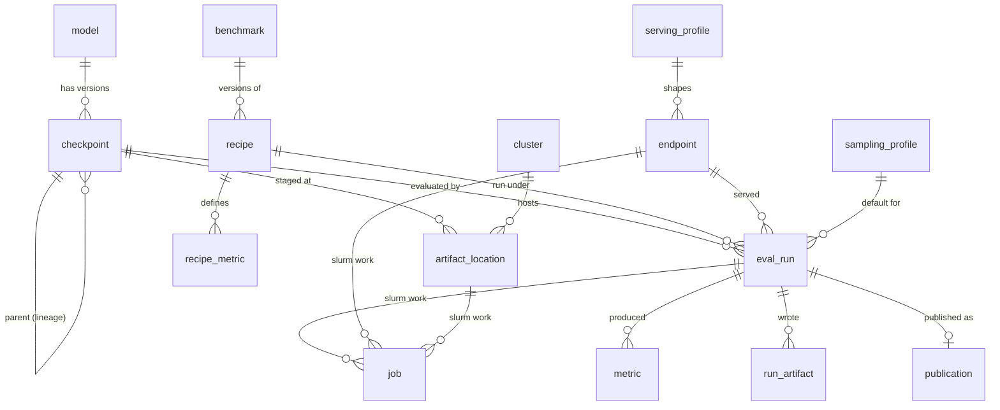
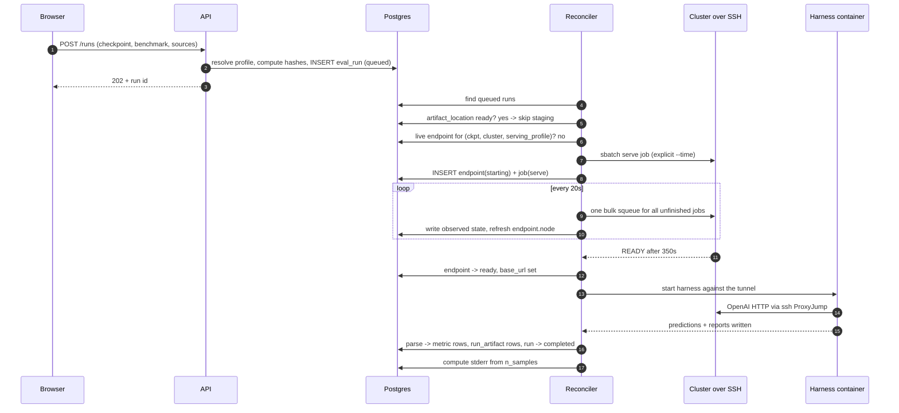

# The Data Model — Postgres, Redis, and How It All Moves

**Date:** Sep 2026
**Companion to:** [`EVAL_SERVICE_PLAN.md`](./EVAL_SERVICE_PLAN.md) · [`CLUSTER_VALIDATION.md`](./CLUSTER_VALIDATION.md) · [`BENCHMARK_UNIFICATION_RESEARCH.md`](./BENCHMARK_UNIFICATION_RESEARCH.md)
**What this is:** Section 10 of the plan was a sketch — table names and column names, no types, no keys, no indexes. This turns it into something you could hand to Alembic on Monday, plus the part the plan doesn't cover at all: what Redis is actually for, and how the pieces move at runtime.

Nothing here changes any code. Where I've deviated from the plan I say so and give the reason. Where I'm guessing, I say that too.

> **The thing to keep in mind while reading.** Our service does not live on the cluster. It runs on its own server somewhere else, and it reaches the cluster over SSH — that's settled in Section 4 of the plan and confirmed by hand in [`CLUSTER_VALIDATION.md`](./CLUSTER_VALIDATION.md). This repo happens to be checked out on the login node right now purely so we could go and look at things. Nothing we build will ever run from there.
>
> That single fact drives most of what follows. Postgres and Redis sit on our own disk, on a normal filesystem, with a normal service manager. Everything we know about the cluster arrived through an SSH pipe that takes somewhere between one and forty-seven seconds to answer and occasionally just dies. So every cluster fact in our database is a **stale copy of something we can't see directly**, and the schema has to be honest about that or we'll spend our lives debugging phantom failures.

---

## Table of contents

1. [The one-paragraph version](#1-the-one-paragraph-version)
2. [The idea that organises everything: declared, derived, observed](#2-the-idea-that-organises-everything-declared-derived-observed)
3. [What we store, and what we deliberately don't](#3-what-we-store-and-what-we-deliberately-dont)
4. [Ground rules before any table](#4-ground-rules-before-any-table)
5. [The schema, table by table](#5-the-schema-table-by-table)
6. [The two hashes, computed exactly](#6-the-two-hashes-computed-exactly)
7. [Metrics are the messy part](#7-metrics-are-the-messy-part)
8. [Redis: what it holds, key by key](#8-redis-what-it-holds-key-by-key)
9. [How a run actually moves](#9-how-a-run-actually-moves)
10. [The reconciler tick, step by step](#10-the-reconciler-tick-step-by-step)
11. [Re-scoring without touching a GPU](#11-re-scoring-without-touching-a-gpu)
12. [Failure, restart, and what survives](#12-failure-restart-and-what-survives)
13. [The leaderboard query, and the indexes it needs](#13-the-leaderboard-query-and-the-indexes-it-needs)
14. [How big does this get](#14-how-big-does-this-get)
15. [Build order](#15-build-order)
16. [Things I'm not sure about](#16-things-im-not-sure-about)

---

## 1. The one-paragraph version

Postgres holds everything that matters and Redis holds nothing that matters. Postgres gets about eighteen tables in three groups — reference data we curate (clusters, frameworks, benchmarks, recipes, profiles), a registry of what exists (models, checkpoints, where their weights are staged), and execution (runs, jobs, endpoints, metrics, artifacts). Redis gets locks, a couple of short-lived caches so the UI never has to wait on an SSH call, a ring buffer of recent log lines, and pub/sub for live updates. Every lock in Redis is backed by a real constraint in Postgres, so if Redis vanishes we waste some work but never corrupt anything. The runtime is a single reconciler loop that wakes up every twenty seconds, asks the cluster one bulk question, writes down what it heard, and nudges each unfinished run one step forward. The database is small enough that none of this needs to be clever — the interesting problems here are all about correctness and honesty, not scale.

---

## 2. The idea that organises everything: declared, derived, observed

If you take one thing from this document, take this. Every column in the schema is one of three kinds, and knowing which kind a column is tells you how to treat it.

**Declared** — somebody told us. A checkpoint's name and parent, a recipe's few-shot count, which team owns a model. This is real truth. It only changes when a human changes it, and it's what we'd cry about losing.

**Derived** — we computed it from declared data. The two hashes, `is_standard`, a confidence interval, a normalized metric value. If we lost it we could recompute it. It's stored because recomputing on every page load is silly, not because it's precious.

**Observed** — the cluster told us, through SSH, at some moment in the past. A job's state, which node an endpoint is on, how many GPU-seconds a run burned. **This is never truth. It's a photograph.** By the time you read it the job may have finished, the node may have been reallocated, and the login node pod may have restarted twice.

Three rules fall straight out of this, and they resolve most of the design questions that would otherwise be arguments:

1. **Every observed column travels with an `observed_at` timestamp.** Not a shared `updated_at` on the row — its own timestamp, because a row can carry declared and observed data side by side and they go stale at completely different rates. If the UI shows a node name that's four minutes old, it should be able to say so.

2. **Only the reconciler writes observed columns.** The API never runs `squeue`. When you click Cancel, the API writes `cancel_requested_at` — an *intent*, which is declared data — and the reconciler is what actually calls `scancel` and later writes down that the job is gone. Two writers racing over "what is the cluster doing" is how you get a run stuck in a state nobody can explain.

3. **Nothing durable lives on the cluster, so the database must be able to rebuild its whole picture from a cold start.** All it needs is the SLURM job IDs, which are declared the moment we submit. Everything else can be re-observed on the next tick. This is what makes deploys and crashes boring.

The plan already says "`endpoint.node` is a cache, not a truth" and the validation doc describes losing an afternoon to a stale hostname. This section is just that lesson, generalised and applied everywhere instead of in one place.

---

## 3. What we store, and what we deliberately don't

**In Postgres:** every checkpoint we know about, every recipe version ever active, every run and what it resolved to, every metric with its sample count, pointers to every artifact, the lineage graph, and an audit trail of who submitted what.

**In Redis:** locks, two short-lived caches, a log ring buffer, and pub/sub channels. That's the whole list.

**On disk or in S3, with only a pointer in Postgres:** predictions, reviews, harness reports, raw logs. These are the only things here that get genuinely big — see [Section 14](#14-how-big-does-this-get) — and putting a 30 MB JSONL blob in a Postgres row would be a mistake we'd be unwinding for years.

**Nowhere, on purpose:** benchmark datasets (Section 8 of the plan — the harness owns them), model weights (Section 7 — they go S3 → cluster and never through us), and any kind of state file on the cluster. The cluster is stateless from our point of view. It runs jobs and holds weights; it doesn't remember anything for us.

Here's the honesty test for the split, and it's a good one: **if you'd ever want to back up Redis, something is in the wrong place.** We should be able to `redis-cli FLUSHALL` on a live system and have the worst consequence be that a few browser tabs stop streaming until they reconnect and one staging job runs twice. If flushing Redis would lose a score, we've made a mistake.

---

## 4. Ground rules before any table

Boring decisions, made once, so nobody has to relitigate them per table.

**Primary keys are `bigint GENERATED ALWAYS AS IDENTITY`.** Not UUIDs. This is an internal service behind SSO with maybe a few hundred thousand rows; sequential integers are smaller, faster to join, and readable in a URL. Anything a human types or refers to — a checkpoint name, a benchmark name, a recipe version — also gets its own unique constraint, so the integer is plumbing and the name is identity.

**Timestamps are `timestamptz`, always, and always UTC.** Never `timestamp`. The cluster is in Portugal, our server may be somewhere else, and the people reading the leaderboard are in a third place. `timestamptz` is the only type that survives that.

**Enums are `text` with a `CHECK` constraint, not Postgres `ENUM` types.** Native enums are genuinely nicer right up until you need to add a value or remove one inside a migration, at which point they become a lock-taking nuisance. A `CHECK` gives us the same protection and changing it is one ordinary `ALTER TABLE`.

**Scores are `double precision`.** They're measurements, not money. `numeric` buys us decimal exactness we have no use for and costs us speed in aggregates.

**JSONB for genuinely shapeless things, real columns for everything you filter or sort on.** `resolved_profile` is JSONB because its keys differ per model family. `profile_hash` is a real indexed column because the leaderboard groups by it on every page load. When in doubt, make it a column — the migration to add one is trivial and the query to filter on a JSONB path is not.

**Naming:** singular table names (`eval_run`, not `eval_runs`), `snake_case`, foreign keys are `<table>_id`. This matches the plan's Section 10 and what's already written into `backend/app/models/base.py`.

**Every table gets `created_at`; anything that changes gets `updated_at`.** Both `NOT NULL DEFAULT now()`. Because those three — `id`, `created_at`, `updated_at` — are on nearly every table and mean the same thing every time, I leave them out of the per-column tables in [Section 5](#5-the-schema-table-by-table) rather than repeating them nineteen times.

**One operational rule that isn't about schema at all but belongs here:** never hold a database transaction open across an SSH call. The validation doc measured `sacct` at 47 seconds and `scontrol show job` at 27. A 47-second open transaction blocks autovacuum and piles up locks for no reason. The pattern is always: open a transaction, read what you need, commit; do the slow thing; open a new transaction and write the result. It sounds obvious and it is exactly the kind of obvious thing that ends up in the code anyway.

---

## 5. The schema, table by table

Nineteen tables in five groups. Each one gets the same treatment: a short note on why the table exists and what it's for, the DDL, a line on every column saying why we need it and what real data looks like in it, and then the design arguments where there are any.

The example values are mostly real. Where I could pull them from the four team repos or from the cluster probe I did — checkpoint names, job IDs, node names, the `0.7412` IFEval score, the `generation_config.json` contents — I used the actual values rather than inventing plausible ones.



### 5.1 Reference data — the stuff we curate

#### `cluster`

This is the address book for the GPU cluster — how to reach it, where to put things, and how much of it we're allowed to take at once. There's exactly one row in it today. It's a table rather than a block of environment variables because the reconciler needs these values per job, the Cluster page needs to display them, and adding a second cluster later should be an insert rather than a refactor.

```sql
CREATE TABLE cluster (
    id                 bigint GENERATED ALWAYS AS IDENTITY PRIMARY KEY,
    name               text        NOT NULL UNIQUE,      -- 'tether-portugal'
    ssh_host           text        NOT NULL,
    ssh_user           text        NOT NULL,
    proxy_jump         text,                             -- login node, for reaching compute nodes
    default_partition  text        NOT NULL DEFAULT 'main',
    model_root         text        NOT NULL,             -- /home/shared/eval-service/models
    log_root           text        NOT NULL,
    rest_url           text,                             -- slurmrestd, if it ever appears
    rest_api_version   text,
    max_serve_jobs     smallint    NOT NULL DEFAULT 4,
    max_stage_jobs     smallint    NOT NULL DEFAULT 2,
    default_walltime_s integer     NOT NULL DEFAULT 7200,
    enabled            boolean     NOT NULL DEFAULT true,
    reachable_at       timestamptz,                      -- observed
    last_error         text,
    created_at         timestamptz NOT NULL DEFAULT now(),
    updated_at         timestamptz NOT NULL DEFAULT now()
);
```

| Column | Why we need it | Example |
|---|---|---|
| `name` | A readable handle for logs and the UI, so nobody has to recognise an IP address. | `tether-portugal` |
| `ssh_host` | Where the connector actually dials. | `login-6` |
| `ssh_user` | The service account we submit as. Its jobs show up in other people's `squeue`, so it should be identifiable. | `eval-service` |
| `proxy_jump` | The login node we hop through to reach a compute node directly. This is what makes tunnels to a vLLM server possible. | `login-6` |
| `default_partition` | Which partition to submit to when nothing overrides it. `main` is the whole cluster. | `main` |
| `model_root` | Where staged weights get written. | `/home/shared/eval-service/models` |
| `log_root` | Where SLURM writes job stdout, so the tailer knows which file to follow. | `/home/shared/eval-service/logs` |
| `rest_url` | `slurmrestd` base URL if it ever gets deployed. Null means "use SSH", which is today. | `null` |
| `rest_api_version` | Each REST API version has a scheduled removal date, so it belongs in config rather than code. | `v0.0.44` |
| `max_serve_jobs` | Our own cap on concurrent GPU jobs, so one runaway sweep can't quietly take forty nodes. | `4` |
| `max_stage_jobs` | Same for staging syncs. They're CPU-only but they hammer a shared NFS mount. | `2` |
| `default_walltime_s` | The `--time` we put on every job. `main` has `MaxTime=UNLIMITED`, so this is the only thing standing between us and a forgotten server. | `7200` |
| `enabled` | Lets us take a cluster out of rotation without deleting its history. | `true` |
| `reachable_at` | **Observed.** Last time an SSH command actually succeeded — drives the health dot on the Cluster page. | `2026-09-03 20:14:02+00` |
| `last_error` | Why the last attempt failed, so the UI can explain rather than just say "unreachable". | `ssh: connect timed out after 30s` |

The one column worth dwelling on is `default_walltime_s`, and specifically the fact that it's `NOT NULL`. `main` has both `MaxTime=UNLIMITED` and `DefaultTime=NONE`, so the cluster will never impose a limit for us. Making the column non-nullable means the schema itself refuses to let us build a job without one — which is the cheapest possible enforcement of the single rule the plan calls non-negotiable, and it costs nothing to add now versus arguing about it after eight H100s have sat idle over a weekend.

The two `max_*_jobs` caps are worth noting for a related reason: `main` isn't a separate pool, it's all 150 nodes, the same hardware the three team partitions use. Nothing preempts anything at equal priority tiers, so we can't be pushed off — but we also can't be stopped from queuing forty jobs and making ourselves very visible in everyone else's `squeue`.

#### `framework`

A framework is one eval harness at one specific version — EvalScope at the commit tool-call pins, lm-evaluation-harness, VLMEvalKit. Each becomes its own container image, because they genuinely can't share a Python environment: tool-call maintains five separate virtualenvs and one-bit-models keeps two conda environments apart because `transformers` 4.x and 5.x can't coexist. We keep these as rows because a score only means something next to the version of the harness that produced it.

```sql
CREATE TABLE framework (
    id            bigint GENERATED ALWAYS AS IDENTITY PRIMARY KEY,
    name          text NOT NULL,          -- 'evalscope' | 'lm-eval-harness' | 'vlmevalkit'
    version       text NOT NULL,
    git_commit    text,                   -- '2ce95c3...' — tool-call pins this
    image         text NOT NULL,          -- registry/evalscope:2ce95c3
    image_digest  text,                   -- sha256:... — this, not the tag, feeds recipe_hash
    result_parser text NOT NULL,          -- 'evalscope_v3' — which adapter reads its output
    notes         text,
    created_at    timestamptz NOT NULL DEFAULT now(),
    UNIQUE (name, version, git_commit)
);
```

| Column | Why we need it | Example |
|---|---|---|
| `name` | Which harness. Determines the whole output shape we have to parse. | `evalscope` |
| `version` | The package version, so a number can be traced back to the code that made it. | `1.2.3` |
| `git_commit` | tool-call pins a commit rather than a release, and so should we — releases lag and the differences matter. | `2ce95c3` |
| `image` | The container we actually run. | `registry.local/evalscope:2ce95c3` |
| `image_digest` | A tag can be repointed at new bytes; a digest can't. This is the value that feeds `recipe_hash`. | `sha256:9f2a1c...` |
| `result_parser` | Names the adapter that reads this harness's output. It's the seam that keeps the rest of the schema framework-agnostic. | `evalscope_v3` |
| `notes` | The awkward corners, which are what make a run fail at 2am. | `needs langdetect + nltk punkt` |

`result_parser` is the seam that keeps the rest of the schema framework-agnostic. Each framework writes results in its own shape — EvalScope's `summary.json` at `schema_version: 3`, lm-eval's `results_*.json`, VLMEvalKit's `scores.csv` — and one small named adapter per framework turns any of them into `metric` rows and `run_artifact` rows. Adding a framework means writing a parser, not migrating a table.

#### `benchmark`

One row per test we can run. This is the column list on the leaderboard and the checklist for "what have we actually verified". It's deliberately separate from `recipe` because a benchmark is the *thing* — "IFEval" — while a recipe is a *version of how we run it* — "IFEval v1". The first is stable for years; the second changes whenever we fix an extraction bug or bump the harness.

```sql
CREATE TABLE benchmark (
    id                bigint GENERATED ALWAYS AS IDENTITY PRIMARY KEY,
    name              text NOT NULL UNIQUE,   -- 'ifeval'
    display_name      text NOT NULL,
    framework_id      bigint NOT NULL REFERENCES framework(id),
    task_name         text NOT NULL,          -- what the harness calls it internally
    modality          text NOT NULL CHECK (modality IN ('text','vision','audio','multimodal')),
    where_it_runs     text NOT NULL DEFAULT 'service'
                           CHECK (where_it_runs IN ('service','cluster')),
    family            text,                   -- 'instruction_following', for track composites
    question_count    integer,                -- 541 for IFEval — drives CIs and dry-run estimates
    typical_gpu_hours numeric(6,2),
    needs_judge       boolean NOT NULL DEFAULT false,
    verified          boolean NOT NULL DEFAULT false,
    created_at        timestamptz NOT NULL DEFAULT now(),
    updated_at        timestamptz NOT NULL DEFAULT now()
);
```

| Column | Why we need it | Example |
|---|---|---|
| `name` | The slug used in URLs, job names and config. | `ifeval`, `gsm8k` |
| `display_name` | What a human reads as a column header. The slug is rarely the nicest label. | `IFEval` |
| `framework_id` | Which harness owns it. When two harnesses can run the same benchmark, this is where we record which one is official. | → the EvalScope row |
| `task_name` | What the harness calls it internally, which isn't always what we call it. | `ifeval` |
| `modality` | Filters the board, and decides whether the benchmark can run on our own server at all. | `text`, `vision` |
| `where_it_runs` | Text benchmarks run in a container on our server; vision ones move gigabytes of images and have to run on the cluster. Per-benchmark, so we never decide it globally. | `service` |
| `family` | Groups benchmarks into tracks, which is what the per-track composite scores are built from. | `instruction_following`, `math` |
| `question_count` | How many questions a full run covers. Feeds the confidence interval and the dry-run GPU estimate. | `541` for IFEval, `1319` for GSM8K |
| `typical_gpu_hours` | What one run usually costs, so the submit page can warn you before you launch forty of them. | `0.06` |
| `needs_judge` | Judge-scored benchmarks cost extra GPU time and add a versioned dependency. Worth knowing before submitting, not after. | `false` for IFEval, `true` for HealthBench |
| `verified` | Has our number been matched against the owning team's number. Only a verified benchmark can produce published rows. | `false` until parity passes |

`question_count` is a small column that earns its place twice: it's what the dry-run preview multiplies to estimate GPU-hours, and it's what the confidence interval is computed from when the harness doesn't tell us the sample count — which, as it turns out, is most of the time.

#### `recipe` — Layer 1, the protocol

This is the official, versioned definition of how one benchmark gets run — the thing that lets us claim two numbers are comparable instead of hoping they are. Every published score points at a row here. The rows are loaded from the reviewed YAML in `standards/`, which stays the source of truth; this table is just the loaded form so the rest of the system can join against it.

```sql
CREATE TABLE recipe (
    id                      bigint GENERATED ALWAYS AS IDENTITY PRIMARY KEY,
    benchmark_id            bigint NOT NULL REFERENCES benchmark(id),
    version                 text   NOT NULL,          -- 'v1'
    status                  text   NOT NULL CHECK (status IN ('draft','active','retired')),
    framework_id            bigint NOT NULL REFERENCES framework(id),

    -- layer 1: the protocol, identical for every model
    dataset_name            text   NOT NULL,
    dataset_revision        text   NOT NULL,          -- pinned, not merely recorded
    split                   text,
    subsets                 text[],
    few_shot                smallint NOT NULL DEFAULT 0,
    exemplars               jsonb,
    prompt_template         text   NOT NULL DEFAULT '',
    extraction              jsonb  NOT NULL,
    repeats                 smallint NOT NULL DEFAULT 1,
    judge_model             text,
    judge_prompt_version    text,

    -- layer 2 defaults: the "benchmark default" source from Section 5 of the plan
    default_sampling        jsonb   NOT NULL,         -- every field present; no nulls allowed
    default_max_tokens      integer NOT NULL,
    default_think_handling  text    NOT NULL
                                    CHECK (default_think_handling IN ('strip','as_is','disallow')),

    -- provenance
    recipe_hash             char(16) NOT NULL,
    source_yaml_sha256      char(64) NOT NULL,        -- makes the YAML loader idempotent
    source_note             text,
    changelog               text,
    verified_against_run_id bigint,
    effective_from          timestamptz NOT NULL DEFAULT now(),
    created_at              timestamptz NOT NULL DEFAULT now(),
    UNIQUE (benchmark_id, version)
);

CREATE UNIQUE INDEX one_active_recipe_per_benchmark
    ON recipe (benchmark_id) WHERE status = 'active';
```

| Column | Why we need it | Example |
|---|---|---|
| `benchmark_id` | Which benchmark this is a recipe for. | → the IFEval row |
| `version` | The label a score carries forever. Old numbers keep their old version rather than being relabelled. | `v1` |
| `status` | Only one recipe per benchmark is active. Drafts can be reviewed before going live; retired ones keep their history readable. | `active` |
| `framework_id` | Pins the harness version, because a harness upgrade can change the number and therefore has to change the recipe. | → EvalScope `2ce95c3` |
| `dataset_name` | Which dataset the questions come from. | `google/IFEval` |
| `dataset_revision` | **Pinned, not just recorded.** Upstream datasets change quietly, and a January score against a June score would be two different exams. | `b1f2c3d` |
| `split` | Which split we score on. Getting this wrong is a silent way to score on the wrong questions. | `train` (IFEval only has one) |
| `subsets` | Which subsets are in scope, for benchmarks that have them. | `{default}`, or `{simple,java,live}` for BFCL |
| `few_shot` | How many in-context examples. This is the GSM8K argument — 4 from the harness, 5–8 by convention — made explicit instead of implicit. | `0` for IFEval, `4` for GSM8K |
| `exemplars` | The actual few-shot examples when they're fixed, so they can't drift between runs. | `null` for zero-shot |
| `prompt_template` | The wrapper around each question. Empty for IFEval **on purpose** — a wrapper could itself violate the instruction being tested, like "respond in all lowercase". | `''` |
| `extraction` | How we pull the answer out of the response. | `{"method":"boxed"}` for GSM8K |
| `repeats` | Samples per question. 1 is fine for GSM8K; a 30-question benchmark needs 8+ or the score is mostly noise. | `1`, or `8` for AIME25 |
| `judge_model` | The grader, where there is one. Versioned here, so a judge upgrade is a new recipe by construction rather than a silent change. | `null`, or `Qwen3.6-27B-FP8` |
| `judge_prompt_version` | The judge's prompt is part of the measurement too, so it gets its own version. | `null` |
| `default_sampling` | The "benchmark default" source from Section 5 of the plan. Every field present, no gaps — a gap is a value the checkpoint fills in for us. | `{"temperature":0.0,"top_p":1.0,"top_k":-1,...}` |
| `default_max_tokens` | The default generation budget. Load-bearing for thinking models, not a minor field — one measured checkpoint spent all 512 tokens thinking and never answered. | `8192` |
| `default_think_handling` | What happens to a `<think>` block before scoring. The default is what the leaderboard shows, so it matters more than the option. | `strip` |
| `recipe_hash` | Lets a run prove it used the protocol it claims to have used, catching config drift. | `a3f9c1d0e2b47856` |
| `source_yaml_sha256` | Makes the YAML loader idempotent and stops it silently overwriting an active recipe. | `4e1f8b...` (64 chars) |
| `source_note` | Where each choice came from — the paper, the harness default, or a decision of ours. This is what makes disagreement a pull request instead of an argument. | `harness default; matches Zhou et al.` |
| `changelog` | What changed from the previous version, and why. | `v2: pinned dataset revision after upstream edit` |
| `verified_against_run_id` | The run whose number we matched to decide this recipe was trustworthy. | `1042` |
| `effective_from` | When this version became the standard, so history reads correctly. | `2026-09-10 00:00+00` |

Two things worth pointing at.

That partial unique index means the database itself guarantees there's exactly one active recipe per benchmark. "Which version is current?" stops being a question you can answer wrongly. Activating `v2` means retiring `v1` in the same transaction, and if you forget, the insert fails instead of quietly producing two competing standards.

`source_yaml_sha256` is what makes loading the standards idempotent. The YAML in `standards/` is the source of truth — the plan is clear about that and it's right, because review should happen in pull requests. On startup the loader reads each file, hashes it, and skips anything whose hash already matches a row. Change a byte, get a new hash, and the loader refuses to silently overwrite an `active` recipe — it makes you create a new version. That's the "we never silently relabel a number" rule, enforced by a checksum rather than by discipline.

`default_sampling` is JSONB, but the loader validates it against a Pydantic model requiring **every** field. No nulls, no partial dicts. This is the schema-level expression of the vLLM finding: any field we leave unset is a field the checkpoint's `generation_config.json` will quietly fill in for us.

#### `recipe_metric`

A benchmark reports more than one number — IFEval alone gives four — and each one needs labelling: what to call it, what scale it's on, whether bigger is better, and which one is the headline. Without this table the leaderboard can't sort a column correctly or decide which of four figures belongs in a cell.

```sql
CREATE TABLE recipe_metric (
    id               bigint GENERATED ALWAYS AS IDENTITY PRIMARY KEY,
    recipe_id        bigint NOT NULL REFERENCES recipe(id) ON DELETE CASCADE,
    name             text   NOT NULL,        -- canonical: 'prompt_level_strict'
    display_name     text   NOT NULL,
    unit             text   NOT NULL
                            CHECK (unit IN ('fraction','percent','count','seconds','edit_distance')),
    higher_is_better boolean NOT NULL DEFAULT true,
    is_primary       boolean NOT NULL DEFAULT false,
    harness_key      text,                   -- 'prompt_level_strict_acc,none' — how to find it
    UNIQUE (recipe_id, name)
);

CREATE UNIQUE INDEX one_primary_metric_per_recipe
    ON recipe_metric (recipe_id) WHERE is_primary;
```

| Column | Why we need it | Example |
|---|---|---|
| `recipe_id` | Metrics belong to a recipe version, not to a benchmark, because a new version can add, drop or rename one. | → IFEval `v1` |
| `name` | The clean canonical name we store and display. | `prompt_level_strict` |
| `display_name` | A readable column header. | `Prompt-level (strict)` |
| `unit` | What scale the harness reports on. This is what reconciles tool-call's `0.7412` with VLMEvalKit's `64.83` for the same kind of quantity. | `fraction`, `percent` |
| `higher_is_better` | **Cannot be derived from anything.** OmniDocBench's `overall_EN` is an edit distance, so lower is better, and getting this wrong flips an entire column without anyone noticing. | `true`, `false` for edit distance |
| `is_primary` | Which of the four numbers goes in the leaderboard cell. | `true` for `prompt_level_strict` |
| `harness_key` | How the parser locates the number in the harness's output, where the real names are ugly and framework-specific. | `prompt_level_strict_acc,none`, `acc:Overall` |

This table isn't in the plan and I'd argue for adding it, for one concrete reason: **not every metric is better when it's bigger.** VLMEvalKit's OmniDocBench reports `overall_EN` as an edit distance, where lower is better. If the leaderboard sorts descending on everything, that column is upside down and nobody notices for a month. `higher_is_better` cannot be derived from anything; somebody has to write it down. Same for `unit`, which is what lets us reconcile tool-call reporting `0.7412` with VLMEvalKit reporting `64.83` for conceptually identical quantities.

`harness_key` is the other half of the framework seam. lm-eval names a metric `exact_match,strict-match` — the filter is baked into the key — and VLMEvalKit uses `acc:Overall`. The parser uses `harness_key` to find the number and `name` to store it, so the ugly names stay at the boundary and never reach the UI.

### 5.2 The two profile tables, and why I split `model_profile` in two

**This is my main deviation from Section 10 of the plan**, so let me make the case properly.

The plan has one `model_profile` table carrying sampling parameters, think handling, chat template, tool parser and reasoning parser together. Those are all Layer 2 things, so grouping them is reasonable on paper. But they behave completely differently at runtime, and tool-call — the only team that's actually built this — keeps them in two separate files for exactly that reason. `configs/families.yaml` holds the serving flags per architecture; `configs/models.yaml` holds named sampling presets like `greedy`, `qwen3_think` and `lfm2_5_think`.

The distinction that matters is **when the value is applied**:

- **Serving settings go on the vLLM command line.** They're fixed for the lifetime of the server. Changing one means a new server, which means six minutes of H100 time.
- **Sampling settings go in the HTTP request body.** They can be different on every single call to the same server.

Once you see it that way, the consequence is immediate and worth real money. **Two runs with completely different sampling can share one model server.** The reuse key for an endpoint is `(checkpoint, cluster, serving_profile)` — sampling is not in it and must not be. The validation doc measured a cold start at 350 seconds of H100 time; if we accidentally key endpoint reuse on the full profile, we pay that again for every sampling variation, which is precisely the exploratory work the three-source design exists to enable.

So — first, the serving side. This holds everything that goes on the vLLM command line and is therefore fixed for the life of one server. It's a table rather than fields on the checkpoint because it follows the model *architecture*: every Qwen3 checkpoint wants the same flags, so writing them once and pointing twenty checkpoints at them is both less typing and less drift. It's also the endpoint reuse key — two runs can share a server only if they'd have launched it identically.

```sql
CREATE TABLE serving_profile (
    id                bigint GENERATED ALWAYS AS IDENTITY PRIMARY KEY,
    name              text NOT NULL UNIQUE,     -- 'qwen3', 'lfm2'
    engine            text NOT NULL DEFAULT 'vllm',
    engine_version    text NOT NULL,            -- '0.19.0'
    vllm_flags        text[] NOT NULL DEFAULT '{}',   -- one argv token per element
    chat_template     text,
    tool_parser       text,
    reasoning_parser  text,
    reasoning_history text CHECK (reasoning_history IN ('think_tag','reasoning_field')),
    tensor_parallel   smallint NOT NULL DEFAULT 1,
    gpus              smallint NOT NULL DEFAULT 1,
    max_model_len     integer,
    gpu_mem_util      numeric(3,2) NOT NULL DEFAULT 0.85,
    notes             text,
    created_at        timestamptz NOT NULL DEFAULT now(),
    updated_at        timestamptz NOT NULL DEFAULT now()
);
```

| Column | Why we need it | Example |
|---|---|---|
| `name` | The family handle, matching tool-call's `families.yaml` keys. | `qwen3`, `lfm2` |
| `engine` | Leaves room for something other than vLLM without a migration. | `vllm` |
| `engine_version` | vLLM removes and renames flags between releases — a removed flag is what killed a server during validation — so the run has to record which version it ran against. | `0.19.0` |
| `vllm_flags` | The extra argv tokens this family needs, one token per element so there's no shell quoting to get wrong. | `{--enable-auto-tool-choice,--tool-call-parser,hermes}` |
| `chat_template` | An explicit template path, for when the checkpoint's own isn't what we want. | `null` |
| `tool_parser` | How vLLM reads tool calls back out of the output. | `hermes`, `qwen3_xml` |
| `reasoning_parser` | How vLLM separates a think block from the actual answer. | `qwen3` |
| `reasoning_history` | Whether the think block comes back inside `content` as a tag or in its own field, which changes how the harness has to read it. | `reasoning_field` |
| `tensor_parallel` | How many GPUs the weights are split across. | `1` for a 4B model |
| `gpus` | What we ask SLURM for, which is what the job actually costs. | `1` |
| `max_model_len` | The context window we serve. Submit-time check: the resolved `max_tokens` plus the prompt has to fit inside this. | `8192` |
| `gpu_mem_util` | vLLM's KV-cache budget. At `0.85` a 4B model used 70.6 GB of the H100's 81.5 GB and got 50× max concurrency. | `0.85` |
| `notes` | Anything odd about serving this family. | `--language-model-only for the VL variant` |

And second, the sampling side — named generation settings, transcribed from tool-call's `sampling:` block. These ride in the HTTP request body, so they can be different on every call to one shared server, which is exactly why they're not in the serving profile. Naming them means `greedy` is one reviewed thing rather than a number retyped in fifteen configs.

```sql
CREATE TABLE sampling_profile (
    id                 bigint GENERATED ALWAYS AS IDENTITY PRIMARY KEY,
    name               text NOT NULL UNIQUE,    -- 'greedy', 'qwen3_think'
    temperature        double precision NOT NULL,
    top_p              double precision NOT NULL,
    top_k              integer          NOT NULL,
    min_p              double precision NOT NULL DEFAULT 0.0,
    presence_penalty   double precision NOT NULL DEFAULT 0.0,
    repetition_penalty double precision NOT NULL DEFAULT 1.0,
    max_tokens         integer          NOT NULL,
    vendor_source_url  text,                    -- where the vendor published this
    notes              text,
    created_at         timestamptz NOT NULL DEFAULT now()
);
```

| Column | Why we need it | Example |
|---|---|---|
| `name` | The handle a user picks in the UI, and the one that appears in a run's provenance. | `greedy`, `qwen3_think` |
| `temperature` | The main knob. `0.0` is greedy — which Qwen explicitly warn causes repetition and degeneration on their thinking models. | `0.0` for `greedy`, `0.6` for `qwen3_think` |
| `top_p` | Nucleus sampling cutoff. | `1.0`, `0.95` |
| `top_k` | Top-k cutoff. `-1` disables it. | `-1`, `20` |
| `min_p` | Minimum probability floor. Rarely used, but it's a real vLLM parameter and leaving it unset means the checkpoint supplies it. | `0.0` |
| `presence_penalty` | Discourages repetition. tool-call's `qwen3_5_think` profile sets this to `1.5`. | `0.0` |
| `repetition_penalty` | Same idea, different formula. Their `lfm2_5_2_6b` profile uses `1.1`. | `1.0` |
| `max_tokens` | The profile's own default budget, still overridable per run since it's an independently chosen Layer 2 setting. | `8192` for `greedy`, `16384` for `qwen3_think` |
| `vendor_source_url` | Where the vendor published these numbers, so the choice is defensible rather than folklore somebody remembers. | `https://qwen.readthedocs.io/...` |
| `notes` | Why this profile exists and when to reach for it, since the name alone doesn't say. | `Qwen's published setting for thinking mode` |

Notice that every sampling column is `NOT NULL`. That's deliberate and it's the same point as before, said in SQL: a null here would become a value supplied by the checkpoint's `generation_config.json`, below the level our config can see. The schema simply doesn't allow us to be vague.

`vllm_flags` as `text[]` with one argv token per element — `['--tool-call-parser', 'qwen3_xml']`, not `['--tool-call-parser qwen3_xml']` — copies tool-call's convention and avoids a whole family of shell-quoting bugs when we build the sbatch script.

Seeding these two tables is mostly transcription: tool-call's seven sampling profiles and five families are already written down, already in production use, and already argued over by people who know those models.

### 5.3 The registry — what exists and where

#### `model` and `checkpoint`

`model` is the family a checkpoint belongs to, so twenty checkpoints of one model group into one thing in the UI instead of twenty unrelated rows. It's thin on purpose — almost everything interesting lives on the checkpoint, and the only job this table has is grouping and ownership.

```sql
CREATE TABLE model (
    id           bigint GENERATED ALWAYS AS IDENTITY PRIMARY KEY,
    name         text NOT NULL UNIQUE,
    owner_team   text NOT NULL,
    modality     text NOT NULL,
    architecture text,
    description  text,
    created_at   timestamptz NOT NULL DEFAULT now(),
    updated_at   timestamptz NOT NULL DEFAULT now()
);
```

| Column | Why we need it | Example |
|---|---|---|
| `name` | The model family name people actually say out loud. | `Qwen3-4B` |
| `owner_team` | Who to ask about it, and the basis for filtering the leaderboard by team. | `tool-call` |
| `modality` | Decides which benchmarks even apply to it. | `text` |
| `architecture` | What vLLM reports on startup, and what picks the serving profile. | `Qwen3ForCausalLM` |
| `description` | Free text for anything worth knowing. | `base model for the ternary experiments` |

`checkpoint` is one row per set of weights we can actually evaluate. This is the registry — what the S3 browser writes into, what the leaderboard's rows are built from, and where the lineage graph lives, since every row points at the checkpoint it came from. Everything else in the system refers to weights through this table rather than by path, which is what makes moving or re-staging them invisible to the rest of the code.

```sql
CREATE TABLE checkpoint (
    id                bigint GENERATED ALWAYS AS IDENTITY PRIMARY KEY,
    model_id          bigint NOT NULL REFERENCES model(id),
    name              text NOT NULL UNIQUE,     -- 'Qwen3-4B-allternary-ep03'
    source            text NOT NULL CHECK (source IN ('s3','cluster_path','hf_hub')),

    s3_bucket         text,
    s3_prefix         text,
    local_path        text,
    hf_repo_id        text,

    param_count       bigint,
    quantization      text,
    dtype             text,
    object_count      integer,
    total_bytes       bigint,
    inventory         jsonb,        -- [{key, size, etag}] — what a staging verify compares to
    generation_config jsonb,        -- the checkpoint's own sampling defaults, read once

    serving_profile_id          bigint REFERENCES serving_profile(id),
    default_sampling_profile_id bigint REFERENCES sampling_profile(id),

    parent_checkpoint_id bigint REFERENCES checkpoint(id),
    lineage_op           text,      -- 'sft' | 'rl' | 'merge' | 'quantize' | 'distill' | 'prune'
    lineage_params       jsonb,
    training_run_url     text,

    owner_team    text,
    registered_by text,
    created_at    timestamptz NOT NULL DEFAULT now(),
    updated_at    timestamptz NOT NULL DEFAULT now(),

    CONSTRAINT s3_needs_location
        CHECK (source <> 's3' OR (s3_bucket IS NOT NULL AND s3_prefix IS NOT NULL)),
    CONSTRAINT path_needs_location
        CHECK (source <> 'cluster_path' OR local_path IS NOT NULL)
);

CREATE INDEX checkpoint_parent   ON checkpoint (parent_checkpoint_id);
CREATE INDEX checkpoint_by_model ON checkpoint (model_id);
```

| Column | Why we need it | Example |
|---|---|---|
| `model_id` | Which model family these weights belong to. | → the `Qwen3-4B` row |
| `name` | The handle everyone uses, matching tool-call's `model_tag`. | `Qwen3-4B-allternary-ep03` |
| `source` | Where the weights come from, which is what decides whether staging is needed at all. | `cluster_path`, `s3` |
| `s3_bucket` | Which bucket to sync from. | `tether-ai-dev` |
| `s3_prefix` | Which prefix under it. | `checkpoints/qwen3-4b/ep03/` |
| `local_path` | The path on the cluster when the weights are already there — which is the Milestone 1 case, no S3 involved. | `/home/shared/agentic_slm/models/Qwen3-4B-allternary-ep03` |
| `hf_repo_id` | For a public baseline we pull from the hub instead. Compute nodes can reach `huggingface.co`, so this works. | `Qwen/Qwen3-4B` |
| `param_count` | The leaderboard's size column, and a sanity check that we staged what we thought. | `4000000000` |
| `quantization` | A real leaderboard dimension — ternary versus bf16 is the entire point of some of these checkpoints. | `ternary`, `null` |
| `dtype` | What it loads as, which affects both memory and the number. | `bfloat16` |
| `object_count` | How many files the checkpoint has, so a staging verify has something to compare against. | `1` |
| `total_bytes` | Same, by size. Also what warns you before a 200 GB sync. | `8040000000` |
| `inventory` | Per-object keys and ETags. This is what lets `ready` mean *verified* rather than "the sync job exited 0". | `[{"key":"model.safetensors","size":8040000000,"etag":"..."}]` |
| `generation_config` | The checkpoint's own sampling defaults, read once at registration. **This is the "from the checkpoint" source** — caching it here turns resolving that source into a dict lookup instead of an SSH round trip. | `{"temperature":0.6,"top_k":20,"top_p":0.95,"max_tokens":32768}` |
| `serving_profile_id` | Which family's serve flags these weights need. | → the `qwen3` row |
| `default_sampling_profile_id` | The sensible sampling preset for this checkpoint, pre-selected in the UI. | → the `greedy` row |
| `parent_checkpoint_id` | The lineage edge. The single most valuable field for the graph, and the one most likely to be left blank. | → the `…-sft-v2` row |
| `lineage_op` | What operation produced this from its parent. | `quantize`, `sft`, `rl`, `merge` |
| `lineage_params` | The key hyperparameters of that step, so clicking an edge in the graph shows a real diff. | `{"steps":600,"dataset":"40k tool traces"}` |
| `training_run_url` | Link back to W&B or wherever the training actually lives. | `https://wandb.ai/...` |
| `owner_team` | Who to ask when a number looks wrong. | `tool-call` |
| `registered_by` | Who put it in, since the lineage they declared is a claim rather than a measurement. | `naresh` |

`generation_config` stored as JSONB at registration time is a small thing that pays off constantly. It's the "from the checkpoint" source from Section 5 of the plan, and caching it here means resolving that source is a dictionary lookup rather than an SSH round trip on a filesystem where reading small files is slow. We read it once, when the checkpoint is registered, and we've already seen exactly what's in it: `{'temperature': 0.6, 'top_k': 20, 'top_p': 0.95, 'max_tokens': 32768}`.

The two `CHECK` constraints stop a half-registered checkpoint existing. An `s3` checkpoint with no prefix is not a thing that should be representable.

`parent_checkpoint_id` is self-referential and nothing in the database stops you creating a cycle. I'd enforce acyclicity in the application at write time — walk up the parents with a depth cap before allowing the insert. A recursive CTE trigger would work too, but for a graph this size the application check is simpler and easier to give a good error message from.

**Where does "thinking mode" live?** Not here, and this took me a while to settle on. For Qwen3, thinking is toggled by a chat template argument passed per request, and the same weights legitimately produce both a thinking and a non-thinking leaderboard row. tool-call models this as two `tag` entries pointing at one directory; one-bit-models has `mode: enable_thinking_false` as a run dimension. If we made it a checkpoint property we'd duplicate the inventory, the staging state and the lineage edges for what is one set of weights. So thinking mode is a **property of the run**, stored on `eval_run` and folded into `profile_hash`. The leaderboard's rows are `(checkpoint, thinking_mode)` pairs, exactly as the plan says, but only one of those two comes from the registry.

The one case that breaks the rule is a model where thinking needs a different *serve* flag rather than a request argument. Then it belongs in the serving profile and it does fragment endpoints. I don't know of one in our fleet today, but it'll show up eventually.

#### `artifact_location` — the thing that makes staging skippable

This table answers exactly one question: are these weights already sitting on this cluster, verified, and safe to serve? Every run asks it before doing anything, and when the answer is yes it skips the entire S3 sync — which is the common case, not the exception, since most evaluation is repeated against a handful of checkpoints. It's separate from `checkpoint` because one checkpoint can be staged on several clusters, each at its own state of readiness.

```sql
CREATE TABLE artifact_location (
    id               bigint GENERATED ALWAYS AS IDENTITY PRIMARY KEY,
    checkpoint_id    bigint NOT NULL REFERENCES checkpoint(id) ON DELETE CASCADE,
    cluster_id       bigint NOT NULL REFERENCES cluster(id),
    path             text NOT NULL,
    state            text NOT NULL
                          CHECK (state IN ('pending','syncing','ready','failed','stale')),
    object_count     integer,          -- verified, not claimed
    total_bytes      bigint,           -- verified, not claimed
    staged_by_job_id bigint,
    verified_at      timestamptz,
    last_error       text,
    created_at       timestamptz NOT NULL DEFAULT now(),
    updated_at       timestamptz NOT NULL DEFAULT now(),
    UNIQUE (checkpoint_id, cluster_id)
);
```

| Column | Why we need it | Example |
|---|---|---|
| `checkpoint_id` | Which weights. | → the `…-allternary-ep03` row |
| `cluster_id` | Which cluster they're staged on. One checkpoint can be on several. | → `tether-portugal` |
| `path` | The directory on the shared filesystem, which the serve job passes to vLLM. | `/home/shared/eval-service/models/42` |
| `state` | The whole point of the table. Only `ready` lets a run skip staging; a cancelled sync leaves `syncing` or `failed` and can never be mistaken for complete. | `ready`, `syncing` |
| `object_count` | What we actually found after syncing, compared against the checkpoint's registered inventory. | `1` |
| `total_bytes` | Same, by size. Together these two are the verification. | `8040000000` |
| `staged_by_job_id` | Which staging job produced this, so a bad sync can be traced to its log. | `285684` |
| `verified_at` | When we last confirmed it matches. A `ready` with no `verified_at` is not actually ready. | `2026-09-03 11:20:00+00` |
| `last_error` | Why the last sync failed, so the UI can explain instead of just showing red. | `aws s3 sync exited 1: connection reset` |

That `UNIQUE (checkpoint_id, cluster_id)` is doing more work than it looks like. The plan says a Redis lock stops two runs racing into the same directory, and it does — but a Redis lock is an optimisation, not a guarantee. Redis can be flushed, a lock can expire mid-sync, the service can be running two replicas by accident. The unique constraint is what actually makes a double-sync impossible: the second inserter gets a constraint violation and backs off. **Redis saves the work; Postgres saves the data.** That pairing shows up again for endpoints and it's the general pattern for every lock in this system.

`state = 'ready'` means verified — object count and total bytes checked against `checkpoint.inventory` — and never merely "the job exited zero". A cancelled sync leaves `syncing` or `failed`. There's also a `stale` state I've added that the plan doesn't have, for the case where somebody re-registers a checkpoint whose S3 inventory has changed: the staged copy is real but no longer matches, so it needs re-syncing rather than being trusted or deleted.

The Milestone 1 checkpoint lands here with no staging job at all. `Qwen3-4B-allternary-ep03` is already on the NFS, so we insert a row with `source = 'cluster_path'`, `state = 'ready'` and a `verified_at` we set ourselves. Same code path, same skip logic, no S3 involved.

#### `s3_listing_cache`

A local copy of what's in the bucket, so the S3 browser page loads instantly instead of making a paginated API call every time somebody clicks into a folder. It's refreshed on a timer rather than on demand, which also means we're not hammering S3 when several people are browsing. This is pure observed data — it's a photograph of the bucket, and the UI should say how old the photograph is.

```sql
CREATE TABLE s3_listing_cache (
    id                    bigint GENERATED ALWAYS AS IDENTITY PRIMARY KEY,
    bucket                text    NOT NULL,
    prefix                text    NOT NULL,
    object_count          integer NOT NULL,
    total_bytes           bigint  NOT NULL,
    last_modified         timestamptz,
    looks_like_checkpoint boolean NOT NULL DEFAULT false,
    is_registered         boolean NOT NULL DEFAULT false,
    refreshed_at          timestamptz NOT NULL DEFAULT now(),
    UNIQUE (bucket, prefix)
);
```

| Column | Why we need it | Example |
|---|---|---|
| `bucket` | Which bucket. | `tether-ai-dev` |
| `prefix` | The folder. Listed with a delimiter so you browse folders rather than a hundred thousand individual keys. | `checkpoints/qwen3-4b/ep03/` |
| `object_count` | How many files are under it, shown in the browser. | `1` |
| `total_bytes` | How big, so the UI can warn you before you kick off a very large sync. | `8040000000` |
| `last_modified` | The newest object under the prefix — this is how you spot a checkpoint that appeared this morning. | `2026-08-26 09:12:00+00` |
| `looks_like_checkpoint` | Has a `config.json` plus at least one `*.safetensors`. Filters the noise so the browser shows candidates rather than everything. | `true` |
| `is_registered` | Whether we already have a `checkpoint` row for this prefix, which is what decides between showing a Register button and a link. | `false` |
| `refreshed_at` | **Observed.** How stale this listing is, displayed so nobody wonders why a new checkpoint isn't showing up. | `2026-09-03 20:00:00+00` |

### 5.4 Execution

#### `run_group` — `config_id` deserves to be a table

A named batch of runs, which in practice means a sweep. You submit fifteen cells at once and then want one page showing all fifteen, one progress bar, one cancel button and one total GPU-hour figure. This is tool-call's `config_id` promoted from a bare string to a row so all of that is a join rather than a `LIKE`.

```sql
CREATE TABLE run_group (
    id           bigint GENERATED ALWAYS AS IDENTITY PRIMARY KEY,
    name         text NOT NULL,         -- 'full-ternary-04b', 'smoke', '20260903'
    description  text,
    submitted_by text NOT NULL,
    team         text,
    is_dry_run   boolean NOT NULL DEFAULT false,
    created_at   timestamptz NOT NULL DEFAULT now(),
    UNIQUE (name)
);
```

| Column | Why we need it | Example |
|---|---|---|
| `name` | The label you'll go looking for three weeks later. tool-call uses either a date or a descriptive name. | `full-ternary-04b`, `smoke`, `20260903` |
| `description` | What you were actually trying to find out, which the name never quite captures. | `ternary vs bf16 across the core suite` |
| `submitted_by` | Who launched the sweep. | `naresh` |
| `team` | For filtering, and eventually for quotas. | `tool-call` |
| `is_dry_run` | A previewed batch that hasn't been submitted. Both medpsy and tool-call default to dry-run for anything touching the cluster, and they're right to. | `true` |

The plan has `config_id` as a bare text column on `eval_run`, borrowed from tool-call. It's worth promoting to a table because a sweep is a real thing people care about — you submit fifteen runs at once, you want one page showing all fifteen, one progress bar, one cancel button, and one total GPU-hour figure. All of that is trivial with a `run_group` and awkward with a string.

#### `eval_run` — the centre of everything

One row per attempt to evaluate one checkpoint on one benchmark with one profile. This is the middle of the whole schema — everything upstream feeds into it and everything downstream hangs off it. It carries three different stories at once, which is why it's the widest table here: what somebody asked for, what actually got sent to the model, and how far the run got.

```sql
CREATE TABLE eval_run (
    id                 bigint GENERATED ALWAYS AS IDENTITY PRIMARY KEY,
    run_group_id       bigint REFERENCES run_group(id),
    checkpoint_id      bigint NOT NULL REFERENCES checkpoint(id),
    benchmark_id       bigint NOT NULL REFERENCES benchmark(id),
    recipe_id          bigint NOT NULL REFERENCES recipe(id),
    cluster_id         bigint REFERENCES cluster(id),
    endpoint_id        bigint REFERENCES endpoint(id),
    serving_profile_id bigint REFERENCES serving_profile(id),

    -- what was asked for (declared)
    sampling_source     text NOT NULL
        CHECK (sampling_source   IN ('benchmark_default','user','checkpoint')),
    think_source        text NOT NULL
        CHECK (think_source      IN ('benchmark_default','user','checkpoint')),
    max_tokens_source   text NOT NULL
        CHECK (max_tokens_source IN ('benchmark_default','user','checkpoint')),
    requested_overrides jsonb,

    -- what actually happened (derived at submit, then frozen)
    resolved_profile jsonb    NOT NULL,   -- the values genuinely sent to the model server
    thinking_mode    text     NOT NULL CHECK (thinking_mode IN ('think','no_think','n_a')),
    recipe_hash      char(16) NOT NULL,
    profile_hash     char(16) NOT NULL,
    seed             integer  NOT NULL DEFAULT 42,
    repeats          smallint NOT NULL DEFAULT 1,

    is_standard  boolean NOT NULL,
    is_smoke     boolean NOT NULL DEFAULT false,
    sample_limit integer,                 -- the harness --limit; null means full run

    -- lifecycle
    status text NOT NULL
        CHECK (status IN ('queued','running','completed','failed','cancelled')),
    phase  text NOT NULL
        CHECK (phase IN ('queued','staging','waiting_endpoint','inference','scoring','done')),
    result_status text CHECK (result_status IN ('ok','partial','error')),
    attempt  smallint NOT NULL DEFAULT 1,
    priority smallint NOT NULL DEFAULT 0,
    cancel_requested_at timestamptz,

    -- re-scoring
    inference_source_run_id bigint REFERENCES eval_run(id),

    -- diagnostics
    truncation_rate double precision,
    error_rate      double precision,
    prompt_count    integer,
    gpu_seconds     integer,               -- observed, from sacct
    error           text,
    error_kind      text,                  -- SERVER_DIED | READINESS_TIMEOUT | HARNESS_ERROR | ...

    submitted_by text,
    team         text,
    queued_at    timestamptz NOT NULL DEFAULT now(),
    started_at   timestamptz,
    finished_at  timestamptz,
    observed_at  timestamptz,
    created_at   timestamptz NOT NULL DEFAULT now(),
    updated_at   timestamptz NOT NULL DEFAULT now()
);
```

**What it's linked to.**

| Column | Why we need it | Example |
|---|---|---|
| `run_group_id` | Which sweep it belongs to. Null for a one-off run. | → `full-ternary-04b` |
| `checkpoint_id` | Which weights were evaluated. | → `…-allternary-ep03` |
| `benchmark_id` | Which test was run. | → `ifeval` |
| `recipe_id` | Which version of the protocol. Frozen here, so retiring the recipe later doesn't rewrite history. | → IFEval `v1` |
| `cluster_id` | Where it ran. Null until it's actually scheduled somewhere. | → `tether-portugal` |
| `endpoint_id` | Which model server answered its requests. This is how we can see reuse actually happening. | → endpoint `17` |
| `serving_profile_id` | How that server was launched, recorded on the run in case the profile is edited afterwards. | → `qwen3` |

**What was asked for.** These four are declared — they're the user's intent, and they're what the UI shows back to them.

| Column | Why we need it | Example |
|---|---|---|
| `sampling_source` | Which of the three sources the user picked for sampling. | `benchmark_default` |
| `think_source` | Same choice, made independently, for think handling. | `benchmark_default` |
| `max_tokens_source` | Same again for the token budget — independently chosen because it's independently load-bearing. | `user` |
| `requested_overrides` | The raw values typed into the UI, kept so we can distinguish "asked for 16k" from "got 16k". | `{"max_tokens":16384}` |

**What actually happened.** Derived at submit time and then frozen. This is the half that decides comparability.

| Column | Why we need it | Example |
|---|---|---|
| `resolved_profile` | The concrete values genuinely sent on every request. The thing `profile_hash` is computed over — not what was requested, so a resolution bug shows up as a hash mismatch rather than a wrong number with the right label. | `{"temperature":0.0,"top_p":1.0,"max_tokens":8192,...}` |
| `thinking_mode` | Think on or off. The same weights with thinking both ways are two leaderboard rows, not one hidden setting. | `no_think` |
| `recipe_hash` | Proves the protocol actually used matches the recipe claimed. | `a3f9c1d0e2b47856` |
| `profile_hash` | **The grouping key.** Two runs may only share a ranking if they share this. Indexed, because the leaderboard filters on it every page load. | `7b21e4a90c3f5d68` |
| `seed` | Recorded so a run is reproducible. Deliberately *not* hashed — two seeds of one config should pool, not split. | `42` |
| `repeats` | Samples per question, copied from the recipe. | `1` |

**How it's classified.**

| Column | Why we need it | Example |
|---|---|---|
| `is_standard` | The leaderboard's main filter: all three sources were `benchmark_default`, no limit, not a smoke run. | `true` |
| `is_smoke` | A deliberate wiring check. Visible in the UI, never a score. | `false` |
| `sample_limit` | The harness `--limit`. `20` for a smoke test, null for a full 541-prompt run. | `null` |

**Where it got to.**

| Column | Why we need it | Example |
|---|---|---|
| `status` | Is this thing alive, and did it work. What a filter dropdown needs. | `running`, `completed` |
| `phase` | Which of the five steps it's on. What the Runs page shows. | `inference` |
| `result_status` | tool-call's third answer: it finished, we have numbers, but not all of them. Collapsing this into pass/fail throws away something people want. | `ok`, `partial` |
| `attempt` | Retries reuse the row and bump this, so one run is one row with one history. | `1` |
| `priority` | Lets an urgent run jump ahead without a separate queue. | `0` |
| `cancel_requested_at` | The API writes *intent* here; the reconciler is what actually calls `scancel`. Two writers of cluster state is how runs get stuck. | `null` |
| `inference_source_run_id` | Set on a re-score, pointing at the run whose predictions were reused. Null for a normal run. | `1042` |

**Diagnostics.** None of these is a score; all of them catch a bad number before anyone acts on it.

| Column | Why we need it | Example |
|---|---|---|
| `truncation_rate` | Fraction of responses that hit `max_tokens`. **Not hypothetical** — the Milestone 1 checkpoint measured 12 out of 12 in a trivial smoke test, meaning the score would have reflected our token budget and nothing else. | `0.0`, or `1.0` on that probe |
| `error_rate` | Fraction of requests that failed or came back empty. EvalScope runs with `ignore_errors: True`, so without this, failures quietly become wrong answers. | `0.0` |
| `prompt_count` | How many prompts were actually sent — the sanity check against `benchmark.question_count`. | `541` |
| `gpu_seconds` | **Observed** from `sacct`: `ElapsedRaw` × the `gres/gpu` count. This is the GPU-hours column on the Cluster page. | `219` |
| `error` | The message, for a human reading the run page. | `vLLM exited 2: unrecognized argument` |
| `error_kind` | The machine-readable version, so retry logic doesn't have to grep prose to tell a bad config from a slow load. | `SERVER_DIED` |

**Who and when.**

| Column | Why we need it | Example |
|---|---|---|
| `submitted_by` | Attribution. We submit jobs to a shared cluster as a service account, so the human has to be recorded somewhere. | `naresh` |
| `team` | Tenancy from day one, even unenforced. Retrofitting this later is a bad week. | `tool-call` |
| `queued_at` | When it was submitted — with `started_at`, this is the queue wait. | `2026-09-03 10:18:00+00` |
| `started_at` | When work actually began. | `2026-09-03 10:24:34+00` |
| `finished_at` | When it ended. Also the tie-break for which run wins a leaderboard cell. | `2026-09-03 10:31:02+00` |
| `observed_at` | **Observed.** When we last heard anything from the cluster about this run. | `2026-09-03 10:30:45+00` |

A few of these need explaining.

**`status` and `phase` are two different questions and both get asked.** `status` is what a filter dropdown needs: is this thing alive, did it work. `phase` is what the Runs page needs: which of the five steps is it on. Deriving one from the other is possible but fiddly and you end up with a giant CASE statement in three places.

**`result_status` is separate from `status`, and this comes straight from tool-call.** Their `summary.json` has `ok | partial | error`, where `partial` means the job completed but produced fewer reports than datasets. That's a genuinely useful third answer: the run finished, we have numbers, but not all of them. Collapsing it into `completed` or `failed` throws away information somebody will want.

**`error_kind` exists because of one specific finding.** The validation doc is emphatic that `SERVER_DIED` and `READINESS_TIMEOUT` mean different things — the first is a bad config to surface immediately, the second might be worth an automatic retry. If they're both just `error` with a message string, the retry logic has to grep prose. A small enum column lets the reconciler decide.

**`is_standard` is narrower than the plan defines it.** The plan says a standard run uses the active recipe *and* the benchmark-default source for all three Layer 2 settings. I'd take "the active recipe" out of the stored flag and leave only the parts that can't change after the fact: all three sources are `benchmark_default`, no `sample_limit`, not a smoke run. Whether the recipe is currently active is a join, not a stored value — because recipes get retired, and a stored flag would silently become a lie the moment `v2` goes active. Same outcome on the leaderboard, one less way to be wrong.

**`inference_source_run_id`** is how re-scoring works, covered in [Section 11](#11-re-scoring-without-touching-a-gpu).

**`seed` is recorded but never hashed.** Two runs differing only in seed *should* be comparable — averaging over seeds is the point of `repeats`. Putting seed in the hash would split them into separate populations, which is exactly backwards.

**Retries reuse the row.** A failed run that's retried increments `attempt` and gets a fresh `job` row; it does not become a second `eval_run`. One row, one history, one thing on the Runs page. Artifacts from a failed attempt are superseded — there's nothing in a failed attempt worth keeping past the log.

#### `job` — every piece of SLURM work

One row per thing we've asked SLURM to do: a staging sync, a model server, or a cluster-side eval. It's separate from `eval_run` because a single run can involve several jobs — stage, then serve, then evaluate — and because the reconciler's entire job is querying this table's unfinished rows and resolving them in one bulk call. This is also the table that makes a service restart survivable: the SLURM job ID is all we need to rebuild the picture.

```sql
CREATE TABLE job (
    id                   bigint GENERATED ALWAYS AS IDENTITY PRIMARY KEY,
    kind                 text NOT NULL CHECK (kind IN ('stage','serve','evaluate')),
    cluster_id           bigint NOT NULL REFERENCES cluster(id),
    slurm_job_id         integer,

    eval_run_id          bigint REFERENCES eval_run(id) ON DELETE CASCADE,
    endpoint_id          bigint REFERENCES endpoint(id) ON DELETE CASCADE,
    artifact_location_id bigint REFERENCES artifact_location(id) ON DELETE CASCADE,

    state text NOT NULL
        CHECK (state IN ('submitting','pending','running','completed',
                         'failed','cancelled','unknown')),
    raw_state       text,          -- exactly what squeue/sacct said, unparsed
    partition       text,
    node_list       text,
    submit_line     text,
    script          text,          -- we keep it; scontrol reports Command=(null)
    stdout_path     text,
    submitted_at    timestamptz,
    started_at      timestamptz,
    finished_at     timestamptz,
    elapsed_seconds integer,
    alloc_tres      text,          -- 'billing=8,cpu=8,gres/gpu=1,mem=64G,node=1'
    exit_code       integer,
    observed_at     timestamptz,
    created_at      timestamptz NOT NULL DEFAULT now(),

    CONSTRAINT job_one_owner CHECK (
        (eval_run_id IS NOT NULL)::int
      + (endpoint_id IS NOT NULL)::int
      + (artifact_location_id IS NOT NULL)::int = 1
    )
);

CREATE UNIQUE INDEX job_slurm_id ON job (cluster_id, slurm_job_id)
    WHERE slurm_job_id IS NOT NULL;
CREATE INDEX job_unfinished ON job (cluster_id, state)
    WHERE state IN ('submitting','pending','running','unknown');
```

| Column | Why we need it | Example |
|---|---|---|
| `kind` | Which of the three sorts of work this is. One table with a `kind` beats three near-identical tables. | `serve`, `stage`, `evaluate` |
| `cluster_id` | Which cluster it went to. | → `tether-portugal` |
| `slurm_job_id` | The handle we poll with. Also the *only* thing needed to re-observe everything after a restart, which is why nothing durable has to live on the cluster. | `285727` |
| `eval_run_id` | Set when `kind = 'evaluate'`. Exactly one of these three owner columns is non-null. | → run `1042` |
| `endpoint_id` | Set when `kind = 'serve'`. | → endpoint `17` |
| `artifact_location_id` | Set when `kind = 'stage'` — the staging job's whole purpose is producing that row. | → location `8` |
| `state` | Our normalized view of what SLURM is doing. | `running`, `completed` |
| `raw_state` | What SLURM *literally* said. When somebody asks why a run failed, the answer should be a quote rather than our paraphrase. | `RUNNING`, `CANCELLED by 1010` |
| `partition` | Which partition it landed in, which matters because `main` is the whole cluster. | `main` |
| `node_list` | Which node(s) were allocated. | `health-35` |
| `submit_line` | The `sbatch` command we issued. SLURM preserves this too, so the two can be compared. | `sbatch --parsable --time=00:25:00 ...` |
| `script` | Our own copy of the script body — necessary because submitting from stdin makes `scontrol show job` report `Command=(null)`. | the full sbatch text |
| `stdout_path` | Which file the tailer follows for live logs. | `/home/shared/eval-service/logs/qe-ifeval-285727.out` |
| `submitted_at` | When we handed it to SLURM. | `2026-09-03 10:18:44+00` |
| `started_at` | When SLURM actually started it. The gap is the queue wait. | `2026-09-03 10:18:44+00` (zero wait, measured) |
| `finished_at` | When it ended. | `2026-09-03 10:27:34+00` |
| `elapsed_seconds` | From `sacct`'s `ElapsedRaw`. Half of the GPU-hour calculation. | `530` |
| `alloc_tres` | The other half — `gres/gpu` is parsed out of this string. | `billing=8,cpu=8,gres/gpu=1,mem=64G,node=1` |
| `exit_code` | What the job returned, which distinguishes a crash from a cancellation. | `0`, `2` |
| `observed_at` | **Observed.** When the last `squeue` or `sacct` told us this. | `2026-09-03 10:27:40+00` |

Three nullable owner columns with a `CHECK` that exactly one is set. It's not beautiful, but the alternatives — a polymorphic `(owner_type, owner_id)` pair with no referential integrity, or three near-identical tables — are both worse. This way the foreign keys are real and cascades work.

`script text` exists because of a specific validation finding: `sbatch` reads from stdin, which is great because nothing has to be written to the cluster first, but the consequence is that `scontrol show job` reports `Command=(null)`. If we want to know what we actually ran — and for a service that submits jobs on other people's behalf, we do — we have to keep our own copy.

`raw_state` alongside `state` is the observed-data principle again. `state` is our normalisation, which is a guess about what SLURM meant. `raw_state` is the string SLURM actually said. When somebody asks why a run is marked failed, the answer should be a quote, not a paraphrase.

`job_unfinished` is a partial index and it's the hottest one in the schema — the reconciler runs that exact query every twenty seconds, forever.

#### `endpoint`

A running model server. It gets its own table rather than being a field on the run because the entire point of splitting inference from scoring is that one server can be reused by several runs — and a cold start was measured at 350 seconds of H100 time, so reuse is worth real money rather than being a tidiness argument. It's also the only place that knows how to actually reach a served model, which is a moving target.

```sql
CREATE TABLE endpoint (
    id                   bigint GENERATED ALWAYS AS IDENTITY PRIMARY KEY,
    checkpoint_id        bigint NOT NULL REFERENCES checkpoint(id),
    cluster_id           bigint NOT NULL REFERENCES cluster(id),
    serving_profile_id   bigint NOT NULL REFERENCES serving_profile(id),
    artifact_location_id bigint REFERENCES artifact_location(id),

    state text NOT NULL
        CHECK (state IN ('requested','starting','ready','draining','stopped','failed')),
    served_name text NOT NULL,
    base_url    text,
    node        text,            -- observed. a cache. never trust it.
    port        integer,
    gpus        smallint NOT NULL,
    node_observed_at timestamptz,

    ready_at         timestamptz,
    last_used_at     timestamptz,
    walltime_seconds integer NOT NULL,
    expires_at       timestamptz,
    failure_kind     text,
    created_at       timestamptz NOT NULL DEFAULT now(),
    updated_at       timestamptz NOT NULL DEFAULT now()
);

CREATE UNIQUE INDEX one_live_endpoint_per_target
    ON endpoint (checkpoint_id, cluster_id, serving_profile_id)
    WHERE state IN ('requested','starting','ready');
```

| Column | Why we need it | Example |
|---|---|---|
| `checkpoint_id` | Which weights are loaded. Part of the reuse key. | → `…-allternary-ep03` |
| `cluster_id` | Which cluster it's running on. Part of the reuse key. | → `tether-portugal` |
| `serving_profile_id` | How it was launched. **The third part of the reuse key** — a run can share this server only if all three match. | → `qwen3` |
| `artifact_location_id` | Which staged copy it's actually serving, so a re-sync can't silently change what's loaded under a running server. | → location `8` |
| `state` | Whether it's usable yet. Only `ready` can accept a run. | `ready`, `starting` |
| `served_name` | The name vLLM answers to, which the readiness poll greps `/v1/models` for. | `Qwen3-4B-allternary-ep03` |
| `base_url` | Where the harness sends requests. Everything above this layer is indifferent to how the route was built. | `http://localhost:19001/v1` |
| `node` | **Observed, and a cache.** Refreshed from `squeue` every tick and never trusted — a stale hostname fails with a connection reset that looks exactly like a dead server. | `health-35` |
| `port` | Derived from the job ID as `8000 + (job_id % 250) * 8`, which is tool-call's scheme for stopping two jobs colliding on one node. | `9816` |
| `gpus` | How many GPUs it's holding. This is what makes an idle endpoint expensive rather than merely untidy. | `1` |
| `node_observed_at` | The age of *the node name specifically*, which is what decides whether a tunnel is safe to open. The row's `updated_at` changes for too many other reasons. | `2026-09-03 20:15:00+00` |
| `ready_at` | When `/v1/models` first answered. Also the cold-start measurement, which came out at 350s. | `2026-09-03 10:24:34+00` |
| `last_used_at` | When a run last hit it. The basis for the deferred idle sweeper, and useful on the Endpoints page today. | `2026-09-03 10:31:02+00` |
| `walltime_seconds` | The `--time` we asked SLURM for. Not nullable, because `main` won't impose one for us. | `1500` |
| `expires_at` | `ready_at + walltime_seconds`, so the page can say "this dies in 41 minutes". One column instead of a reaper. | `2026-09-03 10:49:34+00` |
| `failure_kind` | `SERVER_DIED` versus `READINESS_TIMEOUT` — a bad config to surface now versus a slow load that might be worth retrying. | `SERVER_DIED` |

The partial unique index is the database's half of the endpoint lock — same belt-and-braces arrangement as `artifact_location`. Note again what's in the key: checkpoint, cluster, serving profile. **Not sampling, not think handling, not max tokens.** Those all ride in the request body, so one server happily serves a standard run and three exploratory runs with different temperatures at the same time. That's where the 350-seconds-per-load saving actually comes from.

`node` carries its own `node_observed_at` rather than relying on the row's `updated_at`, because the row gets updated for lots of reasons and the age of *the node name specifically* is what determines whether it's safe to open a tunnel to it.

`expires_at` is computed from `ready_at + walltime_seconds`. Automatic reaping is deferred per the plan, so the Endpoints page plus a manual kill button is the whole defence — and a page that can say "this dies in 41 minutes" is a much better page than one that can't. One column, no machinery.

### 5.5 Results

#### `metric`

One row per number a run produced. Rows rather than columns, because every benchmark reports something different — IFEval gives four numbers, BFCL gives around twenty-five once you count subsets — so adding a benchmark never needs a migration. This is also where the error bars come from, which is the part almost nobody does and the reason this table has more columns than you'd expect for storing a float.

```sql
CREATE TABLE metric (
    id               bigint GENERATED ALWAYS AS IDENTITY PRIMARY KEY,
    eval_run_id      bigint NOT NULL REFERENCES eval_run(id) ON DELETE CASCADE,
    name             text NOT NULL,               -- canonical
    subset           text NOT NULL DEFAULT 'all', -- sentinel, never null
    value            double precision NOT NULL,   -- normalized (fractions are 0..1)
    value_raw        double precision NOT NULL,   -- exactly what the harness printed
    unit             text NOT NULL,
    higher_is_better boolean NOT NULL DEFAULT true,
    stderr           double precision,
    stderr_source    text CHECK (stderr_source IN ('harness','computed')),
    n_samples        integer,
    is_primary       boolean NOT NULL DEFAULT false,
    UNIQUE (eval_run_id, name, subset)
);

CREATE INDEX metric_primary_lookup
    ON metric (eval_run_id) WHERE is_primary;
```

| Column | Why we need it | Example |
|---|---|---|
| `eval_run_id` | Which run produced this number. | → run `1042` |
| `name` | The clean canonical name, matching a `recipe_metric` row. | `prompt_level_strict` |
| `subset` | Which slice of the benchmark, or `all` for the whole thing. A sentinel string rather than null, so the unique index actually stops duplicates. | `all`, `simple`, `live` |
| `value` | **Normalized** — a fraction is always 0–1. This is what the UI reads and sorts on, so every benchmark is on a consistent scale. | `0.7412` |
| `value_raw` | Exactly what the harness printed, so we can always prove what it said rather than what we made of it. | `0.7412` from EvalScope, `64.83` from VLMEvalKit |
| `unit` | What `value_raw` was in, which is how we knew what to divide by. | `fraction`, `percent` |
| `higher_is_better` | Copied from the recipe so a sort doesn't need a join, and so an edit-distance column isn't silently upside down. | `true` |
| `stderr` | The error bar. At n=541 and p≈0.74 this works out to about 0.019, which is ±3.7 points at 95% — enough to make a three-point gap meaningless. | `0.0188` |
| `stderr_source` | Whether the harness vouched for this or we derived it. Today nobody vouches for it, so it's honest to say so. | `computed` |
| `n_samples` | How many questions the number rests on. Without it there's no interval at all, and `0.65` at n=20 looks like a regression against `0.74` at n=541 when they're the same measurement. | `541` |
| `is_primary` | Which of the several numbers goes in the leaderboard cell. | `true` |

`subset` defaults to the string `'all'` rather than being nullable, and that's not fussiness. Postgres treats NULLs as distinct in unique indexes, so a nullable `subset` would let you insert the same `(run, metric)` pair as many times as you like. A sentinel string closes that hole and works on every Postgres version.

Everything else in this table is [Section 7](#7-metrics-are-the-messy-part).

#### `run_artifact`

A pointer to a file the run produced. The files themselves — predictions, reviews, harness reports, logs — are far too big to sit in Postgres, so the row holds a URI and the bytes live on disk or in object storage. The `predictions` kind is the one that really matters: it's what makes re-scoring possible without touching a GPU, which is the difference between a scoring fix costing minutes and costing a GPU-week.

```sql
CREATE TABLE run_artifact (
    id          bigint GENERATED ALWAYS AS IDENTITY PRIMARY KEY,
    eval_run_id bigint NOT NULL REFERENCES eval_run(id) ON DELETE CASCADE,
    kind        text NOT NULL
                     CHECK (kind IN ('predictions','reviews','report','log','summary','config')),
    uri         text NOT NULL,        -- file:// | nfs:// | s3://
    format      text,                 -- 'jsonl' | 'json' | 'xlsx' | 'csv'
    size_bytes  bigint,
    row_count   integer,
    sha256      char(64),
    expires_at  timestamptz,          -- retention; null means keep forever
    created_at  timestamptz NOT NULL DEFAULT now(),
    UNIQUE (eval_run_id, kind, uri)
);
```

| Column | Why we need it | Example |
|---|---|---|
| `eval_run_id` | Which run wrote the file. | → run `1042` |
| `kind` | What sort of file it is. `predictions` has to be findable without guessing at filenames, because re-scoring depends on locating it. | `predictions`, `log`, `summary` |
| `uri` | Where the bytes are, with a scheme — because artifacts genuinely live in three different places depending on where the benchmark ran. | `file:///data/runs/1042/predictions.jsonl` |
| `format` | How to read it. The four harnesses between them emit JSONL, JSON, CSV and xlsx. | `jsonl`, `xlsx` |
| `size_bytes` | For the retention job, and for warning somebody before they download 30 MB of think blocks. | `32100000` |
| `row_count` | The fallback source of `n_samples`, and a cheap completeness check against `prompt_count`. | `541` |
| `sha256` | Proves the file hasn't changed underneath us between the original run and a later re-score. | `8c1f3e...` |
| `expires_at` | Retention. Null for published standard runs, `+30 days` for exploratory ones. **A prediction we deleted is a re-score we can't do.** | `2026-10-03 00:00+00` |

The `kind` enum matters more than it looks, because `predictions` is the one that makes re-scoring possible and it needs to be findable without guessing at filenames.

The URI carries a scheme because artifacts genuinely live in three places. Text benchmarks run in a container on our own server, so predictions land on our disk as `file://`. Vision benchmarks run on the cluster, so theirs land on the NFS as `nfs://`. Long-term retention pushes both to `s3://`. One column, no special cases.

`expires_at` implements the plan's retention policy directly: null for published standard runs, `now() + 30 days` for exploratory ones. A nightly job deletes expired blobs and nulls the URI, keeping the row so the history stays honest about what used to exist.

#### `publication`

The record of a number we've officially put on the board. Publishing is a deliberate act, kept separate from a run merely completing, because a completed run can still be wrong — 100% truncation, a bad error rate, a benchmark we haven't verified against the owning team yet. This table is also the audit trail of what we claimed and when, which matters the first time somebody asks why last month's figure was different.

```sql
CREATE TABLE publication (
    id            bigint GENERATED ALWAYS AS IDENTITY PRIMARY KEY,
    eval_run_id   bigint NOT NULL REFERENCES eval_run(id),
    checkpoint_id bigint NOT NULL REFERENCES checkpoint(id),   -- denormalized for the index
    benchmark_id  bigint NOT NULL REFERENCES benchmark(id),
    thinking_mode text   NOT NULL,
    recipe_id     bigint NOT NULL REFERENCES recipe(id),
    published_by  text   NOT NULL,
    published_at  timestamptz NOT NULL DEFAULT now(),
    superseded_by bigint REFERENCES publication(id),
    note          text
);

CREATE UNIQUE INDEX one_live_publication
    ON publication (checkpoint_id, thinking_mode, benchmark_id, recipe_id)
    WHERE superseded_by IS NULL;
```

| Column | Why we need it | Example |
|---|---|---|
| `eval_run_id` | The run whose number is being published. | → run `1042` |
| `checkpoint_id` | Copied from the run so the database can enforce one live number per cell as a real constraint. | → `…-allternary-ep03` |
| `benchmark_id` | Same reason — part of what identifies a leaderboard cell. | → `ifeval` |
| `thinking_mode` | Same again. Think-on and think-off are separate cells, so both can be published at once. | `no_think` |
| `recipe_id` | Same again. A new recipe version gets its own publication rather than overwriting the old one. | → IFEval `v1` |
| `published_by` | Who signed off. Publishing is a judgement, so it has an author. | `naresh` |
| `published_at` | When we started claiming this. | `2026-09-11 09:00:00+00` |
| `superseded_by` | Points at the publication that replaced this one. Nothing is ever deleted, so the history of our claims stays intact. | `null` for the live one |
| `note` | Why, when it isn't obvious from the run. | `re-published after v2 fixed extraction` |

Three columns here are copied from the run they point at, which is denormalization and normally I'd resist it. It's justified because it's the only way to express "there is at most one live published number per checkpoint, mode, benchmark and recipe version" as a database constraint rather than as application code somebody will eventually get wrong. Publishing a new number sets `superseded_by` on the old row in the same transaction. Nothing is ever deleted, so the history of what we claimed and when is fully intact.

#### `audit_event`

An append-only log of who did what. We hold an SSH key that submits jobs to a shared cluster under a service account, which means from the cluster's point of view every job we run looks like it came from us rather than from a person. "Which human caused this job" needs an answer that doesn't depend on someone still having the application logs.

```sql
CREATE TABLE audit_event (
    id           bigint GENERATED ALWAYS AS IDENTITY PRIMARY KEY,
    at           timestamptz NOT NULL DEFAULT now(),
    actor        text NOT NULL,
    action       text NOT NULL,     -- 'run.submit' | 'checkpoint.register' | 'endpoint.kill'
    subject_type text,
    subject_id   bigint,
    detail       jsonb
);

CREATE INDEX audit_recent ON audit_event (at DESC);
```

| Column | Why we need it | Example |
|---|---|---|
| `at` | When it happened. Indexed descending, because every query on this table is "what happened recently". | `2026-09-03 20:31:00+00` |
| `actor` | The human or system that did it. The reconciler acts on its own too, and that should be distinguishable from a person. | `naresh`, `reconciler` |
| `action` | What they did, as a dotted verb so it's greppable and groupable. | `run.submit`, `endpoint.kill` |
| `subject_type` | What kind of thing it was done to. | `eval_run`, `checkpoint` |
| `subject_id` | Which one. Deliberately not a foreign key — the log should outlive the row it describes. | `1042` |
| `detail` | The payload, for anything a later question might need that we didn't think to make a column. | `{"benchmark":"ifeval","profile_hash":"7b21..."}` |

Challenge 6 in the plan asks for an audit log of every submission, on the grounds that we're holding an SSH key that submits jobs as a service account. One table, append-only, written from the controller layer. Cheap now, impossible to backfill later.

---

## 6. The two hashes, computed exactly

The plan leans on `recipe_hash` and `profile_hash` heavily — they decide which numbers may share a ranking — but never says how they're computed. That's a gap worth closing precisely, because a hash whose definition drifts is worse than no hash at all: it looks authoritative while silently splitting or merging populations.

**The rule for both:** serialise a specific dictionary to canonical JSON, take SHA-256, keep the first 16 hex characters.

Canonical JSON means: keys sorted, no whitespace, UTF-8, and **floats rounded to six decimal places before serialising**. That last one is not pedantry. `0.1 + 0.2` serialises differently from `0.3` and you would get two hashes for one configuration, discover it three months later, and have no idea how long it had been happening.

### `recipe_hash` — is this the protocol it claims to be

```json
{
  "benchmark": "ifeval",
  "recipe_version": "v1",
  "framework": {"name": "evalscope", "image_digest": "sha256:..."},
  "dataset": {"name": "google/IFEval", "revision": "b1f2c3d"},
  "split": "train",
  "subsets": ["default"],
  "few_shot": 0,
  "exemplars": null,
  "prompt_template": "",
  "extraction": {"method": "none"},
  "metrics": ["inst_level_loose", "inst_level_strict",
              "prompt_level_loose", "prompt_level_strict"],
  "primary_metric": "prompt_level_strict",
  "repeats": 1,
  "judge": null
}
```

The framework's **image digest** is in there, not its tag. A tag can be repointed at new bytes; a digest can't. The consequence is real and worth stating plainly: rebuilding the harness image changes the hash, which forces a new recipe version, which means the old numbers keep their old label and the new ones get a new one. That's noisier than pinning a tag, and it's the correct behaviour — the plan classifies a framework upgrade as inference-affecting, and this is what enforcing that looks like.

### `profile_hash` — may these two numbers sit in the same ranking

```json
{
  "recipe_hash": "a3f9c1d0e2b47856",
  "sampling": {
    "temperature": 0.0, "top_p": 1.0, "top_k": -1, "min_p": 0.0,
    "presence_penalty": 0.0, "repetition_penalty": 1.0
  },
  "max_tokens": 8192,
  "think_handling": "strip",
  "thinking_mode": "no_think"
}
```

Computed over **resolved** values — what actually went into the request bodies — never over what the user asked for. That's the whole design: a bug in resolution shows up as a hash mismatch rather than as a wrong number wearing the right label. `max_tokens` is lifted out of the sampling dict and given its own key because it's a Layer 2 setting with its own independently chosen source.

### What's deliberately excluded, and why

| Excluded | Reason |
|---|---|
| `seed` | Two seeds of the same config *should* be poolable. That's what `repeats` is for. |
| `eval_batch_size`, `max_num_seqs` | Including them would fragment the board over a setting nobody chose deliberately. |
| GPU count, tensor parallel | Same, and it would make the same recipe hash differently on different hardware. |
| `sample_limit` | A limited run is exploratory by definition and never reaches the board. |

The batch-size exclusion is the uncomfortable one and it should be written down rather than glossed over. vLLM is not bit-identical across batch sizes even at temperature zero, so two runs sharing a `profile_hash` can genuinely differ in the last decimal place. We're declaring that difference to be within tolerance. That's consistent with what the plan already says about parity checking — compare against the confidence interval, not the third decimal — but it is a judgement call and somebody should be able to find it stated explicitly.

**Both hashes are computed once, at submit time for `profile_hash` and at recipe load time for `recipe_hash`, then frozen on the row.** Never recomputed on read. If the hashing code changes, old rows keep their old hashes and that's correct — they record what was true when the run happened.

### A real resolved profile — which also answers an open question

While checking the reference IFEval number I found the run's own config snapshot, and it happens to answer question 4 in the plan's Section 18: *"What profile produced the reference number on IFEval?"* The plan flags that as blocking the Milestone 1 parity check, so it's worth recording here. From job `270187`, the full 541-prompt run scoring `0.7412`:

| Setting | Value |
|---|---|
| `temperature` | `0.0` — greedy |
| `max_tokens` | `8192` |
| `reasoning_history` | `none` |
| **`enable_thinking`** | **`false`** |
| `reasoning_parser` | `qwen3` |
| `tool_call_parser` | `hermes` |
| `seed` / `repeats` / `limit` | `42` / `1` / `null` |

The important line is `enable_thinking: false`. **The team ran this thinking model with thinking switched off**, which is why they got a real score rather than the zero that Section 3.3 of the validation doc predicts for a model that spends its whole budget inside a `<think>` block. They also did *not* use the checkpoint's own `generation_config.json` — that file says temperature 0.6, top_k 20, top_p 0.95, max_tokens 32768, and none of those values appear here.

Two things follow. First, the Milestone 1 parity run should reproduce **this** profile — `no_think`, greedy, 8192 tokens — before varying anything, otherwise it isn't a parity check. Second, this is a neat confirmation of the modelling choice in [Section 5.3](#53-the-registry--what-exists-and-where): thinking on or off was a per-run setting for the same weights, not a property of the checkpoint. So it belongs on `eval_run.thinking_mode` and inside `profile_hash`, exactly where I've put it, and the same weights with thinking on would correctly land in a different hash and a different leaderboard row.

Note also that this profile is nearly the plan's `greedy` sampling preset. Whether greedy is the right *default* for a thinking model is a separate argument — Qwen explicitly warn against it — and it's still the open question 3 that needs a human.

---

## 7. Metrics are the messy part

Everything above is reasonably tidy. This is where the four teams' realities collide, and it's the part of the schema most likely to be quietly wrong for a year.

Here is what the four harnesses actually produce for what is, conceptually, the same kind of thing:

| Team | Where | What a number looks like | Scale |
|---|---|---|---|
| tool-call | `summary.json` v3 | `"prompt_level_strict": 0.7412` | 0–1 |
| VLMEvalKit | `scores.csv` | `MMStar, 64.83, acc:Overall` | 0–100 |
| one-bit-models | `summary_*.json` | `"exact_match,strict-match": 0.52` | 0–1 |
| VLMEvalKit | OmniDocBench | `overall_EN` edit distance | lower is better |

Four problems in one small table.

**Scale.** `0.7412` and `64.83` are the same kind of quantity written two ways. If both land in one column the leaderboard is nonsense. So `metric` stores both: `value` is normalized — a fraction is always 0–1 — and `value_raw` is exactly what the harness printed. The UI reads `value`; a human debugging a parser reads `value_raw`. Storing only the normalized number means you can never prove what the harness said, and storing only the raw one means every query has to know the unit.

**Direction.** Edit distance is better when it's smaller. Nothing in the number tells you that. It has to be declared in the recipe, which is why `recipe_metric.higher_is_better` exists, and it gets copied onto the metric row so a leaderboard query doesn't have to join back to figure out which way to sort.

**Compound names.** lm-eval calls a metric `exact_match,strict-match` — the extraction filter is welded into the key — and VLMEvalKit uses `acc:Overall`. Those strings should never reach a user. `recipe_metric.harness_key` is how the parser finds the number; `metric.name` is the clean canonical name we display.

**Standard error, which nobody produces.** I went looking specifically for this. EvalScope emits none. VLMEvalKit's `scores.csv` has none. one-bit-models is the only one that gets close — its `aggregate.md` has a stderr column from lm-eval — and even that never reaches its leaderboard rows.

So the error bars the plan wants on every cell are **ours to compute**. To compute them we need the sample count, and the good news is that the sample count is more available than I expected. EvalScope's `raw` block carries `num` at both the metric and the subset level. From the real reference run:

```json
"prompt_level_strict:mean": {
  "score": 0.7412, "num": 541, "aggregation": "mean",
  "subsets": [{"name": "default", "score": 0.7412, "num": 541}]
}
```

That's exactly what `n_samples` needs, at exactly the granularity `metric` stores. So the fallback chain is:

1. **From the harness.** EvalScope's `raw.<dataset>.metrics.<name>.num`, per subset. BFCL's `subgroups.n` gives the same thing in a different shape (`{"simple": 400, "java": 100}`).
2. From `benchmark.question_count` × `repeats`, when the run wasn't limited.
3. By counting rows in the predictions artifact.

In practice step 1 should cover every EvalScope benchmark, which is all of Milestone 1 and 2. Then `stderr = sqrt(p(1-p)/n)` for proportions, with `stderr_source = 'computed'` so a reader can tell a number the harness vouched for from one we derived. Where `n` can't be established at all, both stay null and the UI shows the score without an interval rather than inventing one.

This matters more than it sounds. IFEval at n=541 has a 95% interval of roughly ±4 points. Two models three points apart are indistinguishable, and without the interval on screen somebody will make a decision on that gap this quarter.

**A concrete illustration of why smoke runs aren't scores.** The plan's Milestone 1 reference is `prompt_level_strict = 0.65` at `limit 20`. There's a full 541-prompt run of the same checkpoint in the tool-call results tree reporting `0.7412`. Those aren't in conflict — at n=20 the interval is roughly ±21 points, so `0.65` and `0.74` are the same measurement. But if both rows land on a leaderboard without their `n_samples`, they look like a regression. This is the schema earning its keep before we've run anything.

---

## 8. Redis: what it holds, key by key

The plan says Redis is for "queue, locks, live updates" and that losing it should cost us nothing durable. Here's that made specific. Everything is prefixed `evalsvc:` so a shared Redis stays legible.

| Key | Type | TTL | What it's for |
|---|---|---|---|
| `lock:reconciler` | string (token) | 45s, renewed each tick | Leader election. Only one process ticks, even if the API runs several replicas. |
| `lock:stage:{cluster}:{ckpt}` | string (token) | 30m, renewed | One staging sync per checkpoint. Backed by `artifact_location`'s unique constraint. |
| `lock:endpoint:{cluster}:{ckpt}:{sprofile}` | string (token) | 20m, renewed | One serve job per target. Backed by the partial unique index on `endpoint`. |
| `lock:standards` | string (token) | 60s | One YAML loader on startup. |
| `lease:scoring:{run_id}` | string | 90s, renewed every 30s | Proof a harness container is still alive. See below. |
| `cache:squeue:{cluster}` | string (JSON) | 30s | The bulk poll result. **Every UI read comes from here; the API never runs `squeue`.** |
| `cache:sinfo:{cluster}` | string (JSON) | 120s | Idle nodes and queue depth for the Cluster page. |
| `logtail:{run_id}` | list, capped 500 | 24h | Recent log lines, so a page renders instantly. |
| `events:run:{run_id}` | pub/sub | — | SSE channel for one run's state changes. |
| `events:runs` | pub/sub | — | Firehose for the Runs page. |
| `events:log:{run_id}` | pub/sub | — | Live log lines as they arrive. |
| `idem:{key}` | string → run_id | 24h | Double-click protection on submit. |

### Locks

Standard pattern, no library needed: `SET key <random-token> NX PX <ttl>` to acquire, and a two-line Lua script that deletes only if the token still matches to release. Renewal is the same comparison followed by `PEXPIRE`.

This is not Redlock and it isn't trying to be. A single Redis means a single point of failure for locking, and I want to be straightforward about that rather than pretend otherwise. It's acceptable here for one reason: **every lock is backed by a database constraint.** If a lock is lost or expires early, two staging jobs might start and the second one's insert fails on `UNIQUE (checkpoint_id, cluster_id)`. We waste a sync. We don't corrupt a directory. The lock is there to save GPU-minutes and NFS bandwidth, not to protect correctness — correctness is Postgres's job, and it doesn't delegate.

The `lock:reconciler` one deserves a note. Right now there's one backend container and this is arguably unnecessary. It's three lines and it means the day somebody scales the deployment to two replicas, we don't get two reconcilers submitting duplicate serve jobs and racing each other's state writes. Cheap insurance against a change nobody will think to check for.

### `lease:scoring:{run_id}` — the one genuinely load-bearing Redis key

This is the piece I'd have missed if I hadn't walked through the restart case, and it's the answer to a real hole.

When a run reaches the `scoring` phase, a harness container is running on our server. Suppose the backend restarts. The reconciler comes back, looks at the database, sees `phase = 'scoring'`, and has no way to tell whether that container is still going or died with the old process. There's no SLURM job to ask about — the harness runs on our side, not the cluster's.

So the supervisor task holds a lease: `SET lease:scoring:{run_id} <token> PX 90000`, renewed every 30 seconds while the container lives. The reconciler's rule is then simple — a run in `scoring` with no lease is orphaned, so requeue the scoring step. Recovery is safe because the harnesses are all designed for it: EvalScope's `--use-cache` reuses existing predictions, and VLMEvalKit's whole recovery story is "run the same command again". We pay for the part that didn't finish.

This is the one case where losing Redis costs something real, and even then the cost is bounded: every lease disappears at once, the reconciler concludes every scoring run is orphaned, and it restarts them. Wasteful, self-correcting, and nothing is lost.

### The caches, and why they matter more than usual

`cache:squeue:{cluster}` is the one that changes how the system feels. SLURM control commands were measured at anywhere from 974 milliseconds to 47 seconds. If the Runs page ran its own `squeue`, page loads would be a lottery and ten open tabs would be ten concurrent SSH commands against a login node already sitting at load average 17.

Instead the reconciler does one bulk `squeue` per tick, covering every unfinished job, and writes the parsed result here. Every read path — the Runs page, the Cluster page, the API — reads this key. Page loads become instant and the SSH call rate is fixed at one per twenty seconds regardless of how many people are watching. The 30-second TTL is slightly longer than the tick so a slow tick shows slightly stale data instead of nothing.

### Log tailing

Logs are files on the NFS, and reading them is `ssh cat`. That works, but the filesystem is slow enough that `find -maxdepth 4` took 47 seconds during validation, so re-reading a log on every page load is not a plan.

Instead, for runs in `inference` or `scoring`, a tailer holds `tail -f` over SSH. Each line does two things: `LPUSH` into `logtail:{run_id}` followed by `LTRIM` to 500 entries, and `PUBLISH` to `events:log:{run_id}`. Opening the page reads the list for instant history, then subscribes for anything new. When the run finishes, the full log is copied once into a `run_artifact` and the Redis list is left to expire.

### Live updates, and the one ordering rule

Server-Sent Events, per the plan. Browser opens `GET /api/v1/runs/{id}/events`; the handler sends current state straight from Postgres first, then subscribes to `events:run:{id}`. Sending current state first closes the gap between page load and first event — otherwise a run that changes nothing for two minutes looks broken.

The rule that matters: **publish after commit, never before.** If the reconciler publishes "this run is now scoring" and then the transaction rolls back, every connected browser is showing a state the database doesn't have, and refreshing makes it go backwards. Commit first, publish second, accept that a crash in between means a missed event — which is harmless, because the next tick re-derives everything anyway.

### Two things I'd keep out of Redis for now

**The job queue.** The plan allows Postgres `SELECT … FOR UPDATE SKIP LOCKED` as the queue for a long while, and I'd go further: for the MVP there's no queue at all. The reconciler *is* the scheduler. "Queued" is a status column and admission control is a policy check against `cluster.max_serve_jobs` inside the tick. Adding ARQ or Dramatiq becomes worthwhile when we have work that isn't cluster-shaped — re-scoring fifty runs at once is the obvious candidate — and not before.

**An SSH concurrency semaphore.** Limiting concurrent SSH commands is genuinely necessary, but while there's one reconciler process an in-process `asyncio.Semaphore` does it with no network round trip and no failure mode. It only needs to move to Redis if we ever run more than one.

---

## 9. How a run actually moves

Concretely, using Milestone 1: IFEval against `Qwen3-4B-allternary-ep03`, which is already on the NFS.



Step by step, in terms of rows.

**Submit.** The controller resolves the three Layer 2 sources into concrete values. `benchmark_default` reads `recipe.default_*`; `checkpoint` reads the cached `checkpoint.generation_config`; `user` takes what came in the request. It builds `resolved_profile` with every field populated, computes `profile_hash`, sets `is_standard`, and inserts one `eval_run` at `status='queued'`, `phase='queued'`. Nothing touches the cluster. The response is immediate.

Two checks are worth doing right here, at submit, where the error message can still be useful: that the recipe is `active`, and that `resolved max_tokens` fits inside `serving_profile.max_model_len` with room for the prompt. The second one catches a class of failure that otherwise surfaces six minutes later as a confusing runtime error.

**Staging, or skipping it.** The reconciler looks for an `artifact_location` for this checkpoint and cluster in state `ready`. For Milestone 1 there is one, inserted at registration, so the run goes straight to `waiting_endpoint`. If there weren't, it would take `lock:stage:…`, submit a CPU-only sync job, and move to `phase='staging'`.

**Endpoint.** It looks for a live `endpoint` on `(checkpoint, cluster, serving_profile)`. If one is `ready`, the run attaches to it and skips six minutes of H100 time. If not, it takes `lock:endpoint:…`, submits the serve job with an explicit `--time`, and inserts `endpoint(state='starting')` plus `job(kind='serve')`.

The serve script carries the liveness check from the validation doc — `kill -0` on the vLLM process inside the readiness loop — so a crash on a bad flag exits in seconds with `SERVER_DIED` instead of holding a GPU for the full 900-second timeout. It launches with `--generation-config vllm` so the checkpoint's own defaults are never applied implicitly, and the port comes from `8000 + (job_id % 250) * 8`, which is tool-call's scheme and already known to avoid collisions.

**Inference and scoring.** Once `/v1/models` answers with the served name, the endpoint goes `ready`, `base_url` is filled in, and the harness container starts with every sampling field set explicitly on every request. The lease starts renewing. The run moves to `inference`, then `scoring`.

**Ingest.** The framework's parser reads the harness output and writes `metric` rows and `run_artifact` rows in one transaction, along with `truncation_rate` and `error_rate`, then `stderr` for each metric where `n_samples` is known. The run becomes `completed` with a `result_status` of `ok`, `partial` or `error`.

**Publish.** A separate, deliberate action, gated on: standard run, active recipe, truncation and error rates under threshold, `result_status = 'ok'`. Publishing inserts a `publication` row and supersedes any previous one for the same checkpoint, mode, benchmark and recipe version.

---

## 10. The reconciler tick, step by step

Every twenty seconds. The whole runtime is this loop.

1. **Acquire or renew `lock:reconciler`.** No lock, no tick.
2. **Read all unfinished jobs** — that's the `job_unfinished` partial index — grouped by cluster. Short transaction, then commit before doing anything slow.
3. **One `squeue`** per cluster, listing every unfinished job ID, with a 60-second timeout. If it times out, **log it and skip the tick.** Do not mark anything failed. A slow call is not a failed call — that's the single most important line in this section, and it comes directly from measuring `sacct` at 47 seconds.
4. **One `sacct`** for job IDs that have vanished from `squeue`, to pick up the terminal state, `ElapsedRaw` and `AllocTRES`. GPU-seconds is elapsed × the `gres/gpu` count parsed out of `AllocTRES`.
5. **Write observed state** in a fresh transaction: `job.state`, `job.raw_state`, `job.observed_at`, and for serve jobs `endpoint.node` and `endpoint.node_observed_at` refreshed from what `squeue` just said — never from what the row already held.
6. **Advance phases.** For each unfinished run, apply the transition rules. This includes the orphan check: `phase = 'scoring'` with no `lease:scoring:{id}` means requeue.
7. **Start newly unblocked work** — staging syncs, serve jobs, harness containers — each behind its lock, each respecting `max_serve_jobs` and `max_stage_jobs`.
8. **Handle cancellations.** Any run with `cancel_requested_at` set and no terminal state gets `scancel`, its container killed, and `status='cancelled'`.
9. **Write `cache:squeue:{cluster}`** so the UI reads fresh data without an SSH call.
10. **Publish events** for everything that changed, after the commit.

Two properties make this safe, and they're worth stating as properties rather than leaving implicit.

**The tick is idempotent.** Running it twice in a row changes nothing the second time. Every decision is derived from database state plus a fresh observation, never from anything held in memory between ticks.

**The tick holds no state.** If it dies at step 6, the next one starts from step 1 and reaches the same conclusions. This is why deploys are boring: the SSH connection drops, the login node pod restarts, we reconnect, nothing is lost. And it's why nothing durable lives on the cluster — everything we need to rebuild the picture is a SLURM job ID we wrote down at submit.

---

## 11. Re-scoring without touching a GPU

The plan's state diagram has a self-loop — `scoring → scoring` — for re-scoring stored predictions under a new recipe version. It's one of the most valuable things here, because it turns a scoring-only fix from a GPU-week into a few minutes. But it raises a schema question the plan doesn't answer: if you re-score a run, where do the new metrics go? Overwriting the old ones breaks "old scores keep their old version label", and that's a rule we don't get to break.

**A re-score creates a new `eval_run` row.** It points at the new `recipe_id`, sets `inference_source_run_id` to the run whose predictions it reused, and carries `gpu_seconds = 0` because it burned none.

Three reasons this is the right shape rather than a `scoring_pass` table:

- **The harnesses already work this way.** EvalScope's `--use-cache RUN_DIR` produces a *new* run directory that reuses the old predictions. tool-call's `resummarize` rewrites a summary from cached reports. The precedent is established and battle-tested.
- **Nothing downstream changes.** Metrics still hang off a run. The leaderboard query is untouched. Compare view works. Publishing works.
- **The lineage is explicit and queryable.** "Show me every score derived from this inference run" is one `WHERE`.

The cost is a duplicated row of run metadata, which is a few hundred bytes. That's a good trade for not inventing a second place metrics can live.

The mechanics: find every completed run whose `recipe_id` is the version being superseded and which has a `run_artifact` of kind `predictions` that hasn't expired; for each, create the new run, feed the predictions to the harness in score-only mode, write new metrics. This is the first genuinely good reason to add a task queue, since it's a lot of CPU work that has nothing to do with the cluster.

And it's the argument for the retention policy being generous by default. **A prediction we deleted is a re-score we can't do.** Keep them indefinitely for published standard runs; thirty days is plenty for exploratory ones.

---

## 12. Failure, restart, and what survives

Walking the failure cases is the fastest way to check whether a data model is actually sound.

| What breaks | What happens | What's lost |
|---|---|---|
| Backend process restarts | Next tick re-reads the DB, re-observes via `squeue`, carries on | Nothing. In-flight SSH calls are retried. |
| SSH connection drops | Next tick reconnects. Cold connect costs 16s. | Nothing. |
| Login node pod is evicted | Same as above — it's just a dropped connection | Nothing. Jobs keep running; they don't live on the login node. |
| Tunnel dies mid-run | Connector reconnects; the harness sees a transient HTTP error and retries | Nothing, if the harness retries. Otherwise the run fails and retries. |
| `squeue` times out | Tick is skipped. Nothing is marked failed. | 20 seconds of freshness. |
| Redis is flushed | Locks vanish, leases vanish, caches vanish | Some duplicate work. Scoring runs get restarted. **No data.** |
| Postgres is lost | Everything | Everything. This is the thing to back up. |
| Harness container dies | Lease expires within 90s; reconciler requeues scoring | Partial predictions, which the harness cache mostly recovers. |
| Serve job crashes on a bad flag | Liveness check exits in seconds with `SERVER_DIED` | Seconds of GPU, not the 10m46s that was actually measured. |
| Somebody `scancel`s our job by hand | Next tick sees it gone, `sacct` says CANCELLED, run fails cleanly | Nothing beyond the run. |

The pattern is that only the Postgres row matters. Everything else is either re-observable or re-doable. That's the payoff for putting nothing durable on the cluster and nothing important in Redis.

Backups follow from that directly. Nightly `pg_dump`, plus WAL archiving if we care about point-in-time recovery, which for an internal service we probably don't at first. Redis needs no backup at all — and if anyone ever proposes backing it up, that's a useful signal that something durable has drifted into the wrong place.

---

## 13. The leaderboard query, and the indexes it needs

The leaderboard is the front page and it runs on every visit, so it's worth designing the index for it rather than discovering the need later.

The question is: for each `(checkpoint, thinking_mode)` row and each benchmark column, which single run's primary metric do we show? The rule:

1. The live published run, if there is one.
2. Otherwise the most recent completed standard run under the active recipe with the selected `profile_hash`.

Written as Postgres, the second half is a `DISTINCT ON`:

```sql
SELECT DISTINCT ON (r.checkpoint_id, r.thinking_mode, r.benchmark_id)
       r.checkpoint_id, r.thinking_mode, r.benchmark_id,
       m.value, m.stderr, m.n_samples, m.higher_is_better,
       r.finished_at, rc.version AS recipe_version
FROM   eval_run r
JOIN   recipe   rc ON rc.id = r.recipe_id AND rc.status = 'active'
JOIN   metric   m  ON m.eval_run_id = r.id AND m.is_primary
WHERE  r.status       = 'completed'
  AND  r.result_status = 'ok'
  AND  r.is_standard
  AND  r.profile_hash = $1
ORDER  BY r.checkpoint_id, r.thinking_mode, r.benchmark_id, r.finished_at DESC;
```

Which wants:

```sql
CREATE INDEX eval_run_leaderboard
    ON eval_run (profile_hash, checkpoint_id, thinking_mode, benchmark_id, finished_at DESC)
    WHERE status = 'completed' AND is_standard;
```

A partial index, because the leaderboard only ever looks at completed standard runs and those are a minority of rows. `profile_hash` leads because it's the equality predicate and the grouping key the whole design turns on.

Three more that earn their place:

```sql
CREATE INDEX eval_run_active   ON eval_run (status, phase)
    WHERE status IN ('queued','running');          -- the Runs page and the reconciler
CREATE INDEX eval_run_by_ckpt  ON eval_run (checkpoint_id, finished_at DESC);
                                                    -- checkpoint detail page
CREATE INDEX metric_by_name    ON metric (name, value);
                                                    -- cross-benchmark analysis
```

**No materialized view.** At the sizes in the next section a plain query with these indexes is a few milliseconds, and a materialized view brings a refresh strategy, a staleness window and a class of "why is the board wrong" bug we don't need. If the board ever does get slow, a 60-second Redis cache is the next step and it's a much smaller commitment.

---

## 14. How big does this get

Worth doing the arithmetic, because it changes what's worth worrying about.

**Rows.** Say 150 checkpoints, 20 benchmarks, three profile variants each, re-run a few times a year. That's roughly 20,000 `eval_run` rows a year. Each produces somewhere between 4 metrics (IFEval) and 25 (BFCL, with its per-subset breakdown), so call it 400,000 `metric` rows a year. `job` is two or three per run. Everything else is smaller.

**Postgres will be a few gigabytes after several years, most of it JSONB.** This is a small database. It fits in RAM on a modest server. No partitioning, no sharding, no read replicas, no materialized views. The interesting problems here are all about correctness, and none of them are about scale — which is worth saying out loud, because it's easy to reach for machinery that solves a problem we don't have.

**Predictions are the one thing that gets genuinely large, and it's not close.** A thinking model that emits 16,000 tokens of reasoning per answer produces roughly 60 KB of text per prompt. IFEval's 541 prompts is around 32 MB for one run. Twenty thousand runs a year is on the order of 600 GB, and vision benchmarks are worse. So:

- Predictions never go in Postgres. `run_artifact` holds a pointer.
- `expires_at` is not optional. Published standard runs keep theirs forever because re-scoring depends on it; exploratory runs get thirty days.
- Object storage is the right home long term, with local disk fine for the MVP.

That's a real cost with a real policy attached, and it's the only place in this design where storage needs thinking about at all.

---

## 15. Build order

Mapped onto the plan's milestones. Eight tables get Milestone 0 and 1 working end to end.

**Milestone 0 — importer and a read-only leaderboard.**
`cluster`, `framework`, `benchmark`, `recipe`, `recipe_metric`, `model`, `checkpoint`, `eval_run`, `metric`.
No Redis needed at all. The importer reads existing `summary.json` files from the tool-call results tree and writes `eval_run` + `metric` rows with `is_standard = false` and a legacy label. This is where we find out whether the schema survives contact with real data — and it's real data, since those files are `schema_version: 3` with a stable shape.

One warning from the validation doc: don't write that importer as a naive recursive scan. `find -maxdepth 4` took 47 seconds and a recursive `grep` never returned. The results tree has a known shape — `<bench>/<model_tag>/<config_id>/latest/summary.json` — so glob that exact pattern with a bounded depth and a hard timeout.

**Milestone 1 — one benchmark, end to end.**
Add `serving_profile`, `sampling_profile`, `artifact_location`, `endpoint`, `job`, `run_artifact`, `run_group`.
Redis arrives here: `lock:reconciler`, `lock:endpoint:*`, `lease:scoring:*`, `cache:squeue:*`, `logtail:*` and the three pub/sub channels. This is the full loop for `Qwen3-4B-allternary-ep03` on IFEval.

**Milestone 2 — S3, a second benchmark, publishing.**
Add `s3_listing_cache`, `publication`, `audit_event`, and `lock:stage:*`. Nothing structural changes; these slot into the existing shape.

**Milestone 3 and beyond.**
A task queue when re-scoring at volume needs one. Nothing in this schema needs to change for it.

Alembic from the first commit, one migration per logical change, and every migration reviewed for whether it locks a table — which at these sizes almost nothing will, but the habit is worth having before it matters.

---

## 16. Things I'm not sure about

Listing these honestly rather than burying them, in roughly the order I'd want them settled.

**Splitting `model_profile` into two tables is a change to the plan, and I could be wrong about it.** The argument in [Section 5.2](#52-the-two-profile-tables-and-why-i-split-model_profile-in-two) is sound — serving settings are per-server and sampling settings are per-request, so they belong to different lifetimes — and it directly increases endpoint reuse, which the validation numbers price at 350 seconds of H100 per avoided load. But it's two tables where the plan has one, and whoever owns Section 5 should agree before it's built.

**`n_samples` is confirmed available for EvalScope but not for the other two frameworks.** I checked a real report and EvalScope's `raw` block carries `num` per metric and per subset, so error bars are straightforwardly computable for everything in Milestone 1 and 2. What I haven't verified is the VLMEvalKit and lm-eval paths — VLMEvalKit's `scores.csv` is three columns with no count in sight, so its sample counts will have to come from `benchmark.question_count` or from counting prediction rows. That's fine, just slower, and it means the vision benchmarks in wave 6 may reach the board without intervals until someone does that work.

**Whether `error_kind` should be a fixed enum or free text.** I've written it as free text with a suggested vocabulary. A `CHECK` constraint would be tidier and would stop it drifting into fifty near-identical strings, but I don't yet know the full set of failure modes, and guessing at it now means a migration every time we find a new one. I'd leave it loose for the MVP and tighten it once we've seen a few hundred real failures.

**The framework image digest in `recipe_hash` is correct and might be too strict in practice.** Every image rebuild forces a new recipe version. That's what "a framework upgrade is inference-affecting" means, so it's the honest behaviour — but if we rebuild images often for unrelated reasons, like a base-image security patch, we'll be minting recipe versions that change nothing about the evaluation. A possible refinement is hashing only the harness's own pinned commit rather than the whole image, and accepting that the surrounding environment isn't captured. I don't have a strong view; it depends how we end up building images.

**Retention numbers are guesses.** Thirty days for exploratory predictions is a plausible-sounding number I made up. The real answer depends on how often people actually go back to an exploratory run, which we won't know until the thing has been in use for a few months.

**Two questions genuinely need a human, and neither is technical.** Question 3 in the plan's Section 18 — what the default think handling is — determines what `recipe.default_think_handling` gets seeded with for every benchmark, and there's no defensible default until somebody decides. And the plan's Section 18 question about who signs off on a standard determines whether `recipe.status = 'active'` is something one person can set or something a review process produces. The schema supports either; the process doesn't exist yet.

---

*Table shapes build on Section 10 of [`EVAL_SERVICE_PLAN.md`](./EVAL_SERVICE_PLAN.md), with deviations marked where they occur. Everything about the cluster — command latencies, NFS throughput, cold-start timings, the crashed-server GPU burn, the `generation_config.json` override — is measured, not assumed, and comes from [`CLUSTER_VALIDATION.md`](./CLUSTER_VALIDATION.md).*

*Harness data shapes come from reading the four team repos in this workspace rather than from the research doc. The `summary.json` fields, the `raw` block with its per-subset `num`, and the resolved profile in [Section 6](#a-real-resolved-profile--which-also-answers-an-open-question) were all read directly out of `simple_eval/results/ifeval/Qwen3-4B-allternary-ep03/full-ternary-04b/run-270187/summary.json` in the tool-call repo, along with its `configs/*.yaml` and `slurm/run_cell.sbatch`. VLMEvalKit contributed `scores.csv`, `status.json` at `schema_version: 1.0`, `scripts/collect_board.py` and `vlmeval/utils/endpoint_pool.py`; one-bit-models contributed `leaderboard.jsonl` and `scripts/grade_think_aware.py`. `qvac-research-medpsy` only has a placeholder branch checked out here, so its details are carried over from the research doc rather than read directly, and `qvac-visionpsy-nano` turns out to be inference-only — its evaluation runs through VLMEvalKit.*

*The claim that none of the four harnesses emits a standard error is from searching all of them for it and finding nothing, which is the whole reason [Section 7](#7-metrics-are-the-messy-part) is as long as it is. Sizing figures are arithmetic on stated assumptions, not measurements. Everything in [Section 16](#16-things-im-not-sure-about) is there because I couldn't check it, not because it seemed less important.*
