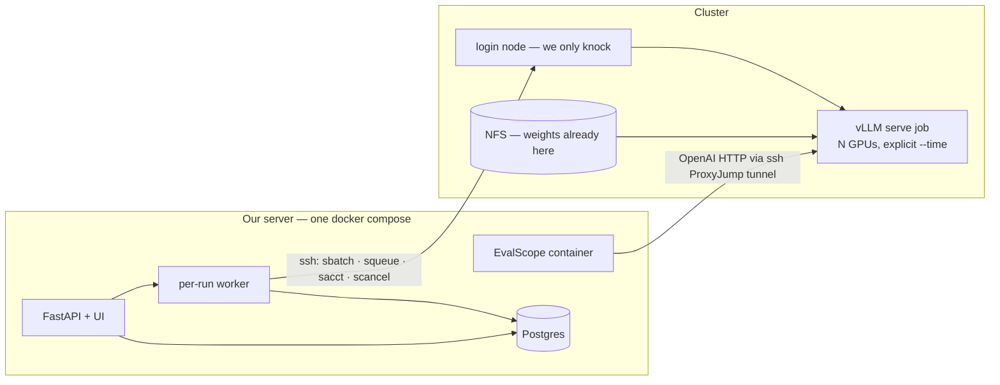
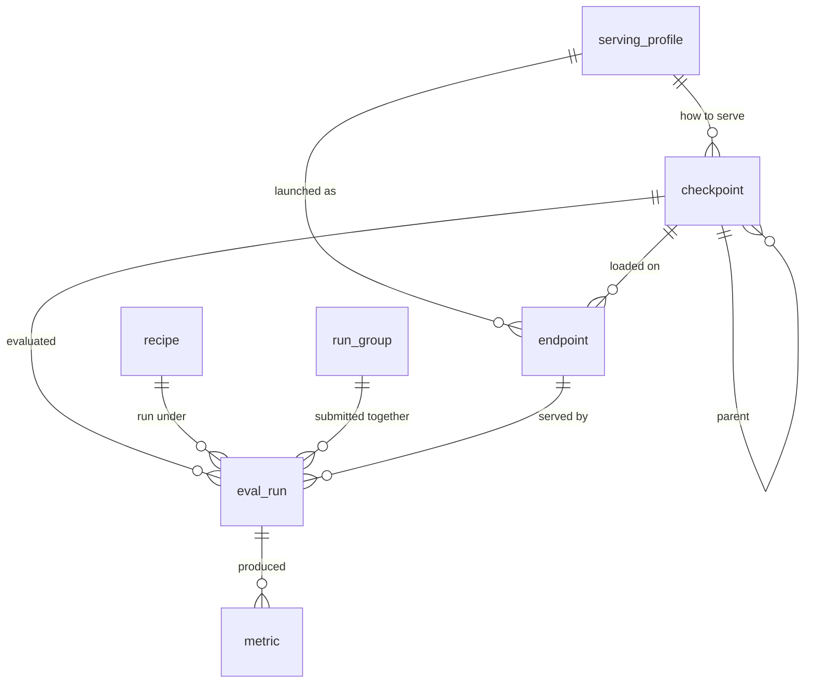

# Data Model — Version 1

**Date:** Sep 2026
**Status:** **This is the schema to build.** The original [`DATA_MODEL.md`](./DATA_MODEL.md) is deferred to a later version — see the banner at the top of it.
**Why it looks like this:** [`V1_SIMPLIFICATION.md`](./V1_SIMPLIFICATION.md) has the reasoning for every cut. This doc is just the reference: seven tables, the hash rule, how a run moves, and what we consciously left out.

Seven tables. No Redis. No reconciler. No S3. No cluster table. Everything a v1 run needs and nothing else.

---

## 1. Where things run

**Nothing of ours runs on the login node.** The service lives entirely on its own server — API, per-run worker, harness container, Postgres, UI — and reaches the cluster over SSH. This is the architecture in Section 4 of [`EVAL_SERVICE_PLAN.md`](./EVAL_SERVICE_PLAN.md), unchanged. One server, one `docker compose up`, one place to look when something breaks.

We considered running on the login node to cut latency. I checked it by hand rather than argue from the earlier write-up, and it doesn't hold up. Recording the findings here so nobody has to re-derive them:

| Checked on `login-4`, 8 Sep | Finding | Why it rules the login node out |
|---|---|---|
| Docker daemon | **Absent.** No `/var/run/docker.sock`. No podman, apptainer or singularity either | No containers. The plan's one-image-per-framework strategy dies, and so does the existing `docker-compose.yml`. |
| `/` and `$HOME` | NFSv3, `hard`, `local_lock=none` | Not somewhere to keep a database. |
| `/tmp` | Local ext4, 1.6 TB free — but a Kubernetes **`emptyDir`** | Correct locking and fsync, so Postgres would *work*, but it's wiped if the pod is rescheduled. |
| Postgres itself | Not installed, and no root to install it | Would need `pip install pgserver` or a hand-built tarball. |
| PID 1 | `sshd` — no service manager | Nothing restarts our process if it dies. |
| Pod identity | `kubepods-burstable.slice`, 51 days uptime | Evictable. Rare in practice, but the failure is "everything vanishes". |

The one finding worth keeping, because it changes how worried we should be about SSH:

> **The SLURM daemons are fast.** `squeue`, `sinfo` and `sacct` all return in **0.05–0.15 s** when run locally, repeatably. So the 27 s and 47 s recorded in [`CLUSTER_VALIDATION.md`](./CLUSTER_VALIDATION.md) were SSH connect time plus a login node at load average 17 — not slow scheduler daemons. With a pooled connection, expect roughly a second or two typical, with occasional spikes when the login node is busy.

That still means generous timeouts and one bulk `squeue` rather than a call per job, but it makes the SSH path far less painful than the original numbers suggested.

### The shape



So the SSH connector comes back, behind the six-method interface the plan specifies — `submit`, `status`, `cancel`, `logs`, `stage_file`, `open_tunnel` — with `asyncssh`, pooled connections, and keepalives on tunnels. All six were exercised by hand during validation, so this is known-good ground rather than new work. Two details from that exercise are load-bearing: **a cold SSH connect costs 16 seconds and a reused one about 1**, so pooling is not an optimisation; and **a tunnel died unprompted between two commands**, so every forward needs `ServerAliveInterval`, `TCPKeepAlive`, `ExitOnForwardFailure=yes` and a reconnect path.

**Where our server sits is worth asking about now.** The cluster is in Portugal. A request from Bangkok to a model server there measured **410 ms**; from inside the cluster it's **6–7 ms**. Across 541 IFEval prompts that's the difference between minutes and seconds of pure latency. Concurrency hides most of it — one tunnel comfortably carried 12 parallel requests at ~1,360 tokens/sec — and the plan deliberately parks this, which is fine. But if there's a choice of where the box lives, closer is materially better and it costs nothing to ask.

---

## 2. Ground rules

Carried over from the original doc, because they were right and they're free.

- Primary keys are `bigint GENERATED ALWAYS AS IDENTITY`. Anything a human types gets its own `UNIQUE`.
- Timestamps are `timestamptz`, always, always UTC.
- Enums are `text` with a `CHECK`, not Postgres `ENUM` types — changing a `CHECK` is one ordinary `ALTER TABLE`.
- Scores are `double precision`. They're measurements, not money.
- Real columns for anything you filter or sort on. `JSONB` only for things that genuinely have no fixed shape.
- Singular table names, `snake_case`, foreign keys are `<table>_id`.
- Alembic from the first migration, one migration per logical change.

And one operational rule that isn't about schema but belongs here: **never hold a database transaction open across an SSH call.** Even at a second or two per call, an open transaction blocks autovacuum and piles up locks for no reason. The pattern is always: open a transaction, read what you need, commit; do the slow thing; open a new transaction and write the result.

---

## 3. The seven tables

In dependency order, which is also migration order.



### 3.1 `serving_profile`

How to launch vLLM for a family of weights. It's a table rather than columns on `checkpoint` because it's the endpoint reuse key, and copying a flag list per checkpoint is how flag lists drift apart.

```sql
CREATE TABLE serving_profile (
    id             bigint GENERATED ALWAYS AS IDENTITY PRIMARY KEY,
    name           text   NOT NULL UNIQUE,          -- 'qwen3'
    vllm_flags     text[] NOT NULL DEFAULT '{}',    -- one argv token per element
    gpus           smallint NOT NULL DEFAULT 1,     -- goes in the sbatch --gres line
    max_model_len  integer,                         -- submit-time fit check
    engine_version text   NOT NULL,                 -- '0.19.0'
    created_at     timestamptz NOT NULL DEFAULT now()
);
```

`vllm_flags` swallows what used to be six separate columns — `chat_template`, `tool_parser`, `reasoning_parser`, `reasoning_history`, `tensor_parallel`, `gpu_mem_util` — because every one of them is literally a command-line flag. One token per array element, so there's no shell quoting to get wrong:

```
{--reasoning-parser,qwen3,--tensor-parallel-size,1,--gpu-memory-utilization,0.85,--generation-config,vllm}
```

`--generation-config vllm` belongs in every profile. Without it vLLM silently applies the checkpoint's own `generation_config.json` underneath whatever we set, which is the measured failure that reshaped the original plan.

`gpus` and `max_model_len` stay real columns because they're needed outside the flag list — one for the sbatch line, one so submit can check that the recipe's `max_tokens` plus the prompt actually fits, which catches a class of failure that otherwise appears six minutes later as a confusing runtime error.

### 3.2 `checkpoint`

One row per set of weights we can evaluate. In v1 they are always already on the cluster's NFS — there is no S3, no staging, no sync and no verification step.

```sql
CREATE TABLE checkpoint (
    id                   bigint GENERATED ALWAYS AS IDENTITY PRIMARY KEY,
    name                 text NOT NULL UNIQUE,   -- 'Qwen3-4B-allternary-ep03'
    path                 text NOT NULL,          -- absolute path on the shared NFS
    family               text,                   -- 'Qwen3-4B' — UI grouping only
    parent_checkpoint_id bigint REFERENCES checkpoint(id),
    serving_profile_id   bigint NOT NULL REFERENCES serving_profile(id),
    generation_config    jsonb,                  -- the checkpoint's own sampling defaults
    registered_by        text,
    created_at           timestamptz NOT NULL DEFAULT now()
);

CREATE INDEX checkpoint_parent ON checkpoint (parent_checkpoint_id);
```

`path` replaces the entire `artifact_location` table. With one cluster and no staging, "are these weights available?" is answered by the path existing.

`family` replaces the `model` table. Its only real job was grouping checkpoints in the UI, and `GROUP BY family` does that without a required foreign key on every registration.

`parent_checkpoint_id` is the one column here that earns its place purely on future value. There's no lineage graph in v1, but this is the only field in the schema you genuinely cannot backfill — in six months nobody will remember what `-allternary-ep03` was quantized from. Nothing in the database prevents a cycle, so check for one in the application at write time with a depth cap.

`generation_config` is read once at registration (it's a 240-byte file sitting next to the weights). It's what lets the submit page warn *"this checkpoint wants `max_tokens` 32768 and your recipe says 8192"* before a job is submitted rather than after. Given that the Milestone 1 checkpoint truncated on 12 of 12 requests, that warning is worth one column.

### 3.3 `recipe`

**Immutable and content-addressed.** This is the table the whole design turns on. A row is created from its own content, hashed, and never updated or deleted. Change anything and you get a new row with a new hash; if that hash already exists you reuse the row you already have.

```sql
CREATE TABLE recipe (
    id                 bigint GENERATED ALWAYS AS IDENTITY PRIMARY KEY,
    hash               char(16) NOT NULL UNIQUE,   -- identity, computed from the content
    label              text,                       -- 'ifeval/v1'; NULL = ad-hoc override
    benchmark          text NOT NULL,              -- 'ifeval' — the leaderboard's column
    framework          text NOT NULL,              -- 'evalscope' — also picks the parser
    framework_image    text NOT NULL,              -- pinned image ref, digest, or commit
    task_name          text NOT NULL,              -- what the harness calls it internally
    dataset_name       text NOT NULL,
    dataset_revision   text NOT NULL,              -- pinned, not merely recorded
    split              text,
    few_shot           smallint NOT NULL DEFAULT 0,
    prompt_template    text NOT NULL DEFAULT '',
    extraction         jsonb NOT NULL,             -- shapeless per benchmark
    metrics            jsonb NOT NULL,             -- see below
    repeats            smallint NOT NULL DEFAULT 1,
    sample_limit       integer,                    -- harness --limit; NULL = full run

    -- sampling as real columns; every one NOT NULL on purpose
    temperature        double precision NOT NULL,
    top_p              double precision NOT NULL,
    top_k              integer NOT NULL,
    min_p              double precision NOT NULL DEFAULT 0.0,
    presence_penalty   double precision NOT NULL DEFAULT 0.0,
    repetition_penalty double precision NOT NULL DEFAULT 1.0,
    max_tokens         integer NOT NULL,

    enable_thinking    boolean NOT NULL,           -- think / no-think = two recipes
    think_handling     text NOT NULL CHECK (think_handling IN ('strip','as_is')),

    created_at         timestamptz NOT NULL DEFAULT now()
);
```

**Every sampling column is `NOT NULL` deliberately.** A null here isn't "unspecified", it's "a value the checkpoint's `generation_config.json` will quietly supply for us, below the level our config can see". The schema simply refuses to let us be vague. For a greedy profile the neutral values are `temperature 0.0, top_p 1.0, top_k -1, min_p 0.0, presence_penalty 0.0, repetition_penalty 1.0` — vLLM's own defaults, written down explicitly instead of applied invisibly.

**`metrics` is a JSONB array** rather than the old `recipe_metric` table. It's a list, so it was always going to be a child table or JSONB — never columns — and with one or two benchmarks and a row that can't change underneath it, JSONB is simpler:

```json
[
  {"name": "prompt_level_strict", "display_name": "Prompt-level (strict)",
   "harness_key": "prompt_level_strict_acc,none", "higher_is_better": true, "is_primary": true},
  {"name": "inst_level_strict",   "display_name": "Instruction-level (strict)",
   "harness_key": "inst_level_strict_acc,none",   "higher_is_better": true, "is_primary": false}
]
```

`higher_is_better` lives here because it cannot be derived from anything — VLMEvalKit's OmniDocBench reports an edit distance where lower is better, and a leaderboard that sorts descending on everything would have that column upside down with nobody noticing.

**`label` does a surprising amount of work.** Recipes loaded from the reviewed YAML in `standards/` get one; recipes minted from a user override at submit time get `NULL`. That single nullable column replaces `status`, the one-active-recipe index, `is_standard`, and the whole standard-versus-exploratory split. The Standards page is `WHERE label IS NOT NULL`.

**What's gone from the original and why:** `status`, `version`, `standard_profile_hash`, `source_yaml_sha256`, `source_note`, `changelog`, `verified_against_run_id`, `effective_from`, `default_think_handling`, `judge_model`, `judge_prompt_version`, `exemplars`, `subsets`, plus the `benchmark_id` and `framework_id` foreign keys. `source_yaml_sha256` is the interesting one: the recipe hash *is* the idempotency check, so loading the same YAML twice finds the same hash and does nothing. That comes free with content-addressing.

### 3.4 `run_group`

A submit produces several runs — a checkpoint against six benchmarks, or three checkpoints against two — and they need something tying them together for one page, one progress view, one cancel.

```sql
CREATE TABLE run_group (
    id           bigint GENERATED ALWAYS AS IDENTITY PRIMARY KEY,
    name         text NOT NULL,          -- user-provided, or a timestamp
    submitted_by text,
    created_at   timestamptz NOT NULL DEFAULT now()
);
```

No `UNIQUE` on `name`, on purpose — two submits can both reasonably be called `smoke`, and you navigate by id from the UI anyway. No `description`, `team` or `is_dry_run`: a dry-run preview is something the submit page renders before it POSTs, not a row.

Every run belongs to a group, including a single run. Always creating one is less code than branching on whether there is one.

### 3.5 `endpoint`

A running vLLM server. It's a separate table because one server serves many runs — a cold start was measured at **350 seconds of H100 time**, so reuse is worth real money.

```sql
CREATE TABLE endpoint (
    id                 bigint GENERATED ALWAYS AS IDENTITY PRIMARY KEY,
    checkpoint_id      bigint NOT NULL REFERENCES checkpoint(id),
    serving_profile_id bigint NOT NULL REFERENCES serving_profile(id),
    slurm_job_id       integer,
    url                text,                    -- 'http://localhost:19001/v1' (tunnel)
    expires_at         timestamptz NOT NULL,    -- submitted_at + walltime
    created_at         timestamptz NOT NULL DEFAULT now()
);

CREATE INDEX endpoint_reuse
    ON endpoint (checkpoint_id, serving_profile_id, expires_at DESC);
```

**The reuse key is `(checkpoint_id, serving_profile_id)`** — deliberately *not* sampling, not max tokens, not think handling. Those all ride in the HTTP request body, so one server happily serves a standard run and three exploratory runs with different temperatures at the same time. That's where the 350-seconds-per-avoided-load saving comes from.

```sql
-- the whole reuse check
SELECT id, url FROM endpoint
WHERE checkpoint_id = $1 AND serving_profile_id = $2
  AND expires_at > now() AND url IS NOT NULL
ORDER BY expires_at DESC LIMIT 1;
```

**`expires_at` replaces the six-state machine.** The old table had `state`, `node`, `port`, `gpus`, `node_observed_at`, `ready_at`, `last_used_at` and `failure_kind`, and something had to keep all of it honest. One timestamp does the necessary job: every serve job carries an explicit `--time`, so the server *will* die on schedule, and the row ages out on its own with no writer and no poller.

`url` is one column instead of `node` + `port` + `base_url`. It holds the **harness-facing address**, which is the local end of the tunnel — everything above this layer is indifferent to how the route was built. The node comes from `squeue -j <slurm_job_id>` when the worker opens the tunnel, so it doesn't need its own column, and the remote port is `8000 + (slurm_job_id % 250) * 8`, which is tool-call's scheme and already known to avoid collisions on a shared node.

**The one lesson worth keeping from validation:** never trust a stored node name. If the tunnel or an HTTP call fails, re-read the node from `squeue` and rebuild the forward before concluding the server is dead. A stale hostname produces a connection reset that looks exactly like a dead server, and that already cost somebody an afternoon.

### 3.6 `eval_run`

One row per attempt to evaluate one checkpoint under one recipe.

```sql
CREATE TABLE eval_run (
    id              bigint GENERATED ALWAYS AS IDENTITY PRIMARY KEY,
    run_group_id    bigint NOT NULL REFERENCES run_group(id),
    checkpoint_id   bigint NOT NULL REFERENCES checkpoint(id),
    recipe_id       bigint NOT NULL REFERENCES recipe(id),
    endpoint_id     bigint REFERENCES endpoint(id),

    status          text NOT NULL
                         CHECK (status IN ('queued','running','done','failed','cancelled')),

    output_dir      text,                     -- harness wrote everything here
    results_json    jsonb,                    -- the harness summary, verbatim
    truncation_rate double precision,          -- fraction that hit max_tokens
    error           text,

    submitted_by    text,
    created_at      timestamptz NOT NULL DEFAULT now(),
    started_at      timestamptz,
    finished_at     timestamptz
);
```

Thirteen columns, down from about forty. What went, and why it's safe:

- **`recipe_id` is enough on its own.** Because the recipe row is immutable, this integer can never change meaning. That's what removes `sampling_source`, `think_source`, `max_tokens_source`, `requested_overrides`, `resolved_profile`, `profile_hash`, `sampling_profile_name`, `is_standard` and `thinking_mode` in one go.
- **One `status`, five values.** The original had `status` (5) plus `phase` (6) plus `result_status` (3) — three columns and fourteen states describing one thing.
- **`truncation_rate` and `error` are the two diagnostics that survived** out of six. Truncation because the Milestone 1 checkpoint hit `finish_reason: "length"` on 12 of 12 requests in a trivial test — without this column your first real number silently measures our token budget instead of the model. `error` because "go read the SLURM log" is not a debugging story. Gone: `error_rate`, `prompt_count`, `gpu_seconds`, `error_kind`.
- **`output_dir` replaces the `run_artifact` table.** The harness writes everything into one directory per run; `predictions.jsonl`, `summary.json` and the log are known filenames inside it.
- **`results_json` is the harness summary stored verbatim**, so when the parser turns out to be wrong you can re-parse without re-running. This is the receipt.
- Gone with no replacement: `cluster_id`, `serving_profile_id`, `attempt`, `priority`, `cancel_requested_at`, `inference_source_run_id`, `seed`, `repeats`, `is_smoke`, `sample_limit`, `team`, `queued_at`, `observed_at`. `seed` is hardcoded to 42 in the launcher (v1 runs greedy, so it's inert); `repeats` and `sample_limit` moved into the recipe, where anything that can change the number belongs.

**Predictions never go in Postgres.** A thinking model emitting 16k tokens of reasoning is roughly 60 KB per prompt, so one 541-prompt IFEval run is around **32 MB**. Those stay on disk under `output_dir`. There's no retention policy in v1 — keep everything, because a prediction you deleted is a re-score you can't do, and that's the one thing on the deferred list you genuinely cannot recover later.

### 3.7 `metric`

One row per number a run produced. Rows rather than columns, so adding a benchmark never needs a migration.

```sql
CREATE TABLE metric (
    id          bigint GENERATED ALWAYS AS IDENTITY PRIMARY KEY,
    eval_run_id bigint NOT NULL REFERENCES eval_run(id) ON DELETE CASCADE,
    name        text NOT NULL,                  -- 'prompt_level_strict'
    value       double precision NOT NULL,      -- normalized: fractions are 0..1
    n_samples   integer,                        -- 541 for a full IFEval run
    is_primary  boolean NOT NULL DEFAULT false,
    UNIQUE (eval_run_id, name)
);
```

Six columns, down from eleven. `value` is normalized at parse time so every benchmark is on one scale — this is what reconciles EvalScope's `0.7412` with VLMEvalKit's `64.83` for the same kind of quantity — and `results_json` on the run is the receipt proving what the harness actually printed, which is what `value_raw` and `unit` were for.

**`stderr` is not stored, because it's derived from two columns that are.** Compute it at render time:

```python
stderr = math.sqrt(value * (1 - value) / n_samples)   # binomial proportion
```

At n=541 and p≈0.74 that's about 0.019, so ±3.7 points at 95% — enough to make a three-point gap meaningless, which is exactly why it goes on screen. Where `n_samples` is null, show the score without an interval rather than inventing one.

`n_samples` is available: EvalScope's `raw` block carries `num` per metric and per subset, confirmed against a real report. Fallbacks are counting rows in `predictions.jsonl`.

**Why keep this table at all**, when `results_json` already has the numbers? Because every benchmark's summary has a different internal shape, so driving the leaderboard off JSONB means per-benchmark extraction logic inside the query. Six columns mean the leaderboard is one stable SQL statement that never changes when you add a benchmark.

---

## 4. The recipe hash, exactly

A hash whose definition drifts is worse than no hash — it looks authoritative while silently splitting or merging populations. So:

> Serialise the dictionary below to **canonical JSON** — keys sorted, no whitespace, UTF-8, **floats rounded to 6 decimal places** — take SHA-256, keep the first 16 hex characters.

The rounding is not pedantry. `0.1 + 0.2` serialises differently from `0.3`, and without it you'd get two hashes for one configuration, find out three months later, and have no idea how long it had been happening.

```json
{
  "benchmark": "ifeval",
  "framework": "evalscope",
  "framework_image": "registry.local/evalscope@sha256:9f2a1c...",
  "task_name": "ifeval",
  "dataset_name": "google/IFEval",
  "dataset_revision": "b1f2c3d",
  "split": "train",
  "few_shot": 0,
  "prompt_template": "",
  "extraction": {"method": "none"},
  "metrics": [{"name": "prompt_level_strict", "is_primary": true, "...": "..."}],
  "repeats": 1,
  "sample_limit": null,
  "temperature": 0.0,
  "top_p": 1.0,
  "top_k": -1,
  "min_p": 0.0,
  "presence_penalty": 0.0,
  "repetition_penalty": 1.0,
  "max_tokens": 8192,
  "enable_thinking": false,
  "think_handling": "strip"
}
```

**Everything that can change the number is in here, and nothing else is.** `label` is excluded, because naming a recipe doesn't change what it measures. `created_at` and `id` are excluded for the same reason.

Deliberately excluded and worth writing down: **`seed`** (two seeds of one config should pool, not split — that's what `repeats` is for) and **batch size / `max_num_seqs`**. The second one is the uncomfortable exclusion: vLLM is not bit-identical across batch sizes even at temperature zero, so two runs sharing a hash can genuinely differ in the last decimal place. We're declaring that within tolerance, which is consistent with comparing against the confidence interval rather than the third decimal — but it's a judgement call and somebody should be able to find it stated.

### The whole override mechanism

```python
def resolve_recipe(base: Recipe, overrides: dict) -> Recipe:
    """A user override is not a special case. It's just a different recipe."""
    config = base.as_hashable_dict() | overrides        # e.g. {"max_tokens": 16384}
    h = recipe_hash(config)                             # canonical json -> sha256[:16]
    return get_by_hash(h) or insert(config, hash=h, label=None)
```

That is the replacement for five columns on `eval_run` and a second hash. Overrides become first-class recipes automatically, and "colour the leaderboard rows by recipe" is `GROUP BY recipe_id`.

The honest cost: recipe rows multiply, one per distinct configuration anyone ever runs. They're a few hundred bytes and deduplicated by hash, so a few thousand rows is nothing.

---

## 5. How a run moves

No reconciler and no state machine. One background task per run, doing the steps in a straight line.

```
POST /runs  ->  create run_group, resolve recipes, insert N eval_run rows (queued), return 202
                    |
                for each run, in a background task:
                    |
    reuse a live endpoint, or sbatch a serve job and poll /v1/models       (status = running)
                    |
    open an ssh ProxyJump tunnel to the serving node; store the local url
                    |
    run the EvalScope container against that url
                    |
    parse output -> metric rows + results_json + truncation_rate          (status = done)
```

Roughly 100 lines instead of the reconciler's 400, and it reads like the diagram. Two things make it safe enough:

1. **On startup:** `UPDATE eval_run SET status='failed', error='service restarted' WHERE status IN ('queued','running')`. One line. You resubmit.
2. **Every serve job carries an explicit `--time`**, so anything abandoned dies on its own.

This is reversible. Swapping in a reconciler later is a rewrite of one module plus an additive migration, because `status` and `endpoint.slurm_job_id` already exist.

**Cancel** is a synchronous `scancel` plus `status='cancelled'`. There's no `cancel_requested_at` because there's no second writer to race with — that column existed to stop the API and the reconciler both writing cluster state.

**Four things to carry into the serve job and the tunnel**, each of which already cost someone real time:

- **Supervise the tunnel.** One died unprompted between two commands during validation with nothing having cancelled it. `ServerAliveInterval`, `TCPKeepAlive`, `ExitOnForwardFailure=yes`, and a reconnect path — a dropped tunnel is a reconnect, not a failed run. One forward per endpoint is plenty; a single tunnel carried 12 concurrent requests at ~1,360 tokens/sec.
- **Check `kill -0` on the vLLM process inside the readiness loop.** A removed flag killed the server in seconds during validation and the readiness poll then held an H100 for **10 minutes 46 seconds** polling a dead process.
- **Expect a 350-second cold start** for a 4B model — about 128 s of Python imports off the NFS, 80 s to read the 8 GB shard, 72 s of engine init. A 900-second readiness timeout is right.
- **Always pass `--generation-config vllm`**, so the checkpoint's own sampling defaults are never applied underneath ours.

---

## 6. The leaderboard query

Rows are `(checkpoint, recipe)` pairs. There's no publish gate and no standard-versus-exploratory filter — every result is visible, and the UI colours by recipe so you can see at a glance which cells were produced the same way.

```sql
SELECT DISTINCT ON (r.checkpoint_id, r.recipe_id)
       r.checkpoint_id, r.recipe_id, rc.benchmark, rc.hash AS recipe_hash, rc.label,
       m.name, m.value, m.n_samples, r.truncation_rate, r.finished_at
FROM   eval_run r
JOIN   recipe   rc ON rc.id = r.recipe_id
JOIN   metric   m  ON m.eval_run_id = r.id AND m.is_primary
WHERE  r.status = 'done'
ORDER  BY r.checkpoint_id, r.recipe_id, r.finished_at DESC;
```

Three indexes, for the three queries that run constantly. Everything else can table-scan at these row counts.

```sql
CREATE INDEX eval_run_board ON eval_run (checkpoint_id, recipe_id, finished_at DESC)
    WHERE status = 'done';
CREATE INDEX eval_run_group ON eval_run (run_group_id);
CREATE INDEX metric_primary ON metric (eval_run_id) WHERE is_primary;
```

No materialized view. At a few thousand runs this is a few milliseconds, and a materialized view brings a refresh strategy, a staleness window and a class of "why is the board wrong" bug we don't need.

---

## 7. Config, which replaces the `cluster` table

There is no cluster concept in v1. One cluster means every `cluster_id` would be a constant on five tables, and these values are deployment config that belongs next to the SSH key, not data a user edits in a UI. They go in `app/config.py`, which already exists and already uses pydantic-settings.

```bash
DATABASE_URL=postgresql+asyncpg://...        # postgres container on our own server

# the cluster, which used to be a table
CLUSTER_SSH_HOST=login-6
CLUSTER_SSH_USER=eval-service                # dedicated account, not a person's
CLUSTER_PROXY_JUMP=login-6                   # to reach compute nodes for tunnels
SLURM_PARTITION=main
SLURM_WALLTIME_SECONDS=7200                  # the --time on every job. mandatory.
CLUSTER_LOG_ROOT=/home/shared/eval-service/logs   # where sbatch writes stdout

# our own server
OUTPUT_ROOT=/data/evalsvc/runs               # eval_run.output_dir lives under here
HF_HOME=/data/evalsvc/hf-cache               # dataset cache, mounted into the harness
HARNESS_IMAGE=registry.local/evalscope:2ce95c3
STANDARDS_DIR=/standards                     # already bind-mounted read-only
```

Gone entirely: `rest_url` and `rest_api_version` (`slurmrestd` isn't deployed and turned out less valuable than it looked, since `sbatch` already reads from stdin), `model_root` (checkpoints carry absolute paths), `max_concurrent_gpus` and `max_stage_jobs`.

The existing `docker-compose.yml` is already almost right for this — **drop the `redis` service and it's correct.** Three containers instead of four.

### The guardrail

**One rule, and it's not optional: every job gets an explicit `--time`.** `main` has `MaxTime=UNLIMITED` and `DefaultTime=NONE`, so the cluster will never impose one for us. This is the only thing standing between a forgotten vLLM server and eight idle H100s over a weekend, and it bounds the damage by construction.

No system-enforced GPU or endpoint cap — that's managed by hand. One number makes that practical: **the GPUs a submit costs equals the number of distinct checkpoints in it**, not the number of runs, because benchmarks against the same checkpoint share one server. A 3-checkpoint × 6-benchmark grid is 18 runs and 3 GPUs. The Endpoints page plus `expires_at` is how you see what's live.

---

## 8. What's deliberately not here

None of it is a one-way door. Original design for all of these is in [`DATA_MODEL.md`](./DATA_MODEL.md), which stays as the reference for when they come back.

| Deferred | Was | Getting it back |
|---|---|---|
| `cluster` | Table with 16 columns + `cluster_id` on 5 tables | One table, one row, add the FKs |
| `model` | Table | It's `checkpoint.family` now; promote when you want a Models page |
| `framework` | Table | It's two columns on `recipe`; promote at framework #3 |
| `benchmark` | Table with 11 columns | It's `recipe.benchmark` text; promote when you want per-benchmark docs |
| `sampling_profile` | Table | Real columns on `recipe` now. YAML defaults cover the reuse case |
| `recipe_metric` | Table | It's `recipe.metrics` JSONB; promote at ~20 benchmarks |
| `artifact_location` | Table + 5-state enum | Needed only when S3 staging returns |
| `s3_listing_cache` | Table | Returns with S3 |
| `job` | Table with 22 columns | Only one job kind exists in v1 (serve). Returns with cluster-side vision benchmarks |
| `orphan_job_sighting` | Table | Managed by hand |
| `run_artifact` | Table | It's `eval_run.output_dir`; promote when retention matters |
| `publication` | Table | One table plus a publish button, when numbers leave the building |
| `audit_event` | Table | Append-only table written from the controller layer |
| Redis | Locks, caches, log ring buffer, pub/sub, scoring lease | Nothing in v1 needs it once there's no reconciler and no live streaming |
| Reconciler | 20 s loop, phase machine, admission control, leader election | Rewrite one module; additive migration |
| Re-scoring | `inference_source_run_id` | One column — **but keep the predictions from day one** |
| `profile_hash` | Second hash over resolved Layer 2 values | Folded into the single recipe hash |
| `stderr` column | Stored per metric | Derived from `value` and `n_samples` at render |

Two things that are *not* deferred and shouldn't be, because they're free now and expensive later: **`checkpoint.parent_checkpoint_id`** (the only unbackfillable field here) and **keeping every prediction file** (a deleted prediction is a re-score you can't do).

---

## 9. Before writing the first migration

Four things worth doing in the order listed.

1. **Ask for the dedicated cluster service account and its SSH key.** This is the only external dependency v1 has, and it has lead time. The plan is right that it should be its own account from day one rather than tightened later, and that it should be used for nothing else. Everything else on our side is `docker compose up`.
2. **Build the EvalScope container image**, pinned to the commit tool-call uses (`2ce95c3`), with the dataset cache mounted and `langdetect` plus the NLTK `punkt` data baked in rather than fetched at runtime. Omissions like that are what make a run fail at 2am. This works precisely because we're on our own server and not the login node, where there's no Docker daemon at all.
3. **Write `standards/ifeval.yaml` before the loader that reads it.** Every field with its source. This is the first real artifact of the project and it decides two things nobody has settled yet: the default `think_handling` (recommendation: `strip`, on the evidence that this checkpoint returns no answer at all otherwise) and the `max_tokens` budget.
4. **Do one serve job plus tunnel end to end by hand** before automating any of it: `sbatch` the serve script with an explicit `--time`, poll `/v1/models`, open the `ProxyJump` forward, `curl` a completion through it, then `scancel`. All of this was done during validation so it's known to work — the point is to have it working from *our server* with *our* account before there's code depending on it.

Worth noting what is **not** on the critical path: the non-interactive AWS identity, which is question 1 in the plan's Section 18 and its biggest external blocker. With no S3 in v1 it simply doesn't apply. It's still worth asking early because it blocks the version after this one, but nothing here waits on it.

Then the first migration is all seven tables at once, plus a seed for one `serving_profile` (`qwen3`) and one `checkpoint` pointing at `/home/shared/agentic_slm/models/Qwen3-4B-allternary-ep03`, which is still there.

---

*The login-node findings in Section 1 — no Docker daemon, NFSv3 root, `/tmp` as a Kubernetes `emptyDir`, `sshd` as PID 1, and SLURM commands at 0.05–0.15 s locally — were measured directly on `login-4` on 8 Sep 2026. They confirm the plan's original decision to keep everything off the login node, and they correct one thing in the earlier write-up: the 27–47 s SLURM latencies were SSH plus a loaded login node, not slow scheduler daemons. The 350-second cold start, the 12-of-12 truncation, the 10m46s crashed-server GPU burn, the 16 s cold SSH connect, the unprompted tunnel death, the 8 GB shard at ~100 MB/s and the 410 ms versus 6–7 ms latency comparison all come from [`CLUSTER_VALIDATION.md`](./CLUSTER_VALIDATION.md). The per-metric sample count in EvalScope's `raw` block was read from a real `summary.json`. Table shapes are Section 5 of [`DATA_MODEL.md`](./DATA_MODEL.md), reduced; the reasoning for each cut is in [`V1_SIMPLIFICATION.md`](./V1_SIMPLIFICATION.md).*
