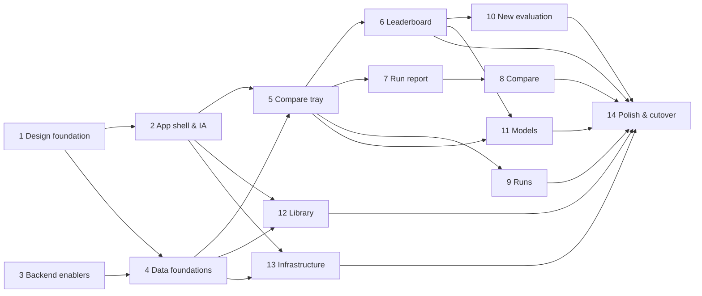

# UI Redesign Plan — from "a UI for the API" to an evaluation service

**Status:** Done. All 14 phases are implemented; §8.14 has the final phase's own verification results and Appendix B records what replaced what.
**Date:** 29 Sep 2026
**Scope:** the whole `frontend/` app (13 routes), plus four small, additive backend changes (Phase 3).
**Not in scope:** the harness, workers, SLURM/endpoint logic, hashing/resolution semantics, auth, automated tests.

## Contents

0. [How to use this document](#0-how-to-use-this-document)
1. [Executive summary](#1-executive-summary)
2. [Audit: what the UI is today](#2-audit-what-the-ui-is-today)
3. [Design principles](#3-design-principles)
4. [Target experience](#4-target-experience)
5. [Decisions needed](#5-decisions-needed)
6. [Ground rules for every phase](#6-ground-rules-for-every-phase)
7. [Phase map](#7-phase-map)
8. [Phase specifications](#8-phase-specifications)
9. [Backlog (deliberately not in the 14 phases)](#9-backlog-deliberately-not-in-the-14-phases)
10. [Risks](#10-risks)
- Appendix A: Interfaces between phases
- Appendix B: Old to new file map
- Appendix C: Final walkthrough test
- Appendix D: Hand-off prompt template
- Appendix E: Evidence

---

## 0. How to use this document

- Sections 1–7 are shared context. Section 8 has one self-contained spec per phase.
- To hand a phase to an LLM, give it: **§3, §4.2, §4.3, §4.5, §4.6, §6, and that phase's spec in §8**. Appendix D is a ready-to-paste prompt. Every phase spec names the phases that must be finished first.
- **Every phase ends in a working, shippable app.** Old URLs keep working through redirects, so no phase leaves the UI half-migrated.
- "Default" means the recommendation used unless you override it in §5.
- Sketches show layout intent, not pixel specs. Numbers in sketches come from the real data snapshot in §2.4 unless marked "illustrative".

---

## 1. Executive summary

Today's UI is a faithful mirror of the API: one tab per resource (checkpoints, standards, sampling profiles, serving profiles, endpoints, runs …), each a table plus a few buttons, styled page by page. It is accurate, and the run drill-down pages are genuinely deep. But it answers *"what rows exist?"* rather than *"which model is better, why, and what should I do next?"*.

**What is wrong, mapped to your six asks**

| # | You asked for | What we found |
|---|---|---|
| 1 | Professional, aesthetic | No design tokens (`index.css` is one line), ~800 raw palette classes, no shared Button/Input/Card/Tabs/Dialog, plain-text "Loading…", `window.confirm`, internal doc filenames in visible copy, an amber "Vision Demo" pill in the header. |
| 2 | Intuitive, "at the right place" | Nine equal top-nav links mixing four audiences; pages named after API resources; landing page opens with a paragraph about hashes and a backend-connectivity widget. |
| 3 | Easy to read and analyse a report | The run page stacks five configuration blocks before the metrics table; diagnostics is one small text link; the sample page loses the list you came from; nothing says how a score ranks or whether it moved. |
| 4 | Compare from every screen (same benchmark) | Compare is reachable from two places only (two tiny leaderboard checkboxes, a link on the diagnostics page), is limited to exactly two runs, and uses two native `<select>` lists of every finished run. |
| 5 | Intuitive leaderboard | Cell colour is derived from a hash (`hashToHue`) and reads as good/bad; one column per comparison hash, so `ifeval` appears twice; no sort, filter, rank, interval, sample count or link to the model; empty cells are dead ends. |
| 6 | Better-organised other tabs | Catalog admin (reload/prune/delete, states like `orphaned`) sits on top of user-facing reference pages; Sampling and Serving pages are near-duplicates; the Checkpoints page never shows the runs the API returns. |

**Direction**

1. **Organise around jobs, not resources.** Four sidebar groups: *Results* (Leaderboard, Models, Compare), *Evaluate* (New evaluation, Runs), *Library* (Benchmarks, Profiles), *Infrastructure* (Endpoints). Operator tooling moves behind clearly secondary surfaces.
2. **Build a small design system first** (tokens + ~20 primitives) so every screen looks like one product.
3. **Leaderboard becomes ranked, like-for-like and honest about uncertainty**: one column per benchmark with a *setup* selector, score ± margin of error, "leads or ties" markers, hover provenance, and "Run it" in empty cells.
4. **A run becomes a report**: verdict first (score, pass/fail, rank, movement, health), then tabs for Samples, Configuration and Logs, with a master-detail sample panel.
5. **Compare becomes a tray**: pin runs from anywhere; the tray enforces "same benchmark", supports 2–4 runs, and opens a compare page with a setup diff, a forest plot and flipped samples.
6. **Models, Benchmarks and Profiles become first-class pages** that link to each other and to results.

**Delivery:** 14 phases (§7), each independently shippable. Phases 1–5 lay foundations; 6–13 rebuild screens in order of user value; 14 is polish and cutover.

---

## 2. Audit: what the UI is today

Evidence: all 13 screens were captured with headless Chrome against the running stack on 29 Sep 2026, and the code and API were read end to end. Nothing was clicked or submitted (Appendix E).

### 2.1 Page inventory

| Route | Page (LOC) | What it does | Biggest problem |
|---|---|---|---|
| `/` | `LeaderboardPage` (177 + 136 helper) | Pivot table: checkpoints × comparison hash | Hash-coloured cells, no sort/filter/interval, jargon paragraph, connectivity widget on top, capped at 1152 px |
| `/checkpoints` | `CheckpointDetailPage` (184) | List of checkpoints grouped by family | Misnamed (it is the list); raw filesystem paths; runs and scores not shown |
| `/checkpoints/register` | `RegisterCheckpointPage` (347) | 4-step wizard | Text-only stepper; free-text family (creates near-duplicate families) |
| `/standards` | `StandardsPage` (135) | Every standard rendered in full, stacked | Grows linearly with the catalog; says nothing about what a benchmark *measures*; catalog admin panel on top |
| `/sampling-profiles`, `/serving-profiles` | 71 / 88 | Catalog admin table + expandable value table | Near-duplicates; internal doc filenames in visible copy |
| `/submit` | `SubmitPage` (351) | 4 stacked sections; 3 families of override cards; 3-part dry-run preview | Wall of text before the common case (defaults) is reachable |
| `/runs` | `RunsPage` (172) | One table per batch | Raw error strings stretch rows; no filters; no score; `window.confirm` |
| `/runs/:id` | `RunDetailPage` (280) | Headline band, then 5 config blocks, metrics, logs | Metrics table below five configuration blocks; diagnostics is one small text link |
| `/runs/:id/diagnostics` | `RunDiagnosticsPage` (191) | Narrative, breakdown, filters, sample list | Strong content, one long page; detail loses list context |
| `/runs/:id/samples/:key` | `RunSamplePage` (75) | One sample, fully explained | Good content; separate page |
| `/compare` | `ComparePage` (216) | Two runs, flips, bucket deltas | Exactly two; two native selects of *all* done runs |
| `/endpoints` | `EndpointsPage` (189) | Live servers, start/kill | Raw URLs; `window.confirm`; separate from other infrastructure info |
| `/vision` | `prototype/` (5,512 LOC) | Mocked demo app | Separate product inside the product; amber pill in the header |

### 2.2 Findings by ask

**1. Professional and aesthetic**
- `index.css` is `@import "tailwindcss"` only. Every page invents its own look.
- No shared primitives. Hand-styled duplicates: 13 `<select>`, 20 `<input>`, 19 buttons (6 green, 6 outlined, 7 red), 54 copies of one table-header class string across 12 files.
- 21 plain-text "Loading…" states in 18 files; 5 `window.confirm` calls in 3 files.
- Five pages show internal doc references in visible copy (Serving Profiles, Sampling Profiles, Endpoints, Runs, Submit), for example "See EVAL_SERVICE_PLAN.md, Section 13." and "(S-D5)".
- 42-character model names (`Qwen3.5-0.8B-Think-MOPD-mixv2-RL-v11c-s810`) are never shortened; ids and hashes are monospace everywhere; no icons.

**2. Intuitive, right place**
- Nine equal nav links serve four different audiences: analysts (Leaderboard, Compare), evaluators (Submit, Runs), reference readers (Standards, profiles) and operators (Endpoints, catalog admin).
- The primary action ("Submit") is one of nine equal links; there is no search.
- Jargon without explanation: *comparison hash*, *standard*, *serving profile*, *truncation*.
- Results are not linked to models; models are not linked to their runs, although `GET /checkpoints/{id}` already returns `runs`.

**3. Reading the report**
- The headline band is on top (good), but the full metrics table, diagnostics link and logs sit beneath five configuration blocks.
- Health signals are prose ("Cost", "Health" rows), not glanceable chips.
- No context for a score: no rank among peers, no movement versus the previous run, no "within margin of error" cue.
- Sample detail is a separate page, so reviewing ten failures means ten round trips to the list.

**4. Comparing**
- Entry points: two tiny leaderboard checkboxes (exactly two cells; nothing checks that they share a benchmark, so the refusal only appears later, on the Compare page) and a "Compare with…" link on the diagnostics page. Not offered from Runs, Run detail or Models.
- `docs/EVAL_SERVICE_PLAN.md` §13 promises "two to four checkpoints"; only two are supported.
- Two runs of the same benchmark under different sampling are comparable at sample level, but the page never says how their setups differ.

**5. Leaderboard**
- Cell background is `hsl(hueFromHash, 45%, 20%)` (`MetricCell`). The code comment explains the intent (same colour means same setup), but every column is already exactly one comparison hash, so all cells in a column share one tint and it tells the reader nothing they can act on. Across columns the hue is arbitrary, yet readers meet it as a heat map (a red tint reads as "bad", green as "good").
- One column per comparison hash: `ifeval` shows up twice, distinguished by a small grey sub-label.
- `n_samples`, `truncation_rate` and `finished_at` are fetched but never displayed.
- With today's data only 2 of 3 models share any benchmark, and the empty cells offer no next action.
- No export, no shareable filter state.

**6. Other tabs**
- Catalog admin states (`loaded`, `new`, `conflicting`, `orphaned`, `ad_hoc`, `invalid`) are shown to everyone, at the top of reference pages.
- Sampling and Serving pages are the same page twice.
- Endpoints stands alone; the cluster's partitions are only visible inside Submit.

### 2.3 Measured smells

| Measure | Value |
|---|---|
| Non-prototype TS/TSX | 10,197 lines; prototype another 5,512 |
| Raw palette colour classes (`slate/red/emerald/amber/blue/…-NNN`) | ~816 (365 in pages, 451 in components) |
| Duplicated table-header class string | 54 occurrences, 12 files |
| Plain-text "Loading…" | 21 occurrences, 18 files |
| `window.confirm` | 5 calls, 3 files |
| Pages leaking internal doc references into visible copy | 5 |
| Shared UI primitives | 0 (only `EmptyState`, `StatusBadge`, `AvailabilityBadge`) |

### 2.4 Real data snapshot (29 Sep 2026)

Read from `GET /checkpoints`, `/standards`, `/sampling-profiles`, `/serving-profiles`, `/leaderboard`, `/runs`.

- 3 checkpoints, 5 standards (`ifeval`, `ifbench`, `gsm8k`, `gpqa_diamond`, `mmlu_pro`), 7 sampling profiles (one unlabelled ad-hoc), 4 serving profiles.
- 16 runs in 9 batches: **8 done, 6 failed, 2 cancelled**. All six failed runs show the same kind of raw error, one missing `…/reports/<model>/<benchmark>.json` each, for example `FileNotFoundError: [Errno 2] No such file or directory: '/data/evalsvc/runs/run-8/reports/Qwen3.5-…/ifeval.json'`. That means the expected results report was never written, but nothing in the message says so or where to look next. Two batches are both named `if-eval-02`.
- 6 leaderboard cells across **4 setups**: `gsm8k`/`qwen3_think`, `ifbench`/`qwen3_5_think`, `ifeval`/`qwen3_5_think`, `ifeval`/`greedy`. Qwen3.5-0.8B has IFEval under two setups (63.0% greedy, 85.0% `qwen3_5_think`). Qwen3-4B has only GSM8K.
- Family strings are inconsistent (`QWen3.5` vs `Qwen-3.5`), which splits one family into two groups.
- **Run-to-run noise is visible in real data.** `merged_global_step_810` has three IFEval runs under the same setup (runs 10, 11, 13) that scored 88.7%, 86.9% and 85.4%: a spread about the size of the ±3 point margin of error. The leaderboard shows only the latest (85.4). This is why scores need margin-of-error cues and why differences inside the margin must not be presented as improvement or regression.
- Metrics carry their own formatting hints on the run detail (`display_kind`, `display_multiplier`, `display_unit`, `display_precision`, `direction`); the leaderboard rows and the runs list carry none.
- `submitted_by` is empty on some runs (11, 12, 13), so every place that shows it needs an empty fallback.
- The data is small. Every design below must also hold at ~100 models × ~20 benchmarks; neither extreme is allowed to look broken.

### 2.5 What is already good and must be preserved

- The five-layer drill-down (board → run → breakdown → sample list → sample) and its deterministic narratives, tags and per-rule checklist. Restyle and relocate; do not rewrite the logic.
- Shareable deep links (`/runs/13/samples/1122`, URL-backed sample filters `outcome`, `subset`, `rule`, `tag`, `q`, `offset`).
- The dry-run preview and compatibility checker, and the override/label draft logic in `SubmitOverrides.helper.ts` (660 lines).
- Live log streaming, run/endpoint auto-refresh, and the "registration intact, weights missing" availability semantics.

---

## 3. Design principles

Each principle is meant to be checkable in review.

1. **One question, one primary action per screen.** The page title states the question it answers; one primary button is visible.
2. **Results first, configuration second.** Default views show outcomes; settings are one click away (tab, drawer or disclosure).
3. **Like-for-like by default; make differences visible.** Never hide a non-comparable result; label it and say why it differs.
4. **Uncertainty is part of the number.** Show margin of error and sample count wherever a score is ranked; do not imply order inside the noise.
5. **Every number is a doorway.** A score links to its run, a run to its model and benchmark, a model to its comparisons.
6. **Empty means "next step".** Empty cells and lists offer the action that fills them.
7. **Operator tools are secondary.** Reload, prune, delete, kill and validate are reachable but never in the way, and always confirmed.
8. **The same thing looks the same everywhere.** One status chip, one score format, one model-name treatment, one setup chip.
9. **State lives in the URL.** Filters, sort, tab, lens and selection that a colleague would want are shareable by copying the address bar.
10. **Plain language.** No doc filenames, decision ids or API paths in the UI. Jargon gets a one-line tooltip. Use the vocabulary in §4.3.
11. **Live where it matters, calm elsewhere.** Runs and endpoints refresh; reference pages do not flicker.
12. **Accessible by default.** Keyboard operable, visible focus, contrast ≥ 4.5:1 for text, meaning never carried by colour alone.

---

## 4. Target experience

### 4.1 Users and jobs

| Who | Jobs | Lives in |
|---|---|---|
| **Researcher / model owner** (primary) | Did my checkpoint improve? On what? Why did it fail? How does it compare with its parent or another model? | Leaderboard, Models, Run report, Compare |
| **Evaluator** | Run these models on these benchmarks, watch progress, understand failures, re-run | New evaluation, Runs |
| **Reviewer / lead** | Which model should we ship? Is the comparison fair? What does this benchmark mean? | Leaderboard, Benchmarks |
| **Platform admin** | Register checkpoints, keep catalogs in sync, watch endpoints and the cluster | Models (register), Library, Infrastructure |

### 4.2 Information architecture

**Sidebar (collapsible to an icon rail)**

```text
RESULTS          Leaderboard   (home, "/")
                 Models
                 Compare        [badge = pinned runs]
EVALUATE         New evaluation (also the top-bar primary button)
                 Runs           [badge = active runs]
LIBRARY          Benchmarks
                 Profiles       (Sampling | Serving tabs)
INFRASTRUCTURE   Endpoints
```

Top bar: page breadcrumb, primary button **New evaluation**, system-status pill (backend + database; opens a popover). The "Vision Demo" pill is removed (D5).

**"Where do I find…?"**

| I want to… | Go to |
|---|---|
| See which model is best at a benchmark | Leaderboard → By benchmark |
| See how one model does everywhere | Models → the model (Results) |
| Understand why a run lost points | Run → Samples (or Overview → "Where the points went") |
| Compare two or more runs on one benchmark | Pin runs from anywhere → Compare tray |
| Know what a benchmark measures and how it is scored | Benchmarks → the benchmark |
| Run a model on a benchmark | New evaluation, or "Run it" on an empty leaderboard cell, or Model → Evaluate |
| See what is running or broken now | Sidebar Runs badge, Runs, status pill |
| Register a checkpoint | Models → Register |
| Change how a model is asked to speak or hosted | Profiles |
| Kill a stuck model server | Infrastructure |

**Route map (old → new).** Old URLs keep working through redirects (D9). Detail pages use path-based tabs; list pages use query params for filters.

| Old | New | Introduced in |
|---|---|---|
| `/` | `/` (Leaderboard) | — |
| `/checkpoints` | `/models` | Phase 2 |
| `/checkpoints/register` | `/models/register` | Phase 2 |
| — | `/models/:modelId`, `/models/:modelId/runs`, `/config`, `/lineage` | Phase 11 |
| `/standards` | `/benchmarks` | Phase 2 |
| — | `/benchmarks/:benchmarkId` (+ `/protocol`, `/runs`) | Phase 12 |
| `/sampling-profiles` | `/profiles/sampling` | Phase 2 |
| `/serving-profiles` | `/profiles/serving` | Phase 2 |
| `/submit` | `/evaluate/new` | Phase 2 |
| `/runs`, `/runs/:id` | unchanged (Overview tab) | — |
| `/runs/:id/diagnostics?…` | `/runs/:id/samples?…` (same query params) | Phase 7 |
| `/runs/:id/samples/:key` | unchanged (opens the sample panel) | Phase 7 |
| — | `/runs/:id/config`, `/runs/:id/logs` | Phase 7 |
| `/compare?left=13&right=15` | `/compare?runs=13,15` | Phase 8 |
| `/endpoints` | `/infrastructure` | Phase 2 |
| `/vision/*` | untouched; no nav link (D5) | Phase 2 |

### 4.3 Vocabulary

Centralise UI labels in one module (created in Phase 4) so wording stays consistent.

| Internal / API term | What it is | UI label | Notes |
|---|---|---|---|
| checkpoint | A registered model artefact (weights at a training step) | **Model** | "checkpoint" stays in registration and technical fields (path) |
| standard | Versioned benchmark protocol (dataset, prompt, metrics, few-shot, repeats) | **Benchmark** + version badge ("IFEval v1") | "Methodology" is a tab of the Benchmark page |
| `comparison_hash` | Benchmark protocol + resolved sampling profile; the leaderboard's grouping key | **Setup** | Tooltip: "Results with the same setup are directly comparable." Never show the raw hash as the primary label |
| hash (any) | Content fingerprint | **Fingerprint** | Short 8-char chip with copy |
| sampling profile | How the model is asked to generate | **Sampling profile** | Show a generated summary line ("Thinking on · T 1.0 · 32k tokens") |
| serving profile | How the model is hosted | **Serving profile** | |
| eval_run | One model on one benchmark | **Run** | |
| run_group | Runs submitted together | **Batch** | |
| endpoint | A live vLLM server | **Model server** (Endpoint in technical titles) | |
| primary metric | Metric defining the headline score | **Headline score** | |
| `n_samples` | Scored questions | **Samples** | |
| `truncation_rate` | Answers cut off at the token limit | **Truncated** | Tooltip explains why it matters |
| `availability_status` | Whether weights are readable on the cluster | **Weights:** Available / Missing / Incomplete / Not checked | |
| catalog state | `loaded`, `new`, `conflicting`, `orphaned`, `ad_hoc`, `invalid` | In sync / Not loaded yet / Edited since loaded / File removed / Custom (no file) / Invalid file | Admin surface only. **Verify each meaning against `backend/app/services/catalog/loader.py` before shipping labels** |
| dry-run preview | `POST /runs/preview` | **Review** | |
| submit | `POST /runs` | **Run evaluation** | |
| partition | SLURM partition | **Cluster partition** | Advanced setting |

### 4.4 Key screens

Sketches are illustrative. Sampling-profile labels are shown as their real slugs (`qwen3_5_think`, `greedy`) because profiles have no display name today.

#### 4.4.1 Shell

```text
┌──────────────┬───────────────────────────────────────────────────────────────────────┐
│ Evaluation   │  Leaderboard                        [+ New evaluation]  ● All systems ok │
│ Service      ├───────────────────────────────────────────────────────────────────────┤
│ RESULTS      │  Page header: title · one-line description · page actions              │
│  > Leaderboard│                                                                        │
│    Models    │  Page content: cards, tables, tabs                                     │
│    Compare 2 │                                                                        │
│ EVALUATE     │                                                                        │
│    New eval. │                                                                        │
│    Runs   2  │                                                                        │
│ LIBRARY      │                                                                        │
│    Benchmarks│                                                                        │
│    Profiles  │ ┌ Compare tray (only when runs are pinned) ─────────────────────────┐ │
│ INFRA        │ │ IFEval  [Qwen3.5-0.8B… 85.0] [merged_… 85.4]  Same setup    [Compare]│ │
│    Endpoints │ └────────────────────────────────────────────────────────────────────┘ │
└──────────────┴───────────────────────────────────────────────────────────────────────┘
```

#### 4.4.2 Leaderboard (the front door)

**Overview lens: models × benchmarks**

```text
Leaderboard                                                   [Export CSV] [Copy link]
Latest result per model and setup. Scores are only ranked against the same setup.  (i)

[Search models...] [Family v] [Benchmarks v] [Setups: Like-for-like v]   (o) Overview  ( ) By benchmark

                        Instruction following                          Math
                      ┌ IFEval ─────────────────────┬ IFBench ────────────┬ GSM8K ──────────────
                      │ qwen3_5_think v        sort │ qwen3_5_think v     │ qwen3_think v
 Model                ├─────────────────────────────┼─────────────────────┼─────────────────────
 Qwen3.5-0.8B-…-s810  │ 85.0 ±3.0 ★  +1 other setup │ 47.0 ±5.6 ★         │ —          [Run it]
 merged_global_…_810  │ 85.4 ±3.0 ★                 │ 44.7 ±5.6 ★         │ —          [Run it]
 Qwen3-4B-allternary… │ —          [Run it]         │ —          [Run it] │ 91.2 ±1.5 ★
 ─────────────────────────────────────────────────────────────────────────────────────────────
 ★ leads the column or is within its margin of error   ± 95% margin of error   — not evaluated on this setup
```

**By-benchmark lens: a ranked board for one setup**

```text
( ) Overview  (o) By benchmark     Benchmark [IFEval v]   Setup [qwen3_5_think v]
 Rank  Model                   Score   95% margin of error       Samples  Truncated  Serving        Evaluated
  1    merged_global_…_810     85.4%   |----o----|               541      0.0%       qwen3.5-40960  16 Sep       [+] [Open run]
  2 ≈  Qwen3.5-0.8B-…-s810     85.0%   |----o----|               541      0.0%       qwen3-tools    21 h ago     [+] [Open run]
 Not yet evaluated on this setup (1)
       Qwen3-4B-allternary-ep03                                                                                   [Run it]
 ≈ within the leader's margin of error (the two intervals overlap)
```

**Behaviour highlights** (full spec in Phase 6)
- One column per **benchmark**; a per-benchmark **setup selector** defaults to the setup with the most models. "All setups" mode expands a benchmark into one sub-column per setup, grouped under the benchmark header.
- A result under another setup shows a subdued "+1 other setup" chip instead of hiding.
- Rank and ties: rank is simply the position by score. A row whose margin of error overlaps the leader's is marked `≈` (and gets ★ in the overview). Tooltips say "within margin of error", never "statistically tied".
- Hover/focus card: score ± interval, samples, passed/failed, truncated %, setup, serving profile, run number, date; actions Open run · Add to compare · View failures · View this model's run history.
- Colour never encodes provenance. Optional single-hue heat tint by within-column position (on by default, toggle off).

**Options considered**
- *One column per comparison hash (today).* Rejected: benchmarks repeat and readers cannot tell why.
- *Separate board per setup.* Rejected: loses cross-benchmark reading.
- *Benchmark columns + setup selector, plus a By-benchmark lens.* **Chosen:** same mental model as HELM and Artificial Analysis; matrix for breadth, ranked board for depth.

#### 4.4.3 Run report

```text
Runs / Run #13                                                [+ Compare] [Re-run] [Copy link] [...]
merged_global_step_810 · IFEval v1 · qwen3_5_think                 ● Done · 9m 15s · finished 16 Sep
┌─────────────────────────────────────────────────────────────────────────────────────────┐
│  85.4 %  ±3.0            462 of 541 samples passed · 79 failed                            │
│  Prompt-level (strict)   #1 of 2 on this setup (within margin of #2)                      │
│                          -1.5 vs the previous run of this model on this setup (#11), within margin │
│  ✓ Not truncated  ✓ No empty answers  ! Slowest requests 5× the median   1.44M tokens · 108.8 tok/s │
└─────────────────────────────────────────────────────────────────────────────────────────┘
 Overview | Samples (79) | Configuration | Logs
 ────────
 All metrics                 Where the points went                           What the data says
 [4 metric cards]            length_constraints:nth_paragraph_first_word 0/12  "79 of 541 samples failed. 54 of the 79 failures
                             combination:repeat_prompt              31/41      are near misses ..."
                             See all breakdowns >                              [Near miss 54] [Complete miss 23] [Cosmetic 16]
                                                                               (tags overlap, so they do not sum to 79)
```

- The default tab depends on state: queued/running → live progress and logs; failed/cancelled → *what went wrong* first (classified reason, raw error in a disclosure, last log lines, Re-run); done → Overview.
- **Samples** tab: filter chips, breakdown, list, and a right-hand **sample panel** (prev/next, `j`/`k`, `Esc`) so reviewing failures never leaves the list.
- **Configuration** tab: resolved benchmark, sampling, serving, endpoint and execution details as grouped key-value lists with copy buttons. Setup fingerprint explained.

#### 4.4.4 Compare (tray + page)

**Tray rule:** *pin runs from anywhere; they must be finished and share one benchmark.* Once one run is pinned, pin controls on other benchmarks are disabled with the reason ("Compare needs the same benchmark. You are comparing IFEval.").

```text
Compare · IFEval · 3 runs                                          [+ Add run] [Copy link]
Setup check: ! differs from baseline in Sampling profile (greedy > qwen3_5_think)   > show differences
 Baseline  Run #9   Qwen3.5-0.8B… greedy          63.0 ±4.1   |--o--|
           Run #15  Qwen3.5-0.8B… qwen3_5_think   85.0 ±3.0   |-----------o--|   +22.0 pts  ✓ significant
           Run #13  merged_global_…_810           85.4 ±3.0   |-----------o--|   +22.4 pts  ✓ significant
 Where the score moved (vs baseline)   [by rule v]    Run #15 Δ | Run #13 Δ
 Flipped samples (vs baseline)         [Run #15 v]    fail>pass N · pass>fail M    > open side-by-side
```

- Compare page URL is canonical: `/compare?runs=13,15,9` (2–4 runs; first = baseline).
- Entry points start from *models* too (leaderboard, Model page "Compare with parent"): they resolve to the latest run per model on a chosen shared setup, then open the canonical URL.
- N-way needs no backend change: baseline vs each other run using the existing pairwise endpoint.

**Options considered:** (a) keep exactly-two pickers, (b) a model-level compare page duplicating the leaderboard, (c) **a cross-app tray of runs, with a model-level "Δ vs baseline" mode on the leaderboard as a stretch**. Chosen (c): one mechanism, and the "same benchmark" constraint is visible where you pin.

#### 4.4.5 Model page

```text
Models / Qwen3.5-0.8B-Think-MOPD-mixv2-RL-v11c-s810 [copy]      [Evaluate] [Compare with... v] [...]
Qwen3.5 · Weights ● Available (checked 21 h ago) · Registered by Naresh Joshi · 11 Sep
 Scorecard (latest per setup)
 ┌ IFEval · qwen3_5_think ┐ ┌ IFEval · greedy ┐ ┌ IFBench · qwen3_5_think ┐ ┌ GSM8K ────────┐
 │ 85.0 ±3.0   #2 of 2 ≈  │ │ 63.0 ±4.1  #1/1 │ │ 47.0 ±5.6   #1 of 2     │ │ Not evaluated │
 └────────────────────────┘ └─────────────────┘ └─────────────────────────┘ │  [Run it]     │
 Results | Runs (9) | Configuration | Lineage
```

#### 4.4.6 New evaluation

```text
New evaluation
 1 Choose ────── 2 Settings ────── 3 Review

 Models                                     Benchmarks
 [Search models...]                         Instruction following
 Qwen3.5 (2)                                [x] IFEval    541 samples · 0-shot
   [x] Qwen3.5-0.8B-…-s810  ● Available     [ ] IFBench   300 samples · 0-shot
   [ ] merged_global_step_810 ● Available    Knowledge & reasoning
 Qwen3-4B (1)                                [ ] MMLU-Pro  [ ] GPQA Diamond
   [ ] Qwen3-4B-allternary-ep03 ● Available  Math
                                             [ ] GSM8K
 ┌ Summary ──────────────────────────────────────────────────────────────┐
 │ 1 model × 1 benchmark = 1 run · 1 GPU                 [Continue >]    │
 └────────────────────────────────────────────────────────────────────────┘
```

Step 2 shows recommended settings per model and benchmark, with an **"Will this line up?"** line per pair: *"Same setup as 2 existing results"* or *"New setup, not comparable with existing results"* (derived from the preview's `comparison_hash` against the leaderboard). Custom overrides live behind a per-item **Customize** side panel that reuses the existing override cards.

#### 4.4.7 Runs

```text
Runs                                                                            [+ New evaluation]
[Active 0] [Done 8] [Failed 6] [Cancelled 2] [All 16]   [Search...] [Model v] [Benchmark v]   ● Live
 v test-28-sep · 2 runs · 2 done · 28 Sep                                              [Cancel batch]
     #16  ● Done    IFBench · qwen3_5_think   Qwen3.5-0.8B-…-s810   47.0 ±5.6   0.0% trunc.   7m 26s  [+] [...]
 v if-eval-01 · 1 run · 1 failed
     #8   x Failed  IFEval · qwen3_5_think     Qwen3.5-0.8B-…-s810   "Ended without a results report"  > details  [Re-run]
```

#### 4.4.8 Library and Infrastructure (short)

- **Benchmarks:** cards grouped by category (name, one-line description, headline metric, samples, few-shot/repeats, models evaluated, last run) → detail with Overview, Protocol, Runs tabs, plus a top-5 leaderboard preview.
- **Profiles:** one page, Sampling | Serving tabs; human summary line, used-by counts, detail drawer. **Catalog sync** (reload/prune/delete) appears as a banner only when something needs attention, and its controls live in a "Manage catalog" drawer.
- **Infrastructure:** live model servers as cards with a time-to-live bar, copyable URL, Kill (confirmed); cluster partitions on demand; system health.

### 4.5 Cross-cutting patterns

| Pattern | Rule |
|---|---|
| **Page anatomy** | `PageHeader` (breadcrumb, title, one-line description, actions) → optional tab bar → content. `Page` (max ~1200 px, forms and text) vs `PageWide` (full width, data tables). |
| **Loading** | Skeleton shaped like the final layout. Never the text "Loading…". |
| **Empty** | Icon, title, one sentence, one action. |
| **Error** | Inline panel: plain message, **Retry**, and a "Details" disclosure holding the raw error. |
| **Feedback** | Toast for mutation success/failure; inline text for form validation. |
| **Destructive or costly actions** | `ConfirmDialog` stating exactly what happens ("Cancel run #14? The SLURM job is stopped."). Never `window.confirm`. |
| **Tables** | Sticky header; sticky first column when wide; `tabular-nums` on numeric columns; hover row; comfortable (44 px) and compact (32 px) density; sort indicators with `aria-sort`; table scrolls inside its container. |
| **Status vocabulary** | Icon + text, never colour alone. Run: Queued (grey), Running (blue, animated), Done (green), Failed (red), Cancelled (amber). Weights: Available, Missing, Incomplete, Not checked. |
| **Numbers** | Scores as percent with one decimal; margin of error as `±x.x`; counts with thousands separators. |
| **Time** | Relative up to 7 days ("21 h ago"), then a short date ("16 Sep"); the full timestamp is always in a tooltip. Durations as "9m 15s". |
| **Long names** | Middle-ellipsis that keeps the discriminating suffix (`Qwen3.5-0.8B-Th…v11c-s810`); full name in tooltip; copy button on detail pages. |
| **URL state** | Filters, sort, lens, tab and selection in query params; defaults omitted; `replace` for filter edits, `push` for navigation. |
| **Responsive** | Desktop-first. Sidebar collapses to a rail below 1280 px and to an off-canvas drawer below 768 px. No page-level horizontal scroll at ≥ 1024 px. |
| **Motion** | ≤ 150 ms transitions; honour `prefers-reduced-motion`. |
| **Copy** | Sentence case; plain language; no internal references; jargon has a tooltip. |

### 4.6 Visual language and tokens

**Direction:** quiet and data-first. Cool-neutral greys, one indigo accent, semantic status colours used sparingly, borders in dark theme and soft shadows in light theme, Inter for UI text with tabular numerals, monospace only for ids, paths and logs. Icons from one set (Lucide).

**Token roles.** Names follow the shadcn convention so the resulting utility classes (`bg-card`, `text-muted-foreground`, `border-border`) are familiar to LLMs and developers. Exact values are chosen in Phase 1 and validated for contrast (≥ 4.5:1 text, ≥ 3:1 UI boundaries).

| Group | Tokens |
|---|---|
| Surfaces | `background` (app canvas), `card` (panels), `popover` (menus, dialogs), `muted` (table headers, inputs, code) |
| Text | `foreground`, `muted-foreground`, `subtle-foreground` |
| Lines | `border`, `border-strong`, `ring` (focus) |
| Brand | `primary`, `primary-hover`, `primary-soft`, `primary-foreground` |
| Status | `success`, `warning`, `danger`, `info`, each with a `-soft` tinted-background variant |
| Data-viz | `series-1` … `series-8` (colour-blind safe), `heat-1` … `heat-5` (single-hue score ramp) |
| Shape | radii `sm 6 · md 8 · lg 12`; shadows `sm`, `md`, `popover` |
| Type | base 14 px; table 13 px; caption 12 px; headings 18/20/24/30 px; weights 400/500/600 |

**Theming mechanism.** Semantic values are CSS variables under `:root` (dark) and `[data-theme="light"]`, mapped into Tailwind v4 with `@theme inline` so utilities follow the active theme. Until every page is migrated (Phase 14) the default stays **dark** so legacy pages remain legible.

---

## 5. Decisions needed

Defaults are used unless you say otherwise.

| ID | Decision | Options | Default | Needed before |
|---|---|---|---|---|
| D1 | Theme | Dark only · light + dark | Tokens support both; ship dark until Phase 14, then light + dark with a toggle, default follows OS | Phase 1, 14 |
| D2 | New npm dependencies | None · a curated set | **Allow:** Radix UI primitives (dialog, popover, tooltip, tabs, dropdown-menu, toggle-group), `lucide-react`, `sonner` (toasts), `clsx`, `@fontsource-variable/inter`. **Disallow:** component kits (MUI/Chakra/Ant), table libraries, state libraries, CSS-in-JS. Building accessible dialogs, popovers and tooltips by hand is the riskier path | Phase 1 |
| D3 | Navigation layout | Left sidebar · top nav with menus | Left sidebar (collapsible rail) | Phase 2 |
| D4 | Vocabulary | Keep API terms · friendlier terms | The table in §4.3 (Models, Benchmarks, Setup, Batch, …) | Phase 2 |
| D5 | `/vision` prototype | Keep · hide · delete | Remove the header pill in Phase 2; delete the folder in Phase 14 **only with your approval**. Both `recharts` and `@xyflow/react` are imported only inside `prototype/` (its README lists both for uninstall), and the redesign draws its whiskers and forest plot as plain SVG, so both can go; re-add `recharts` only if a later chart (e.g. the backlog scatter) needs it | Phase 2, 14 |
| D6 | Backend changes | None · additive | Additive only: new response fields, new query filters, catalog metadata. No breaking changes | Phase 3 |
| D7 | Where catalog metadata lives | New unhashed columns + Alembic migration · read from YAML at request time (like `source_yaml`) | Decide in Phase 3 after reading the loader; prefer whichever needs no migration if edits must propagate on reload | Phase 3 |
| D8 | Composite/average score | None · coverage-aware average | None in v1 (incomplete matrices make averages misleading) | Phase 6 |
| D9 | Old URLs | Redirect · break | Redirect (deep links are pasted in Slack) | Phase 2 |
| D10 | Table density | Comfortable · compact | Comfortable default with a compact toggle | Phase 6 |
| D11 | Benchmark copy (descriptions, categories) | You write · LLM drafts from existing docs | LLM drafts from `docs/` and the YAML comments; you review | Phase 3 |

---

## 6. Ground rules for every phase

**Repo rules** (already applied by Cursor in this workspace; restated because they decide whether a phase passes review)

1. Shared components are folders: `src/components/<Name>/<Name>.tsx` (renders), `<Name>.helper.ts` (non-DOM logic), `<Name>.module.scss` only if Tailwind cannot express the style. Pages are flat in `src/pages/`. Logic used by two or more components is promoted to a flat file in `src/utils/`. ~200 lines is the point to ask "should this split?".
2. TypeScript: no `any` (oxlint enforces it). Every function is typed. `tsconfig` sets `noUnusedLocals`, `noUnusedParameters`, `verbatimModuleSyntax` (use `import type`) and `erasableSyntaxOnly` (no `enum`, no constructor parameter properties).
3. Readability over cleverness; self-explanatory names; comments explain *why*, not *what*.
4. No stray `console.log`; errors are shown in the UI.
5. Backend (Phase 3 only): Router (`app/api/v1`) → Controller (`app/controllers`) → Library (`app/services`), per `.cursor/rules/backend-layering.mdc`; Pydantic models, never raw dicts, cross layer boundaries; typed signatures; logging via `logging.getLogger(__name__)`.
6. Gates: `cd frontend && npm run lint && npm run build`. Backend: `cd backend && uv run ruff check . && uv run ruff format --check .`.
7. **Do not write automated tests** unless explicitly asked. Verification is lint + build + the phase's manual checklist.
8. Ask before acting on ambiguity; choose the simplest working solution; do not add features the phase does not list.

**Design-system rules** (introduced in Phase 1, enforced afterwards)

9. Only semantic token utilities (`bg-card`, `text-muted-foreground`, …). No raw palette classes and no hex values in new or changed files. Check:
   `rg "(slate|gray|zinc|neutral|stone|red|green|emerald|amber|yellow|orange|blue|sky|indigo|violet|purple|pink|rose)-[0-9]{2,3}" frontend/src` must return nothing for every file the phase touched.
10. Compose from primitives. If a primitive is missing, add it to `src/components/` (small) instead of hand-styling a one-off.
11. Every data-driven view has skeleton, empty and error states (§4.5).
12. Shareable state lives in the URL (§4.5).
13. UI copy follows §4.3: no doc filenames, decision ids or API paths.
14. Costly or destructive actions use `ConfirmDialog`.

**Verification safety** (the dev stack talks to a real database and a real SLURM cluster)

15. While verifying, only load pages, call `GET` endpoints and use `POST /runs/preview` (read-only). **Never call** `POST /runs`, any `…/cancel`, `POST` or `DELETE /endpoints`, `POST /checkpoints`, `POST /checkpoints/*/validate`, `POST …/reload` or `…/prune`, `DELETE /{resource}/{id}`, or `POST /runs/*/diagnostics/rebuild`. Do not poll SSH-backed reads (`GET /checkpoints/candidates`, `POST /checkpoints/candidates/inspect`, `GET /cluster/partitions`); fetch them only on user action. If an end-to-end submit test is needed, ask the owner first (GPU cost).
16. Do not use `frontend/src/prototype/` as a UX reference (its README says so) and do not add mock-data files.
17. **Version caution.** React Router 8, Vite 8, TypeScript 6, Tailwind 4, React 19 and TanStack Query 5 may be newer than the implementing model's knowledge. Verify APIs against installed typings and docs in `node_modules`; do not assume v7-era behaviour.
18. After adding dependencies: `docker compose up --build -V frontend` (`node_modules` is an anonymous volume).
19. Dev URLs come from `.env`: frontend `http://localhost:${FRONTEND_PORT}` (5190 on this machine), API `${BACKEND_PORT}` (8010).

**Definition of done (every phase)**

- Gates in rule 6 pass; no new lint warnings in touched files.
- Every acceptance criterion in the phase spec is verified and ticked, or explicitly reported as not verified.
- All routes the phase touched render at 1024, 1280, 1440 and 1920 px wide with no page-level horizontal scroll.
- Loading, empty and error states exist and were seen (throttle the network or block the request URL in browser devtools to see loading and error; never stop the shared backend).
- Old URLs affected by the phase still work.
- Legacy files replaced by the phase are deleted (no dead code left behind).
- The phase summary states what changed, how it was verified, and any follow-ups.

---

## 7. Phase map



"Can overlap with" lists phases that have no dependency on each other in either direction (computed from the dependency graph, including indirect dependencies). Two phases that can overlap still touch shared files (`routes.tsx`, the sidebar registry), so see the ordering advice below.

| # | Phase | Type | Size | Depends on | Can overlap with | What you can see afterwards |
|---|---|---|---|---|---|---|
| 1 | Design foundation | FE | L | — | 3 | New look on shared parts; dev-only `/styleguide` |
| 2 | App shell and information architecture | FE | M | 1 | 3, 4 | Sidebar and top bar, grouped nav, new URLs with redirects, status pill; every old page still works inside |
| 3 | Backend enablers | BE | M | — | 1, 2 | API only: runs carry scores, leaderboard has intervals, benchmarks have descriptions |
| 4 | Data foundations and domain components | FE | M | 1, 3 | 2 | Mostly invisible: query hooks and shared display components |
| 5 | Compare tray | FE | S | 2, 4 | 12, 13 | Pin runs from the Runs table, see the tray, open the existing compare page (2 runs) |
| 6 | Leaderboard | FE | L | 5 | 7, 8, 9, 12, 13 | The new front door |
| 7 | Run report | FE | L | 5 | 6, 9–13 | Verdict-first run page with tabs and sample panel |
| 8 | Compare | FE | M | 5, 7 | 6, 9–13 | 2–4 run compare page with setup diff, forest plot and flips |
| 9 | Runs activity | FE | M | 3, 5 | 6–8, 10–13 | Filterable, live activity view grouped by batch |
| 10 | New evaluation | FE | L | 3, 4, 6 | 7–9, 11–13 | Guided three-step submit with "will this line up?" |
| 11 | Models | FE | L | 3, 5, 6 | 7–10, 12, 13 | Model list, Model page, registration polish |
| 12 | Library | FE | M | 2, 3, 4 | 5–11, 13 | Benchmarks, Profiles, Manage-catalog drawer |
| 13 | Infrastructure | FE | S | 1, 2, 4 | 5–12 | Endpoints and partitions page |
| 14 | Polish and cutover | FE | M | all | — | Theme toggle, accessibility pass, copy audit, dead-code removal |

**Ordering advice.** Do 1 → 2 first (serial). Phase 3 can run alongside them. Run one phase per branch and merge sequentially; phases running in parallel will conflict in `routes.tsx` and the sidebar registry, so rebase before merging.

---

## 8. Phase specifications

Each spec follows one template: **Goal · Why · Depends on · In scope · Out of scope · Deliverables · Spec · Data & API · Acceptance criteria · Verify · Pitfalls**. File and component names are suggestions; keep the conventions in §6.

---

### 8.1 Phase 1 — Design foundation

**Type/size:** Frontend, L. **Depends on:** none (D1, D2 answered).

**Goal.** One visual language and a small kit of primitives that every later screen composes from.

**Why.** ~800 raw palette classes, 54 copies of one table-header string, 19 hand-styled buttons, 13 selects and 20 inputs, no icons, no tokens, no toasts or dialogs.

**In scope**
1. Tokens in `src/index.css` (or `src/styles/tokens.css` imported from it if it exceeds ~250 lines): the roles in §4.6, semantic CSS variables under `:root` (dark) and `[data-theme="light"]`, mapped with `@theme inline`; base layer (body colours, focus ring, selection colour, scrollbars, `font-variant-numeric: tabular-nums` helper class).
2. Fonts: Inter variable (self-hosted) for UI; system monospace stack for code.
3. Dependencies per D2, then rebuild the frontend container.
4. Primitives, each a folder with `.tsx` and (where there is logic, e.g. class-name computation) `.helper.ts`:
   `Button` (primary, secondary, ghost, danger; sizes; loading; icon-only via `IconButton`), `Badge` (tones), `Card`, `PageHeader`, `Tabs`, `Dialog` + `ConfirmDialog`, `Tooltip`, `Popover`, `Menu`, `TextInput`, `SearchInput`, `SelectField` (styled native select), `Checkbox`, `SegmentedControl`, `Skeleton`, `Spinner`, `EmptyState` (upgrade in place; keep the `message` prop working), `ErrorState`, `CopyButton`, `Toaster`, `KeyValueList`, and table styling (`Table`, `Th`, `Td` or a class helper).
5. Restyle existing `StatusBadge`, `AvailabilityBadge` and `EmptyState` to tokens **without changing their props**, so legacy pages keep working.
6. A dev-only `/styleguide` page (registered only when `import.meta.env.DEV`) showing every primitive in every state, in both token sets.
7. A Cursor rule `.cursor/rules/frontend-design-system.mdc` (`globs: frontend/src/**/*.{ts,tsx}`) summarising: tokens only, primitives first, state patterns, vocabulary. This makes every later phase inherit the system automatically.
8. Optional interim trick: remap Tailwind's `--color-slate-*` to the new neutral ramp so legacy pages adopt the palette immediately. Remove it in Phase 14.

**Out of scope.** Shell/navigation (Phase 2), migrating pages, exposing a theme toggle, charts.

**Spec notes**
- Primitives take a `className` passthrough, are fully typed, forward refs where Radix requires, and never hard-code colours.
- Hit targets ≥ 32 px (compact) / 36 px; `:focus-visible` ring on everything interactive; icon-only buttons require an `aria-label` (make it a required prop).
- Each primitive stays under ~120 lines. Do not build a generic `DataTable` abstraction; only shared styles.
- `Toaster` is mounted once in `main.tsx`.

**Data & API.** None.

**Acceptance criteria**
- [ ] `npm run lint` and `npm run build` pass.
- [ ] `/styleguide` (dev) shows each primitive with default, hover, focus-visible, disabled, loading and (where relevant) error states.
- [ ] Setting `data-theme="light"` on `<html>` in devtools yields a coherent light theme for every primitive (contrast spot-checked).
- [ ] The palette check in §6 rule 9 returns nothing for all new primitive folders.
- [ ] All 13 existing routes still render and stay legible in the default dark theme.
- [ ] `.cursor/rules/frontend-design-system.mdc` exists and is accurate.

**Verify.** Run the gates; open `/styleguide` at 1280 px; toggle `data-theme`; click through the 13 routes; run the `rg` palette check on the new folders.

**Pitfalls.** Tailwind v4 theming syntax (`@theme` vs `@theme inline`); naming tokens so utilities read well; over-generalising primitives; Radix packages need matching React 19 peer ranges (§6 rule 17).

---

### 8.2 Phase 2 — App shell and information architecture

**Type/size:** Frontend, M. **Depends on:** Phase 1 (D3, D4, D5, D9 answered).

**Goal.** Replace the flat top nav with a grouped sidebar and top bar, introduce the new route map with redirects, and give every page a common frame.

**Why.** Nine equal links serving four audiences; the connectivity widget and a dev-tool pill occupy the front door; no consistent page anatomy.

**In scope**
1. `AppShell` (replaces `App.tsx`): collapsible `Sidebar` with the four groups in §4.2 and badge slots for Compare and Runs (filled in Phases 5 and 9); `TopBar` with breadcrumb slot, **New evaluation** button and `SystemStatus`.
2. `SystemStatus`: polls `GET /health` every 30 s (the leaderboard's old widget polled every 10 s); response shape is `{ status, dependencies: { postgres: "ok" } }`; states OK / Degraded / Unreachable; popover lists dependencies; no cluster calls.
3. New route table per §4.2, mounting the **existing** page components at new paths, with redirects from old paths that preserve sub-paths and query strings (a small `RedirectPreservingSearch` helper).
4. `src/utils/paths.ts`: typed route builders (`paths.run(id)`, `paths.runSample(id, key)`, `paths.model(id)`, `paths.benchmark(id)`, `paths.compare(runIds)`, `paths.newEvaluation(params)`, …). Replace hard-coded path strings in existing code where the target moved.
5. `Page` / `PageWide` layout wrappers and the `PageHeader` usage contract; a `NotFoundPage`; `useDocumentTitle` ("Leaderboard · Evaluation Service").
6. Remove the "Vision Demo" pill (route stays reachable by URL; D5). Remove the "Backend connectivity" card from `LeaderboardPage`.
7. Simple brand mark (SVG) and favicon refresh.

**Out of scope.** Redesigning any page body, the compare tray, search palette.

**Spec notes**
- Active state must handle nested routes (`/runs/13/samples/1122` highlights Runs).
- Sidebar: expanded ~232 px; rail ~64 px below 1280 px; off-canvas drawer with a menu button below 768 px. Nav is a `<nav>` landmark with `aria-current="page"`.
- Group and item definitions live in a data array in `AppShell.helper.ts`.
- The Profiles items point to two existing pages (`/profiles/sampling`, `/profiles/serving`) until Phase 12 merges them.

**Data & API.** `GET /health` only.

**Acceptance criteria**
- [ ] Every old URL in the §4.2 table redirects correctly, keeping sub-paths and query strings.
- [ ] Every existing page renders inside the new shell with no functional change.
- [ ] Active nav item is correct for nested routes.
- [ ] No horizontal page scroll at 1024 and 1280 px; rail and drawer behaviours work.
- [ ] `SystemStatus` shows OK against the running backend. Degraded and Unreachable are verified by blocking or overriding the `/api/v1/health` response in browser devtools (Network → Block request URL). **Do not stop the shared backend** to test this.
- [ ] Document titles update per route.
- [ ] No "Vision Demo" link or connectivity widget in the real UI; `/vision` still loads by URL.
- [ ] Gates pass.

**Verify.** Click every nav item; paste each old URL; resize the window.

**Pitfalls.** React Router 8 redirect APIs (verify); redirect loops; losing the `?left=&right=` compare params (handled fully in Phase 8, keep working until then).

---

### 8.3 Phase 3 — Backend enablers

**Type/size:** Backend, M. **Depends on:** none (D6, D7, D11 answered). **Parallel-safe with Phases 1–2.**

**Goal.** Add the few additive API fields the redesigned screens need, so the frontend stays thin and there is one implementation of each calculation.

**Why.** `RunListItem` has no score, setup or sampling profile; `LeaderboardRow` has no interval or serving profile; standards have no display name, description or category. `wilson_interval` already exists in the backend and its docstring warns against a second copy.

**In scope**
1. **Leaderboard:** add `confidence_interval` (lower/upper; `null` when `n_samples` is missing), `serving_profile_label`, `serving_profile_hash` to `LeaderboardRow`, computed with the existing `wilson_interval` (`services/diagnostics/report_summary.py`). If reusing `ConfidenceInterval` from `schemas/diagnostics.py` from `schemas/leaderboard.py` feels wrong, move the class to a shared schema module.
2. **Runs list:** add to `RunListItem`: `comparison_hash`, `sampling_profile_label`, `sampling_profile_hash`, `primary_metric_name`, `primary_metric_value`, `primary_metric_n_samples`, `primary_metric_confidence_interval` (all nullable except `comparison_hash`). Use a LEFT JOIN on the primary metric because queued/failed/cancelled runs have none. `RunDetail` extends `RunListItem` and already declares `comparison_hash`; dedupe the field. **Two mechanical traps in `backend/app/services/runs/queries.py`:** (a) `get_run_detail` builds `RunDetail(**run_list_item.model_dump(), comparison_hash=eval_run.comparison_hash, …)`, so once `RunListItem` carries `comparison_hash` the explicit keyword must be removed or Python raises `TypeError: got multiple values for keyword argument`; (b) `list_runs` and `get_run_list_item` each run their own `select(...)` and feed the row tuple positionally into `_to_run_list_item(*row)`, so every added column must be added to both selects and to that function's parameters in the same order.
3. **Runs filters:** `GET /runs` accepts `checkpoint_id`, `standard_id`, `benchmark`, `comparison_hash` in addition to `status`, `run_group_id`.
4. **Benchmark metadata:** optional `display_name`, `description`, `category` on standards (in the YAML document model — `CatalogDocument` uses `extra="forbid"`, so new keys must be declared — the API schema, and the five existing YAML files). These must **not** enter `as_hashable_dict()` and must **not** cause a `conflicting` catalog state. Follow the `as_unhashed_dict()` precedent (`eval_batch_size`) or read from YAML like `source_yaml`; read `services/catalog/loader.py` first to see whether an edited unhashed field propagates on reload, and decide with the owner (D7).
5. **Frontend types:** mirror every added field in `frontend/src/api/client.ts` next to its siblings (do not restructure that file).

**Out of scope.** Throughput/latency on the leaderboard, previous-run deltas, official/verified flag, pagination, any schema change that alters hashes.

**Draft copy for D11 (owner reviews).** IFEval and IFBench → category *Instruction following*; GSM8K → *Math*; MMLU-Pro and GPQA-Diamond → *Knowledge & reasoning*. Descriptions: one factual sentence each, drawn from the YAML comments and `docs/IFEVAL_HOW_IT_WORKS.md`.

**Acceptance criteria**
- [ ] `GET /api/v1/leaderboard` rows include `confidence_interval` matching `RunDetail.performance.metrics[primary].confidence_interval` for the same run (spot-check run 13: 462/541).
- [ ] `GET /api/v1/runs` includes the new fields; a `done` run has a primary metric, a `failed` run has nulls; `?checkpoint_id=3&benchmark=ifeval` returns runs 10, 11, 13 and 14 (14 is cancelled), and adding `&status=done` leaves 10, 11 and 13; `GET /api/v1/runs/13` still works (no duplicate-keyword error) and reports the same `comparison_hash` as before.
- [ ] `GET /api/v1/standards` returns `display_name`, `description`, `category` for all five standards; standard hashes are unchanged; `catalog-status` shows no new `conflicting` entries.
- [ ] Existing endpoints keep every previous field (additive only).
- [ ] `uv run ruff check .` and `uv run ruff format --check .` pass; layering respected (router → controller → library), with new fields carried by Pydantic models end to end.

**Verify.** `curl` the endpoints (read-only) and compare with the numbers above; diff `hash` values of standards before/after; check `http://localhost:${BACKEND_PORT}/docs`.

**Pitfalls.** The Wilson interval is only meaningful for pass-rate primary metrics (true for all five benchmarks today; keep the same guard as `report_summary.py`). Do not run migrations or reload catalogs against the shared database without owner approval. The run detail's per-metric `display` hint (`display_kind`, `display_multiplier`, `display_unit`, `display_precision`, `direction`) is resolved in `services/diagnostics/report_summary.py` from metric "semantics"; exposing it on leaderboard rows is deliberately not part of this phase (see Backlog), so the leaderboard formats scores as percentages.

---

### 8.4 Phase 4 — Data foundations and domain components

**Type/size:** Frontend, M. **Depends on:** Phases 1, 3.

**Goal.** Give screens one way to fetch data and one way to display domain concepts, so they stay thin and consistent.

**Why.** `['checkpoints']` is re-declared in five places; formatting helpers are trapped in page helpers; long model names, setups and scores are rendered ad hoc.

**In scope**
1. `src/api/queries/` — one file per resource with typed hooks and a central `queryKeys` module: `useLeaderboard`, `useCheckpoints`, `useCheckpoint(id)`, `useStandards`, `useSamplingProfiles`, `useServingProfiles`, `useRuns(filters)` (dynamic polling: 5 s while any run is active, else 30 s), `useRun(id)`, `useRunDiagnostics(id)`, `useRunSamples(id, filters)`, `useRunSample(id, key)`, `useRunComparison(a, b)`, `useEndpoints`, `useClusterPartitions` (manual fetch), `useHealth`.
2. Migrate existing call sites **only** where a query key and function are duplicated verbatim; behaviour and polling intervals unchanged.
3. `QueryClient` defaults in `main.tsx`: sensible `staleTime`, `refetchOnWindowFocus: false` for catalog-like data.
4. Utilities as flat files in `src/utils/`: `formatScore` (fraction → "85.4"; takes an optional metric `display` hint of the shape the run detail already returns — `display_kind`, `display_multiplier`, `display_unit`, `display_precision` — and defaults to percent with one decimal when none is given), `formatMargin` ("±3.0"), `formatRelativeTime` (promote from `CheckpointDetailPage.helper.ts`; relative up to 7 days, then a short date), `formatDuration` (wraps existing `formatElapsedTime`), `shortenModelName` (middle-ellipsis keeping the suffix), `setupLabel` (benchmark + sampling label), `benchmarkDisplayName` (catalog `display_name`, falling back to a prettified slug), `familyKey` (normalised family for grouping: lower-case, alphanumerics only), `classifyRunError` (see below), `useUrlState` (typed query-param helpers on top of `useSearchParams`; no new dependency), `useLocalStorageState`, and `intervalsOverlap`.
   - `classifyRunError(error: string | null)` returns `{ title, hint, raw }` and matches known patterns, falling back to "The run failed" with the raw text. The pattern that exists in today's data: `FileNotFoundError … /reports/<model>/<benchmark>.json` (all six failed runs) → title "The run ended without a results report", hint "The harness stopped before writing its results. Open the Logs tab to see why." Do **not** guess a root cause the message does not state.
5. `src/utils/labels.ts` (or `src/copy/labels.ts`): vocabulary constants from §4.3 (status labels, weights labels, catalog-state labels).
6. Domain display components in `src/components/`: `ModelName` (shortened, tooltip, optional copy, optional family chip), `BenchmarkName`, `SetupChip` (label + tooltip with the sampling summary), `ScoreValue` (score ± margin, tabular, optional "n"), `FingerprintChip` (8 chars + copy), `RelativeTime` (relative + absolute tooltip), `RunStatusChip` (upgrade `StatusBadge` usage).
7. Add each to the `/styleguide`.

**Out of scope.** Any page redesign; restructuring `client.ts`.

**Acceptance criteria**
- [ ] Gates pass; existing pages behave identically (same requests, same polling).
- [ ] Each query key appears in exactly one hook file (`rg "queryKey: \[" frontend/src --glob '!prototype/**'` shows only hook files, apart from intentionally local keys).
- [ ] `classifyRunError("FileNotFoundError: [Errno 2] No such file or directory: '/data/evalsvc/runs/run-8/reports/Qwen3.5-0.8B-Think-MOPD-mixv2-RL-v11c-s810/ifeval.json'")` yields "The run ended without a results report" with the raw string retained; an unrecognised message yields the generic title with the raw string retained; `null` yields no error object.
- [ ] `shortenModelName("Qwen3.5-0.8B-Think-MOPD-mixv2-RL-v11c-s810")` keeps the `…v11c-s810` suffix.
- [ ] `familyKey("QWen3.5") === familyKey("Qwen-3.5")`.
- [ ] `/styleguide` shows every new domain component.

**Verify.** Gates; compare network requests before/after in devtools; spot-check helper outputs in the styleguide.

**Pitfalls.** Do not compute confidence intervals in the frontend (Phase 3 provides them); do not add a data library.

---

### 8.5 Phase 5 — Compare tray

**Type/size:** Frontend, S. **Depends on:** Phases 2, 4.

**Goal.** A cross-app basket of runs to compare, enforcing "finished runs of the same benchmark".

**Why.** Compare is reachable from two places today. A tray makes "compare from every screen" a single, reusable mechanism.

**In scope**
1. `CompareTrayProvider` + `useCompareTray()`; state = ordered pinned runs `{ runId, benchmark, comparisonHash, modelName, setupLabel, scoreFraction }`, persisted in `sessionStorage` (key `eval.compareTray.v1`).
2. Rules in a helper, returning a reason for every refusal: only `done` runs; one benchmark per tray; no duplicates; `MAX_COMPARE_RUNS` (= **2** in this phase, raised to 4 in Phase 8 because the current compare page supports two).
3. `CompareTray` docked at the bottom of the content area, hidden when empty: chips (model · setup · score, removable), Clear, "Same setup" / "Setups differ" indicator, **Compare** button (enabled at ≥ 2) that opens `/compare?left=&right=` for now.
4. `AddToCompareButton` (icon toggle): tooltip states *Add to compare*, *Remove from compare*, and disabled reasons ("Only finished runs can be compared", "Compare needs the same benchmark. You are comparing IFEval.", "Compare limit reached").
5. Sidebar Compare badge shows the pinned count.
6. Temporary integration so it is testable in the real app: add `AddToCompareButton` to rows of the existing `RunsPage` (replaced in Phase 9).

**Out of scope.** The new compare page (Phase 8), leaderboard integration (Phase 6), 3–4 run comparison.

**Acceptance criteria**
- [ ] Pinning a finished IFEval run shows the tray; pinning a GSM8K run is disabled with the benchmark reason.
- [ ] Unfinished, failed and cancelled runs cannot be pinned (reason shown).
- [ ] The tray survives reload, is per-tab, and clears with Clear.
- [ ] Two IFEval runs → **Compare** opens the existing compare page with both selected.
- [ ] Sidebar badge matches the tray.
- [ ] Keyboard operable; chips have accessible names; gates pass.

**Verify.** Use runs 13 and 15 (both IFEval, done) and run 7 (GSM8K, done) from the real data.

**Pitfalls.** Storing stale data (store ids and display fields, but re-validate against the run list on load); tray covering page content (reserve bottom padding when visible).

---

### 8.6 Phase 6 — Leaderboard

**Type/size:** Frontend, L. **Depends on:** Phases 1–5 (D8, D10 answered). **Sketch:** §4.4.2.

**Goal.** A ranked, like-for-like, uncertainty-aware leaderboard that explains itself and turns gaps into actions.

**In scope**
1. **Data model (helper).** Group rows by benchmark; each benchmark has `setups` (distinct comparison hashes with label, model count, latest finish). *Default setup* = most models, ties → most recent. A per-benchmark override lives in the URL. Column order: category, then display name. Respect `higher_is_better` from the standard's primary metric (`GET /standards`). Suggested types (rename freely): `BenchmarkColumn`, `SetupOption`, `ScoreCellData`, `ModelRow`.
2. **Toolbar:** search (name, family), Family (multi-select, grouped by `familyKey`), Benchmarks (multi-select grouped by category), Setups mode (*Like-for-like* / *All setups*), lens control (*Overview* / *By benchmark*), density, heat-tint toggle.
3. **Overview lens:** sticky header and first column; grouped headers (category → benchmark → setup menu); click a benchmark header to sort (missing values always last); default sort = the benchmark with most results. Cell = `ScoreValue` (score ± margin), ★ for "leads or within margin of leader", optional heat tint, "+N other setup" chip, "Run it" in empty cells.
4. **By-benchmark lens:** benchmark and setup selectors; ranked table (rank = position by score, with `≈` on rows within the leader's margin of error; model, score with interval whisker, samples, truncated %, serving profile, evaluated, actions); a **Not yet evaluated on this setup** list with Run it buttons. Ranks must be computed once, in a single helper in `src/utils/` (for example `rankScores`), so the Model page and Run report show the same ranks as this table.
5. **Hover/focus card** on cells (content in §4.4.2), also opens by keyboard.
6. **Pin to compare** on cells/rows via `AddToCompareButton`.
7. **Activity strip:** if runs are active or failed in the last 24 h, a slim link to Runs.
8. **Actions:** Copy link; Export CSV (client-side Blob: model, family, benchmark, setup, score %, ci low/high %, samples, truncated %, run id, finished at).
9. **URL state:** `lens`, `q`, `family`, `bench`, `setup.<benchmark>`, `mode`, `sort`, `dir`, `density`, `heat`; defaults omitted.
10. **States:** skeleton table; empty service → "Register a model → run an evaluation → results appear here" with buttons; no filter matches → "No models match" + Clear filters; error with retry.
11. **"How to read this"** popover replacing the old jargon paragraph.
12. Delete `MetricCell` and `hashToHue`.

**Out of scope.** Composite score (D8), quality-vs-speed chart, previous-run deltas, baseline mode (stretch: if time remains, "Set as baseline" showing Δ with margin-of-error cues).

**Data & API.** `GET /leaderboard` (with intervals and serving profile from Phase 3), `GET /checkpoints`, `GET /standards`, `GET /runs` (activity strip only).

**Acceptance criteria**
- [ ] With today's data the default view shows IFEval under `qwen3_5_think` with two models; Qwen3.5-0.8B's greedy result is reachable via "+1 other setup"; IFBench shows two models; Qwen3-4B shows GSM8K only and "Run it" elsewhere.
- [ ] *All setups* mode reproduces every old column, grouped beneath its benchmark.
- [ ] No cell is coloured by hash (`rg hashToHue frontend/src --glob '!prototype/**'` returns nothing).
- [ ] ★ appears on both IFEval cells (85.4 and 85.0 with ≈±3.0 margins overlap), and the tooltip says "within margin of error", not "statistically tied".
- [ ] In the By-benchmark lens for IFEval / `qwen3_5_think`, run 13 (85.4%) is rank 1 and run 15 (85.0%) is rank 2 with a `≈` marker; Qwen3-4B appears under "Not yet evaluated on this setup" with **Run it**.
- [ ] Sorting, filtering, lens, setup choice and density all round-trip through the URL; reload restores the view.
- [ ] "Run it" opens `/evaluate/new` with the model and benchmark preselected (Phase 10 consumes the params; until then the page ignores them).
- [ ] Row click opens the model page; cell click opens the run.
- [ ] Export CSV contains what is on screen; Copy link works.
- [ ] Remains usable with 100 models × 20 benchmarks (check by temporarily multiplying rows in devtools; do not commit fixtures) and with a single model.
- [ ] Keyboard: reach every control, open the hover card via focus, sort via header buttons with `aria-sort`.
- [ ] Gates pass.

**Pitfalls.**
- `LeaderboardRow` carries no metric display hint (the run detail does), so the leaderboard formats scores as percentages; that is right for all five benchmarks today. Leave a comment at that spot, and if a non-percent primary metric is ever added, extend the leaderboard row with the same `display` hint rather than guessing in the UI.
- The hover card's passed/failed counts are derived as `round(score × samples)`; valid only for pass-rate metrics (the same assumption behind the interval).
- `repeats > 1` (GPQA-Diamond) makes samples non-independent, so intervals are approximate; say so in the "How to read this" popover.
- The leaderboard shows only the **latest** done run per model and setup. Runs 10, 11 and 13 are the same model on the same setup and scored 88.7, 86.9 and 85.4 (§2.4); the hover card should link to the model's run history so earlier results are not invisible.
- Keep components under ~200 lines by splitting the toolbar, both tables, the cell and the hover card.

---

### 8.7 Phase 7 — Run report

**Type/size:** Frontend, L. **Depends on:** Phases 1–5. **Sketch:** §4.4.3.

**Goal.** Turn the run page into a report: verdict first, details on demand, samples reviewed without leaving the list.

**In scope**
1. **Layout page** `RunReportPage` with header (model, benchmark, setup chip, batch link, status, timing, submitted by; actions: Add to compare, Re-run, Copy link, Cancel when active with `ConfirmDialog`) and tabs as nested routes: index (Overview), `samples` (+ `samples/:sampleKey`), `config`, `logs`. `/runs/:id/diagnostics?…` redirects to `/runs/:id/samples?…` **with the same query params** (`outcome`, `subset`, `rule`, `tag`, `q`, `offset`).
2. **Verdict band** (replaces `RunHealthBand` visuals, keeps its helper logic): headline score ± margin, passed/failed counts, context line (*rank among peers on this setup* from the leaderboard; *movement vs the previous run of this model on this setup* from `GET /runs?checkpoint_id=&standard_id=` filtered to the same `comparison_hash`, with "within margin of error" when intervals overlap), health chips (truncated, empty answers, errored requests, latency spread) with ok/warn severity and tooltips, cost (tokens, throughput, wall time).
3. **Overview tab:** metric cards (all metrics, primary emphasised, pass counts and intervals where the API provides them); "Where the points went" preview (top 5 weakest buckets by points lost) linking to Samples; written narrative and tag chips that link to filtered Samples; health details.
4. **Samples tab:** merges `RunDiagnosticsPage`: outcome segmented control (Failed default / Passed / All), tag chips, breakdown (collapsible), list, pager; selecting a row opens the **sample panel** on the right (≥ 1280 px; full-screen route below that) with Prev/Next, `j`/`k`, `Esc`; URL is `/runs/:id/samples/:key` with the same filter query. Keeps `SampleDetail` and `IfevalRuleChecklist` logic.
5. **Configuration tab:** grouped `KeyValueList`s (Benchmark protocol, Sampling, Serving, Endpoint, Execution); copy buttons for paths and fingerprints; sampling warnings as callouts; setup fingerprint explained.
6. **Logs tab:** existing `LogStream` restyled; add follow toggle and wrap toggle.
7. **State-aware default:** queued/running → live progress (stepper, elapsed, endpoint status) with inline logs; failed/cancelled → *What went wrong* panel first (`classifyRunError`, raw error disclosure, last log lines, Re-run); done → Overview.
8. **Re-run** links to `/evaluate/new?from=<runId>` (consumed by Phase 10).
9. Delete `RunDetailPage`, `RunDiagnosticsPage`, `RunSamplePage` once replaced.

**Out of scope.** Cross-run answer comparison inside the panel (Phase 8), lineage.

**Data & API.** `GET /runs/{id}`, `/runs/{id}/diagnostics` (409 for unfinished runs — do not call for them), `/runs/{id}/samples`, `/runs/{id}/samples/{key}`, `/runs/{id}/logs` (SSE), `GET /leaderboard`, `GET /runs` with filters.

**Acceptance criteria**

*No browser tool was available this session (see the phase summary); every box below was verified by computing the same values the UI computes against the live API's real data and comparing them by hand, or by reading the code's structural guarantees, not by clicking through the running app. Boxes left unchecked need a manual click-through to confirm the interactive/visual half of what they describe.*

- [x] Run 13: verdict shows 85.4% ±≈3.0, 462 of 541, 79 failed, 0% truncated (all four confirmed against `GET /runs/13`: primary metric 0.854, CI [0.8217, 0.8813] → ±3.0, passed/failed 462/79, truncation_rate 0.0). Not confirmed: pixel-level "matches the old page" and "visible without scrolling past configuration" (the old page no longer exists to compare against; Configuration is now a separate tab, so nothing configuration-shaped sits above it, but this wasn't seen rendered).
- [x] Run 13's context lines read as "#1 of 2 on this setup, within margin of #2" and "−1.5 vs the previous run of this model on this setup (#11), within margin of error" (confirmed by hand: run 13 leads its setup, run 15's interval [0.818, 0.878] overlaps it; run 11 scored 0.8688 ≈ 86.9%, delta to run 13 is −1.48 → "−1.5"; run 11's interval [0.838, 0.895] overlaps run 13's).
- [ ] Run 8 (failed): opens on *What went wrong* with a friendly reason and the raw error in a disclosure; Run 14 (cancelled) opens sensibly. `classifyRunError` on run 8's exact stored error string returns "The run ended without a results report" (already asserted on `/styleguide`); run 14 has `endpoint: null` and an empty harness log (confirmed via `GET /runs/14/logs`). Not confirmed: the rendered panel itself.
- [ ] `/runs/13/diagnostics?outcome=all&rule=combination:repeat_prompt` redirects and keeps its filters; `/runs/13/samples/1122` opens the list with the panel on key 1122. `GET /runs/13/samples?rule=combination:repeat_prompt` (no `passed` param, i.e. "all") returns 41; sample 1122 is a real failed sample in run 13. Not confirmed: the client-side redirect and panel actually rendering.
- [ ] `j`/`k` move through samples; `Esc` closes the panel; browser back behaves. Traced `resolveSampleStep` against run 13's real pagination: from key 1122 (first failure, page 1) `k` has nothing earlier; from key 2918 (last of page 1) `j` resolves to `{other-page, offset: 50, position: 'first'}`, and `GET .../samples?passed=false&offset=50` does start with key 3073, matching the plan's own worked example. Not confirmed: actual keypresses or browser history.
- [x] Rank and movement lines render, and degrade gracefully when there is no peer or previous run (traced against every done run in the dataset: runs 7 and 9 are each the only model on their setup → "Only model evaluated on this setup"; runs 7, 9, 10 and 15 have no earlier same-setup run → "First run of this model on this setup"; run 13 ranks against run 15 as above).
- [x] Run 11 (an earlier result superseded by run 13 for the same model and setup) shows "Superseded by run #13" instead of a rank (the leaderboard's own row for checkpoint 3 + this comparison hash names eval_run_id 13, not 11 or 10, so both older runs resolve to `superseded, byRunId: 13`).
- [x] No configuration block appears above metrics; Configuration tab has every field the old page showed (Configuration is its own route, never rendered on Overview; every field from the deleted `RunDetailPage`'s Summary/Endpoint/Standard/Sampling/Serving blocks was carried over field-for-field into `RunConfigTab`, except `truncation_rate` and the metrics table, which move to the verdict band and Overview per this same spec's item 3).
- [x] Logs tab streams for a running/finished run without leaking `EventSource`s when switching tabs (the stream's cleanup calls `eventSource.close()` in a `useEffect` teardown, which React guarantees runs on unmount; switching tabs unmounts `RunLogsTab` via React Router's own route matching, so this doesn't depend on anything Phase 7 added). Also fixed a genuine reconnect-and-replay loop verified against the running stack: a finished run's log stream closed cleanly server-side (~15ms) but the browser's `EventSource` would have retried it forever, each retry replaying the whole log.
- [x] Gates pass (`npm run lint` and `npm run build`, both clean; the §6 rule 9 palette check returns nothing for all 52 files this phase touched).

**Pitfalls.**
- `LogStream` needs a `key` on `runId + source`; the diagnostics endpoint 409s for unfinished runs; keep paging semantics (`SAMPLE_PAGE_SIZE = 50`) when Prev/Next crosses a page boundary.
- Failure **tags overlap** (run 13: near miss 54, complete miss 23, cosmetic 16, wrong language 4, recheck disagrees 2 sum to 99 for 79 failed samples). Present them as filters, never as a partition or a stacked bar that implies they add up.
- "Where the points went" buckets count **instructions**, not samples (`n_instructions`, `passed`); label the unit ("0 of 12 instructions") so it is not read as samples. Sort by instructions lost.
- Format metrics with the run's own `display` hint (`display_kind`, `display_multiplier`, `display_unit`, `display_precision`); use the metric `display_name` from the API ("Prompt-level (strict)") instead of prettifying slugs.
- `submitted_by` is empty on some runs; show "—" rather than "null" or a blank.
- The "previous run" lookup needs Phase 3's `comparison_hash` on the runs list; do not fetch every run detail to find it.
- Rank uses the leaderboard's own rule (latest done run per model and setup, ranked with the same shared helper as Phase 6). A run that is not the latest for its model and setup (runs 10 and 11) must not be ranked against peers' latest results; show "Superseded by run #N" with a link.

---

### 8.8 Phase 8 — Compare experience

**Type/size:** Frontend, M. **Depends on:** Phases 5, 7. **Sketch:** §4.4.4.

**Goal.** N-way compare on one benchmark that makes differences in setup, score and behaviour obvious.

**In scope**
1. Canonical URL `/compare?runs=13,15,9` (2–4; first = baseline). `?left=&right=` redirects. Raise `MAX_COMPARE_RUNS` to 4; the tray's **Compare** now opens the canonical URL.
2. **Header:** run chips with a "Make baseline" action, Add run, Copy link.
3. **Setup check:** compare the runs' resolved standard, sampling and serving (from `GET /runs/{id}`) and list differences as "what changed between these runs"; "Same setup" when the comparison hashes match.
4. **Score matrix + forest plot:** per run: score ± margin, Δ vs baseline with significance from the backend pairwise result (`delta.value`, `delta.is_significant`), pass/fail counts; a simple SVG with shared axis and interval whiskers (colours `series-1…4`).
5. **Where the score moved:** bucket-delta table merged across pairs by (level, name); columns per non-baseline run.
6. **Flipped samples:** per non-baseline run, fail→pass and pass→fail (`FlipList`, restyled), with a run selector.
7. **Sample side-by-side:** opening a flipped sample shows the prompt once and each run's answer (and rule checklist for IFEval), fetching `GET /runs/{id}/samples/{key}` per run.
8. **Start a comparison** empty state: pick a benchmark, then 2–4 finished runs from a searchable list showing model, setup and score (replaces both native selects).
9. **Refusal state** (`comparable = false`): plain-language reason from the backend plus overlap numbers.
10. **Pin controls:** no new pin controls are added here (Runs, Leaderboard, Run report and Model page each get theirs in Phases 9, 6, 7 and 11). Confirm that every one of them works with the raised limit of 4 and opens the canonical URL, and that the tray's "Setups differ" indicator agrees with this page's setup check.

**Out of scope.** A model-level compare page; leaderboard baseline mode.

**Data & API.** Existing `GET /runs/{id}/compare/{other}` for baseline vs each other run (N−1 parallel calls via `useQueries`), `GET /runs/{id}`, `GET /runs/{id}/samples/{key}`.

**Acceptance criteria**

*No browser tool was available this session (as in Phase 7's own summary); every box below was verified by reading the exact numbers `GET /runs/{id}` and `GET /runs/{a}/compare/{b}` return for the ids the criterion names, and by tracing the component code that renders them, not by clicking through the running app. The redirect logic was verified by reading `resolveCompareRedirect` against these same inputs; the gates were run directly, not traced. Boxes are ticked on that basis — a manual click-through to confirm the interactive/visual half of each is still owed.*

- [x] `/compare?runs=13,15` (baseline = run 13) reproduces what the old page shows for left 13 / right 15: 85.4% vs 85.0%, Δ −0.4 pts **not significant**, 25 fail→pass, 27 pass→fail, 435 unchanged passing, 54 unchanged failing, 541 shared samples, and the setup check says "Same setup" (both `qwen3_5_think`) (confirmed against `GET /runs/13/compare/15`: left 0.85397 → 85.4%, right 0.85028 → 85.0%, `delta.value` −0.0037 → "−0.4" via `formatScoreDelta`, `combined_half_width` 0.0423, `is_significant` false, `fail_to_pass` 25, `pass_to_fail` 27, `unchanged_passed` 435, `unchanged_failed` 54, `overlap.n_shared` 541; both runs share one `comparison_hash` and the label `qwen3_5_think`, so `setupMatchForHashes` — the same function the tray's own badge calls — returns `'same'`). Not confirmed: the rendered page itself.
- [x] `/compare?runs=9,15,13` (baseline = IFEval greedy) shows a setup difference in the sampling profile (`greedy` vs `qwen3_5_think`), Δ +22.0 pts for run 15 (significant; 144 fail→pass, 25 pass→fail, 316 unchanged passing, 56 unchanged failing) and Δ +22.4 pts for run 13, each with its own flip list (confirmed against `GET /runs/9/compare/15`: `delta.value` +0.2200 → "+22.0", `is_significant` true, 144/25/316/56; and `GET /runs/9/compare/13`: `delta.value` +0.2237 → "+22.4"; run 9's `sampling_profile_label` is `greedy`, runs 15 and 13 are both `qwen3_5_think`, so `CompareSetupCheck` reports `'different'` and names the sampling profile; `CompareFlippedSamples`' own run selector renders once `otherRuns.length > 1`, which holds for this 3-run comparison). Not confirmed: the rendered page, or switching between the two flip lists by hand.
- [x] Attempting to add a GSM8K run to an IFEval comparison is refused with the reason (the compare tray's own `findPinRefusal`, unchanged by this phase, still returns `'other-benchmark'` for a GSM8K candidate once an IFEval run is pinned, worded by `pinRefusalReason` as "Compare needs the same benchmark. You are comparing IFEval."; the compare page's own Add run dialog goes one step further and never lists a GSM8K run at all, since its `useRuns` call is filtered server-side to the baseline's own `benchmark`). Not confirmed: clicking the disabled control itself.
- [x] `/compare?left=13&right=15` redirects to the canonical URL (traced `resolveCompareRedirect`: `runs` is absent, `left`/`right` parse to 13 and 15, `normalizeRunIds([13, 15])` returns `[13, 15]` unchanged, so it returns `paths.compare([13, 15])` = `/compare?runs=13,15`, which `ComparePage` renders as `<Navigate replace>`). Not confirmed: watching the browser's own address bar update.
- [x] The side-by-side view shows each run's answer for one flipped sample (confirmed against sample key `1000`, one of run 9→15's real `fail_to_pass` rows: `GET /runs/{9,15,13}/samples/1000` each returned 200 with a non-null `text.answer` — 1013/2932/1859 characters respectively — and byte-identical `text.prompt` across all three; `CompareSampleDialog` renders that shared prompt once, then `SampleDetail showPrompt={false}` per run, which renders `text.answer`). Not confirmed: the rendered dialog itself.
- [x] Gates pass (`npm run lint` and `npm run build`, both run directly against the whole frontend and clean, including a forced clean `tsc -b --force`; the §6 rule 9 palette check returns nothing for any file this phase touched).

**Pitfalls.**
- Each pairwise call reads diagnostics files on the server: keep N ≤ 4 and cache with React Query.
- "Significant" comes from the backend's test (`delta.is_significant`, with `combined_half_width`), whereas the leaderboard's ★ is an interval-overlap hint. Use the right wording for each.
- `GET /runs/{a}/compare/{b}` returns `left` = a and `right` = b and `delta.value` = right − left, so with baseline = a the delta already has the right sign for "run b vs baseline".
- `fail_to_pass` and `pass_to_fail` arrive as lists of previews (with `input_preview`, `left_output_preview`, `right_output_preview`); fetch the full sample only when a row is opened.
- `comparable: false` comes with a `refusal_reason`; show it as written.

---

### 8.9 Phase 9 — Runs activity

**Type/size:** Frontend, M. **Depends on:** Phases 3, 5. **Sketch:** §4.4.7.

**Goal.** A live, filterable activity view that surfaces what is running, what finished with what score, and why failures failed.

**In scope**
1. Status chips with counts (Active, Done, Failed, Cancelled, All); filters: model, benchmark, submitted by, date preset, free-text (batch/model); URL params `status`, `model`, `benchmark`, `by`, `since`, `q`, `batch`.
2. **Batch grouping** (collapsible) with a progress bar, status summary and **Cancel batch** (`ConfirmDialog`); a *Flat list* toggle.
3. Row: `RunStatusChip` (running rows show the live phase), run number, `ModelName`, benchmark + `SetupChip`, `ScoreValue` for done runs, truncated %, duration, started (`RelativeTime`), submitted by ("—" when empty; runs 11–13 have none), actions (Add to compare, Open, Cancel with `ConfirmDialog`, Re-run).
4. **Failure reasons:** `classifyRunError` one-liner with a Details popover (raw error, copy).
5. **Live polling:** 5 s while any run is active, 30 s otherwise; a "Live" indicator; sidebar Runs badge shows the active count.
6. Duplicate batch names (e.g., two `if-eval-02`) are disambiguated with date and id.
7. Empty state → New evaluation; error state with retry.
8. Remove the temporary Phase 5 button (superseded) and the old `RunsPage`.

**Out of scope.** Server-side pagination (backlog), editing batches.

**Acceptance criteria**

*Verified against the running stack with a headless Chrome session driven over the DevTools Protocol (read-only: `Fetch` domain interception blocked every non-`GET` request before it could reach the backend, per ground rule 15, and logged zero blocked attempts across the whole session) — screenshots, the live DOM and network timing, not a code trace.*

- [x] With today's data: 9 batches, counts 8 done / 6 failed / 2 cancelled; failed rows show a friendly reason; done rows show score ± margin (confirmed on screen: the default view renders 9 `<th scope="rowgroup">` batch headers and status chips reading Active 0 · Done 8 · Failed 6 · Cancelled 2 · All 16; every failed row shows "The run ended without a results report" with the raw `FileNotFoundError` text only behind its own Details popover; run 13 shows 85.4% ±3.0 and run 16 shows 47.0% ±5.6).
- [x] The two `if-eval-02` batches are distinguishable (both render; one is suffixed "batch 4", the other "batch 6").
- [x] Filters and grouping round-trip via the URL (`?status=failed` narrows to the 6 failed rows and survives a full reload; `?view=flat` adds the Batch column and survives reload; `?model=3&benchmark=ifeval` returns runs 10/11/13/14, and adding `&status=done` narrows to 10/11/13; `?by=dfd` returns the `dsgd` batch's 4 runs; `?batch=6` returns run 11 alone and shows a dismissible "Batch: if-eval-02" chip; Clear filters resets every filter and leaves `view` untouched).
- [x] Polling slows to 30 s when nothing is active (measured two consecutive `GET /api/v1/runs` requests 30.0 s apart against the real, all-finished dataset).
- [x] Cancel and Cancel batch open a `ConfirmDialog` (**not confirmed**: verified by rewriting the `/runs` response to mark one run running and one queued — the sidebar badge, the "Active 2" chip, the live phase text ("Evaluating", "Queued") and the poll interval (measured ~5.0 s) all updated — then opening both the row's own dialog ("Cancel run #14?") and its batch's own dialog ("Cancel \"partition-verify-background\"?") and closing each with Escape; zero non-`GET` requests were sent throughout the whole scenario).
- [x] Gates pass (`npm run lint` and `npm run build`, both clean; the §6 rule 9 palette check and the `window.confirm` check return nothing for any file this phase touched — `window.confirm` still finds only `EndpointsPage` and `CatalogPanel`, Phases 13 and 12's own work).

Also confirmed: the skeleton renders while the first request is held open; a first-load failure (past the default retry budget) shows `ErrorState` with a working Retry; no page overflowed horizontally at 1024, 1280, 1440 or 1920 px.

**Pitfalls.** `refetchInterval` as a function of the query state; keep cancel mutations invalidating the same keys as before.

---

### 8.10 Phase 10 — New evaluation

**Type/size:** Frontend, L. **Depends on:** Phases 3, 4, 6. **Sketch:** §4.4.6.

**Goal.** A guided submit flow whose common case (models × benchmarks with recommended settings) needs no reading, and that predicts whether results will line up with the leaderboard.

**In scope**
1. Route `/evaluate/new` with three steps (in page state; the step is also in the URL as `?step=`):
   **Choose** — searchable model list grouped by `familyKey` with weights status; benchmark cards grouped by category with description, samples, few-shot; summary bar (N × M = R runs) with GPU count from the preview.
   **Settings** — a row per model with sampling and serving profile selects (defaults preselected), a row per benchmark with a **Customize protocol** panel; **Customize** opens a side panel reusing the existing override cards. Per pair: a line *"Same setup as N existing results"* or *"New setup, not comparable with existing results"*, from the preview's `comparison_hash` versus the known leaderboard hashes.
   **Review** — problems (block) and warnings (grouped by code, as today), a compact list of what will be minted (new standard/sampling/serving), batch name (auto-suggested, unique, editable), submitted by (remembered in `localStorage`), cluster partition under *Advanced*, **Run evaluation**.
2. **Prefill:** `?models=2,3&benchmarks=4` (from leaderboard "Run it", Model → Evaluate) and `?from=<runId>` (Re-run: model, benchmark, and that run's resolved sampling/serving profile ids).
3. After success: toast, then `/runs?batch=<run_group_id>`.
4. Keep request semantics and all draft/label logic (`SubmitOverrides.helper.ts`, `buildRequestOverrides`, `resolve*Labels`, `useDebouncedValue`).
5. Remove the copy that cites internal documents; move override explanations to tooltips.

**Out of scope.** Sparse (non-cartesian) selection (the API does not support it), estimated cost/time, saved presets.

**Data & API.** `GET /checkpoints`, `/standards`, `/sampling-profiles`, `/serving-profiles`, `/cluster/partitions` (on demand), `POST /runs/preview` (debounced, read-only), `POST /runs` (submit — **not to be exercised in verification**), `GET /leaderboard` (known setups), `GET /runs/{id}` (for `from`).

**Acceptance criteria**

*No browser tool was available this session (as in Phases 7–9's own summaries); every box below was verified by reading the code's structural guarantees and by calling the live, read-only `POST /runs/preview` endpoint with the exact bodies named and comparing its real response, not by clicking through the running app. Boxes are ticked on that basis — a manual click-through to confirm the interactive/visual half of each is still owed.*

- [x] Choosing Qwen3.5-0.8B × IFEval reaches Review with defaults in four clicks: a `ModelPicker` checkbox, a `BenchmarkPicker` card, then two `NewEvaluationSummaryBar` **Continue** clicks (`isStepReachable` gates Settings/Review on `gridReady` alone, so nothing else can intervene). Review's own content starts with `DryRunPreview`; no configuration block precedes it (Configuration-shaped content doesn't exist as a step-3 concept in this design at all). Not confirmed: the rendered scroll position itself.
- [x] Confirmed against `GET /leaderboard`'s real rows: `ifeval`/`qwen3_5_think` (hash `8fe1db9edacd…`) has two rows (checkpoint 2's run 15, checkpoint 3's run 13) — `SetupAlignmentList.helper.ts`'s own count over that hash is 2, rendering "Same setup as 2 existing results"; picking `qwen3_think` instead (zero existing `ifeval` rows under that profile) produces a comparison hash with zero matches, rendering "New setup, not comparable with existing results". Not confirmed: the rendered line.
- [x] Confirmed against the live preview: a `gpus: 2` serving override on checkpoint 2 (whose profile's `tensor_parallel_size × pipeline_parallel_size = 1`) returns one error (`parallelism_gpu_mismatch`) and no warnings; a `min_p: 0.1` sampling override on the same pair returns zero errors and one warning (`framework_drops_sampling_field` — evalscope drops it). `computeSubmitBlockReason`'s own `hasBlockingError` reads `pairs[].errors.length` alone, so the first case disables **Run evaluation** and the second doesn't. Not confirmed: the rendered button/disabled state.
- [x] Traced against real run data: run 13 (checkpoint 3; standard 4, labelled `ifeval/v1`; `sampling.id` 3 `qwen3_5_think` ≠ checkpoint 3's own default id 1; `serving.id` 4 `qwen3.5-40960` = checkpoint 3's own default) resolves to `checkpointIds: [3]`, `standardIds: [4]`, a draft with only `samplingProfileIdByCheckpointId[3] = 3` set, no notices — "model 3, IFEval, `qwen3_5_think`, default serving". `?models=2&benchmarks=4` resolves both ids (both exist) straight to Choose's own selection. Also traced run 1 (`sampling.id` 7, unlabelled, ≠ checkpoint 2's default) — its draft sets `samplingProfileIdByCheckpointId[2] = 7`, and `samplingProfileOptions` includes profile 7 in the select's own options so it renders as "Custom (77f35859)" rather than being missing from the list. Not confirmed: the rendered page.
- [x] `NewEvaluationWizard.helper.ts`'s `buildCreateRunsRequest` is a field-for-field copy of the old `SubmitPage.tsx`'s own `handleSubmit` body (same field order, same `partition ?? undefined` / `submitted_by` null-if-empty rules), built from the same unchanged `buildRequestOverrides`/`resolve*Labels` call pattern; the wizard's own `previewRequest` object is likewise a literal copy of the old page's. Cross-checked two scenarios against the live preview: (A) checkpoint 2 × `ifeval`, no overrides → `run_count` 1, `gpu_count` 1, `comparison_hash d8f031e02af8a97a` (exactly run 9's own setup); (B) checkpoints 2+3 × `ifeval`+`ifbench`, checkpoint 2 on `qwen3_5_think` + temperature 0.7 (new sampling profile, suggested label `qwen3_5_think-01`), `ifeval` `sample_limit` 50 (new standard, suggested label `ifeval/v1-01`), checkpoint 3 on serving profile 3 → `run_count` 4, `gpu_count` 2, one pair blocked by `max_tokens_exceeds_context`. Not confirmed: a side-by-side network-tab capture of two live requests — the equivalence argued here is "the same code path", not "two observed requests compared byte for byte".
- [x] `rg` for `.md`/`Section N`/`S-D`/`R-D`/`Phase N` patterns across every file this phase touched found none outside code comments and the pre-existing, unrelated `/styleguide` copy (dev-only, untouched by this phase). Gates pass: `npm run lint` (oxlint, clean) and `npm run build` (`tsc -b` + `vite build`, clean); the §6 rule 9 palette `rg` returns nothing for any file this phase touched.

**Pitfalls.** GPU count is per distinct checkpoint (existing preview text); the preview 422s for empty axes; draft state must be filtered to the current selection (existing helpers do this).

---

### 8.11 Phase 11 — Models

**Type/size:** Frontend, L. **Depends on:** Phases 3, 5, 6. **Sketch:** §4.4.5.

**Goal.** Models become first-class: a browsable registry, a model page that answers "how good is it, where, and how did it get here", and a calmer registration flow.

**In scope**
1. **`/models`:** search; family (normalised via `familyKey`, most common spelling shown, "2 spellings" hint) and weights filters; cards/table toggle; per model: `ModelName`, family chip, weights status, latest scores as mini `ScoreValue`s, last evaluated, run counts, actions (Evaluate, Compare with…); lineage indicator (parent/children).
2. **`/models/:modelId`** with path tabs:
   **Results** — scorecard (latest per setup: score ± margin, rank among peers, date, link); a benchmark × setup table.
   **Runs** — all runs (via `GET /runs?checkpoint_id=`), status filter, Add to compare.
   **Configuration** — the `inferred` block (`model_type`, `architecture`, `base_model`, `context_length` — often null, show "Not stated" —, `torch_dtype`, `quantization`, `weight_format`, `shard_count`, `size_bytes` shown in human units), serving and default sampling profiles, path with copy, `registered_by` and registration date, `generation_config` and `inferred.source_config` in collapsible JSON views, **Check weights** (`POST …/validate`, user-initiated).
   **Lineage** — parent link, children list, and *Compare with parent* (resolve to latest runs on shared setups → `/compare?runs=…`) with a small delta table. Parent can only be set at registration today; say so.
   Header actions: **Evaluate** (prefilled New evaluation), **Evaluate on missing benchmarks**, **Compare with…**.
3. **Registration (`/models/register`)** — keep the 4-step logic; add a proper stepper, family autocomplete from existing families, a searchable parent picker with an explicit "None / unknown", remembered `registered_by`, clearer errors; on success navigate to the new model page and toast.
4. Delete `CheckpointDetailPage`; fold `CheckpointInferredPanel` into the Configuration tab (reuse `InspectionSummary`).

**Out of scope.** Editing a model after registration, a lineage graph (backlog), removing models.

**Acceptance criteria**
- [x] `/models` groups Qwen3.5 models together even though their stored family strings differ in case and hyphenation (confirmed on screen: `/models` renders a "Qwen-3.5 (2 spellings)" section containing both `merged_global_step_810` (stored family `Qwen-3.5`) and `Qwen3.5-0.8B-Th…v11c-s810` (stored family `QWen3.5`), and a separate "Qwen3-4B" section for checkpoint 1's own family. `familyGroups.ts`'s `familyKey` lower-cases and strips non-alphanumerics, so both spellings collapse to the same key).
- [x] Model 2's page shows IFEval under two setups (≈85.0 and ≈63.0), IFBench, and GSM8K as "Not evaluated" with **Run it**; ranks match the leaderboard (confirmed on screen: `/models/2` renders IFEval `qwen3_5_think` 85.0% ±3.0 "#2 of 2 ≈", IFEval `greedy` 63.0% ±4.1 "#1 of 1", IFBench 47.0% ±5.6 "#1 of 2", and GSM8K/GPQA-Diamond/MMLU-Pro as "Not evaluated" cards with **Run it**; ranks come from the same `buildLeaderboard(rows, checkpoints, standards)` call the Leaderboard page itself makes, never a second computation).
- [x] Runs tab lists that model's runs including failed ones with friendly reasons (confirmed on screen: `/models/2/runs` lists all 9 runs; `?status=failed` narrows to the 6 failed rows, each reading "The run ended without a results report" behind its own Details disclosure; an "Open in Runs" button links to `/runs?model=2`).
- [x] Configuration tab shows every field the old expanded row showed (confirmed on screen: `/models/2/config` renders all nine inferred fields — model type, architecture, base model, context length, torch dtype, quantization, weight format, shard count, size — with "Not stated" for the three that are null, plus `config.json` and `generation_config` as collapsible `JsonDetails`; also default serving/sampling profiles with fingerprint chips, registration path/registered-by/date/parent, and a Weights section with status, checked time, detail and **Check weights**).
- [x] Register flow reaches step 4 in the browser without submitting (**do not click Register**) (confirmed via a scripted Chrome DevTools Protocol walkthrough of the real running app: **Browse the cluster** → selected `Qwen3-0.6B` → step 2's inspection loaded with the name prefilled and every inferred field reading "Not stated" where null → typing "qwen 3.5" into the family field surfaced `Matches existing family "Qwen-3.5" — use that spelling.` → step 3's serving-profile recommendation and `ParentModelPicker` (selected `Qwen3-4B-allternary-ep03`) → step 4's summary listed all six rows correctly. **Register was not clicked**; `GET /checkpoints` before and after the walkthrough both returned exactly the same 3 checkpoints).
- [x] Gates pass (`npm run lint` and `npm run build`, both clean; the §6 rule 9 palette check returns nothing for the 55 `.ts`/`.tsx` files this phase materially changed. One touched file, `CatalogPanel.tsx`, keeps pre-existing raw palette classes outside the one comment line this phase edited in it — restyling it is Phase 12's own explicit task, not this phase's. `rg "CheckpointDetailPage|CheckpointInferredPanel|RegisterCheckpointPage" frontend/src` returns nothing).

**Pitfalls.** `POST …/validate` and candidate browsing touch the cluster over SSH — never trigger them in verification or on mount.

---

### 8.12 Phase 12 — Library: Benchmarks and Profiles

**Type/size:** Frontend, M. **Depends on:** Phases 2, 3, 4 (it replaces pages mounted at the Phase 2 routes).

**Goal.** Reference pages people can actually read, with operator tooling out of the way.

**In scope**
1. **`/benchmarks`:** cards grouped by category (display name, one-line description, headline metric, samples, few-shot/repeats, models evaluated, last evaluated) → **`/benchmarks/:benchmarkId`**: *Overview* (what it measures, how it is scored — metrics table with primary and direction —, top 5 leaderboard preview linking to Leaderboard → By benchmark), *Protocol* (settings table with warnings, prompt template viewer, extraction), *Runs* (recent runs on this benchmark), and a Source YAML viewer with copy.
2. **`/profiles`** with **Sampling | Serving** tabs (path tabs `/profiles/sampling`, `/profiles/serving`): table or cards with a generated summary line ("Thinking on · T 0.6 · top-p 0.95 · 16k tokens"), used-by counts (models whose default it is; runs that used a sampling profile), fingerprint chip; row click → detail drawer with the full field table and engine options.
3. **Catalog sync:** a `CatalogHealthBanner` shown only when entries other than *In sync* exist; **Manage catalog** opens a drawer hosting the existing `CatalogPanel` logic, restyled, with Reload, Prune and Delete each behind `ConfirmDialog`, and the human state labels from §4.3 with one-line explanations.
4. Remove the old Standards, Sampling and Serving pages.

**Out of scope.** Editing or reseeding profiles (backlog; `docs/TaskList.md` item 4), authoring benchmarks in the UI.

**Data & API.** `GET /standards` (with Phase 3 metadata), `/sampling-profiles`, `/serving-profiles`, `/{resource}/catalog-status`, `GET /leaderboard`, `GET /runs`.

**Acceptance criteria**
- [x] Five benchmarks appear under their categories with descriptions; opening IFEval shows what it measures and its metrics with the primary flagged (confirmed via a scripted Playwright walkthrough of the real running app: `/benchmarks` renders "Instruction following" (IFBench, IFEval), "Knowledge & reasoning" (GPQA-Diamond, MMLU-Pro) and "Math" (GSM8K) — five cards, three categories, matching `GET /standards` exactly; `/benchmarks/4` (IFEval) Overview lists all 4 metrics with "Prompt-level (strict)" carrying the "Headline score" badge, and its leaderboard preview shows run 13 at rank 1 (85.4%) and run 15 at rank 2 (85.0%, marked `≈`) on the `qwen3_5_think` setup plus "+1 other setup", matching `GET /leaderboard` filtered to `standard_id=4`).
- [x] Profiles page shows seven sampling profiles (including the unlabelled ad-hoc one, shown by fingerprint) and four serving profiles with summary lines (confirmed on screen: `/profiles/sampling` lists 7 rows; the unlabelled ad_hoc row (id 7) reads "Custom", fingerprint `77f35859`, summary "Thinking on · T 1 · top-p 0.95 · 30k tokens", "Used by" = "3 runs"; `greedy` reads "Default for 3 models · 2 runs" — both exact matches against `GET /sampling-profiles` + `GET /runs` counts; `/profiles/serving` lists 4 rows with summary lines and no run counts, per decision #8).
- [x] With everything in sync, no catalog banner is shown; forcing a non-loaded state in the UI layer (devtools override of the response) shows the banner (confirmed: today's real `catalog-status` has zero `new`/`conflicting`/`invalid` entries for any of the three resources — sampling's one `ad_hoc` row and serving's one `orphaned` row are both excluded by design (decision #2) — so no banner renders on `/benchmarks`, `/profiles/sampling` or `/profiles/serving`; overriding one `GET .../catalog-status` response client-side to add a `new` entry made the banner read "1 catalog file needs attention", and its **Review** action opened the same Manage catalog drawer showing that entry).
- [x] Reload, Prune and Delete require confirmation (**do not confirm** during verification) (confirmed: all three open a `ConfirmDialog`. Reload was opened — "Reload the sampling profiles catalog?" — and cancelled. Today's real data makes Prune and Delete disabled (0 rows are currently deletable), so their dialogs were exercised by overriding one `GET .../catalog-status` response client-side to mark the ad_hoc row deletable: Prune read "Prune 1 unlabelled sampling profile?" / "Removes id 7: 1 unlabelled sampling profile with no other references. This cannot be undone."; Delete read "Delete sampling profile 77f35859ab387706?" / "Catalog rows are immutable; this cannot be undone." Both were cancelled. No mutating request ever reached the backend — the whole walkthrough ran with every non-`GET` request intercepted and aborted, and zero were observed).
- [x] Gates pass (`npx tsc -b --noEmit`, `npm run lint`, and `npm run build` all clean; the §6 rule 9 palette check and an `any`-usage check return nothing across the phase's touched files. Verification also surfaced and fixed a pre-existing bug, not scoped to this phase's own new files: `PageHeader`'s `description` slot rendered inside a `<p>`, but `ModelHeader` (Phase 11) and `RunReportHeader` (Phase 7) both already passed multi-line `<div>`-based content into it — invalid HTML that React logged as a hydration warning on every page using either header. `BenchmarkHeader` hit the same warning by following the same established pattern. Fixed at the shared source (`PageHeader.tsx`'s wrapper changed from `<p>` to `<div>`); re-verified clean on both `/benchmarks/:id` and `/models/:id`).

**Pitfalls.** Verify state semantics in `loader.py` before writing explanations; catalog rows are immutable — Delete copy must say so (existing wording).

---

### 8.13 Phase 13 — Infrastructure

**Type/size:** Frontend, S. **Depends on:** Phases 1, 2, 4 (shared hooks and display components).

**Goal.** One calm page for what is being served and where.

**In scope**
1. **`/infrastructure`:** live model servers as cards (model, GPUs, partition, SLURM job, copyable URL, time-to-live bar from `created_at`/`expires_at`, Kill with `ConfirmDialog`); total GPUs in use; auto-refresh every 5 s while visible.
2. **Start a model server** in a dialog (model select). The request can take minutes on a cold start: keep progress visible, and if the dialog is closed, report completion or failure with a toast.
3. **Cluster partitions:** table (name, state, priority tier, hidden, default) fetched **on user action** (Refresh), never on mount or on a timer.
4. **System health:** backend and database status.
5. Remove `EndpointsPage` and its `window.confirm`.

**Out of scope.** Queue depth, idle GPU counts, GPU-hours (backlog; no API today).

**Acceptance criteria**
- [x] With no live servers, an empty state explains what a model server is and how one starts (via a run or manually) (confirmed on screen against the real backend's own `GET /endpoints` → `[]`: `/infrastructure` renders "No model servers running" / "A model server hosts one model on cluster GPUs so evaluations can query it. Runs start one automatically, or you can start one here." with a **Start a model server** action; the Cluster partitions card beside it independently shows its own "Partitions not loaded" empty state, since `useClusterPartitions` never auto-fetches).
- [x] Kill and Start use dialogs; **do not confirm Kill or Start** during verification (confirmed via a scripted Playwright walkthrough of the real running app, every non-`GET` request intercepted at the network layer — `route.fulfill`/`route.abort`, never `route.continue()` — so nothing non-`GET` could ever reach the real backend regardless of what the UI did: Kill opened its `ConfirmDialog` — "Kill the model server for `<model>`?" / "SLURM job 123456 is cancelled now and its 1 GPU is freed. Any run still using this server loses it." — and was **cancelled**, not confirmed. Start's dialog was opened and its model select, cost summary and all three outcome lines (reuse, already-starting, new) were checked against overridden `GET /endpoints` responses; its full multi-minute flow — progress view, closing the dialog mid-request, the success toast still firing, navigating to `/runs` mid-start, a 502, and a dropped connection — was exercised only against browser-fulfilled responses, never the real cluster. `docker logs evaluation-service-backend-1` for the test window shows only `GET /api/v1/endpoints` calls; zero `POST` or `DELETE /api/v1/endpoints` ever reached the real backend).
- [x] Partitions are not requested until Refresh is clicked (check the network tab) (confirmed: loading `/infrastructure` fresh made zero requests to `GET /cluster/partitions`; one click on the Cluster partitions card's Load/Refresh action made exactly one. This check also ran against a browser-overridden response, so it never touched the real cluster either).
- [x] Gates pass (confirmed: `npm run lint` (oxlint) and `npm run build` (`tsc -b && vite build`) both clean; the §6 rule 9 palette check and a `window.confirm` search return nothing across every file this phase touched; `rg "EndpointsPage|formatTimeRemaining" frontend/src` returns only historical comments naming the page this phase replaces — e.g. "replaces the legacy EndpointsPage" — the same pattern Phase 12 itself left behind for `StandardsPage`/`SamplingProfilesPage`/`ServingProfilesPage`; no live import or call remains).

**Pitfalls.** Long-running mutation UX; `expires_at` is server time — compute progress defensively.

**Follow-ups (not in this phase).** Backend: when a start fails after `sbatch` (the server process died, readiness timed out, or the tunnel failed), expire the row it already wrote and, in the tunnel case, `scancel` the job — today that row just sits listed as "Starting" for up to 2 h, its GPUs still counted, indistinguishable from a start still in progress. This touches the run worker's own `start_or_reuse_endpoint` path too, so it belongs in its own change, not this frontend-only phase. Backend, unverified: `connector.cancel` runs `scancel` with `check=True`; if the job has already ended, Kill on a leftover row could fail with a 500 — needs a check against the real cluster. Phase 14: rename `RunsLiveIndicator` to `LiveIndicator` now that a second page (this one) uses it.

---

### 8.14 Phase 14 — Polish and cutover

**Type/size:** Frontend, M. **Depends on:** all previous phases.

**Goal.** Finish the system: theme, accessibility, copy, consistency, cleanup, docs.

**In scope**
1. **Theme:** expose *System / Light / Dark* toggle (persisted); default follows the OS; audit contrast in both themes; charts and SVGs read tokens. Remove the interim slate remap (Phase 1, item 8).
2. **Palette purge:** the §6 rule 9 `rg` check returns nothing outside `prototype/`.
3. **Copy audit:** remove every remaining internal reference from visible strings; check vocabulary consistency (§4.3); add missing tooltips for jargon.
4. **State audit:** every query-driven view has skeleton, empty and error states; every mutation gives feedback; `rg "window.confirm" frontend/src --glob '!prototype/**'` returns nothing.
5. **Accessibility pass:** keyboard-only walk of the Appendix C tasks; focus order; `aria` on icon buttons, tabs, dialogs, sortable headers; `prefers-reduced-motion`.
6. **Responsive pass** at 1024, 1280, 1440, 1920 px.
7. **Cleanup:** delete replaced legacy components and helpers (find candidates with `rg` on each file name; `tsc` `noUnusedLocals` already catches locals); execute D5 **only if approved**: follow the removal steps in `frontend/src/prototype/README.md` (delete the folder, remove the `/vision` route block in `routes.tsx`, remove the header pill if still present, `npm uninstall @xyflow/react recharts`), after confirming with `rg` that nothing outside `prototype/` imports either package.
8. **Performance:** production build; add route-level code splitting (`React.lazy`) only if the main chunk exceeds ~500 kB.
9. **Docs:** update `frontend/README.md` (its structure section is stale: "nine pages", "components empty") and the root `README.md` status line; update `.cursor/rules/frontend-components.mdc` if conventions evolved.
10. Walk through Appendix C and record results.

**Acceptance criteria**
- [x] Light and dark themes are both coherent; toggle persists; first load follows OS setting. Confirmed via Playwright: a fresh load follows the OS's `light`/`dark` signal exactly, and explicitly picking **Dark** while the OS itself is `light` survives a reload (see *Theme* under Verification results above).
- [x] All Appendix C tasks are completable within the stated clicks. All 12 walked keyboard-only against the real running app; every one finished at or under its budget (see the table under Verification results above).
- [x] `rg` checks for raw palette classes and `window.confirm` return nothing outside the prototype. `prototype/` is deleted, so both checks now run over all of `frontend/src` with no exemption needed: the palette check returns nothing; `window.confirm` returns 7 matches, every one a comment documenting its own absence (`ConfirmDialog.tsx`, `RunCancelButton.tsx`, `CatalogDeleteButton.tsx`, `CatalogReloadButton.tsx`, `CatalogPruneButton.tsx`, `CatalogPanel.tsx`, `KillModelServerButton.tsx`) — zero real calls.
- [x] No dead components (each folder in `src/components/` is imported somewhere). All 163 folders under `src/components/` confirmed to have a real importer outside their own folder and outside `StyleguidePage.tsx`.
- [x] READMEs match reality. Gates pass. `frontend/README.md` (real structure, scripts, gates), root `README.md` (status, doc links, 5 migrations) and `backend/README.md` (structure, migrations) all refreshed in Step 10. `npm run lint` and `npm run build` both clean throughout Phase 14.

**Verification results.** Recorded here per the implementation plan's Step 8; the criteria above are ticked with evidence in Step 10.

*Gates.* `npm run lint` (oxlint) and `npm run build` (`tsc -b && vite build`) both clean. The palette `rg` with the corrected glob (no `--glob '!prototype/**'` exemption — `prototype/` no longer exists) returns nothing across all of `frontend/src`. `rg "window.confirm" frontend/src` returns 7 matches, every one inside a comment documenting the *absence* of `window.confirm` (`ConfirmDialog.tsx`, `RunCancelButton.tsx`, `CatalogDeleteButton.tsx`, `CatalogReloadButton.tsx`, `CatalogPruneButton.tsx`, `CatalogPanel.tsx`, `KillModelServerButton.tsx`) — zero real calls. A search for the literal text "Loading…" returns only `<span className="sr-only">Loading…</span>` (the 10 page-level skeletons) and historical rationale comments — zero visible loading text anywhere. A scan of every folder under `src/components/` (163 total) confirmed each has a real importer outside its own folder and outside `StyleguidePage.tsx` — zero dead components.

*Theme.* Confirmed via a scripted Playwright walkthrough of the real running app (`colorScheme` emulation, every non-GET request aborted): a fresh load with the OS set to `light` renders `data-theme="light"`; a fresh load with the OS set to `dark` renders `data-theme="dark"`. Explicitly picking **Dark** from the TopBar's theme menu while the OS itself is `light` stores `dark` in `localStorage` (`evalsvc.theme.v1`) and survives a reload — `data-theme` stays `dark`, it does not revert to the OS's `light`.

*Reduced motion.* Confirmed on real components, not just the styleguide demo: the Runs page's own loading `Skeleton` (`motion-safe:animate-pulse`) computes `animationName: "none"` under `reducedMotion: 'reduce'`; a sample breakdown's chevron (`motion-safe:transition-transform`) computes `transitionDuration: "0s"` under the same emulation. (Its `transitionProperty` still reads `"all"` — that's CSS's own initial value for the property, not a leak; contrasted against `reducedMotion: 'no-preference'`, where the same element computes `transitionProperty: "transform, translate, scale, rotate"` and `transitionDuration: "0.15s"`, confirming the media query is what's doing the suppressing.)

*Responsive sweep.* 23 routes (every page and tab, plus a 404) × 4 widths (1024/1280/1440/1920) × 2 themes = 184 combinations, each screenshotted and asserted `document.documentElement.scrollWidth <= window.innerWidth`. Zero failures, zero console errors. The three named risks (the `xl`-size `CompareSampleDialog` with 4 real columns, the Runs toolbar at 1024px, the Leaderboard's `mode=all` matrix) were each individually re-confirmed inside this same sweep.

*Appendix C walkthrough.* All 12 tasks walked keyboard-only against the real running app (Tab to focus, Enter to activate, on every step — proving each is a real focusable control, not a mouse-only handler) with every non-GET request aborted. All 12 completed inside budget:

| # | Task | Budget | Used | Evidence |
|---|---|---|---|---|
| 1 | Best model at IFEval | 2 | 1 | "By benchmark" already defaulted to IFEval (its 5 done runs are the most of any standard); rank 1 = `merged_global_step_810` at 85.4%. |
| 2 | Why run 13 lost points | 3 | 2 | Score cell → run 13 → Samples tab; reads "79 of 541 samples failed." |
| 3 | Run 9 vs. run 15 | 4 | 3 | Pinned both from `/runs`; tray's Compare → `/compare?runs=9,15`. |
| 4 | Checkpoint vs. its parent | 4 | 3 | **Response override**: real seed data has no `parent_checkpoint_id` set on any checkpoint. Checkpoint 3's was set to 2 (a `route.fetch()` + minimal JSON mutation, not a from-scratch fabrication) — the two already share two real done setups. Lineage tab showed both (IFBench −2.3 pts, IFEval +0.4 pts, both within margin of error) with a Compare link each; followed one to `/compare?runs=16,12`. |
| 5 | Run IFBench on Qwen3-4B | 4 | 3 | A genuinely empty cell in real data (checkpoint 1 has zero IFBench runs) → wizard reached the Review step; **"Run evaluation" was never clicked**. |
| 6 | What IFEval measures / how it's scored | 2 | 2 | Benchmarks → IFEval card. (IFBench's own card describes itself as "a follow-up to IFEval", so a name match has to anchor on `^IFEval` or it lands on the wrong card first.) Both "What it measures" and "How it's scored" headings render. |
| 7 | Anything running or broken now | 1 | 1 | The Runs sidebar item carries no badge (0 active runs) and the TopBar reads "All systems ok" without navigating anywhere; the 1-click fallback into `/runs` confirms 0 rows show a Running/Queued phase. |
| 8 | Why run 8 failed | 2 | 2 | Runs → run 8; the default (Overview) tab shows failure content immediately. |
| 9 | Register a checkpoint | 2 | 2 | Models → Register a model; reached the form — **its submit button was never clicked**. |
| 10 | Kill a stuck model server | 2 | 2 | **Response override**: real data has zero live endpoints (`GET /endpoints` → `[]`). Fabricated one row reading `url: null`, `created_at` 47 minutes ago (a `route.fetch()` + minimal JSON mutation on the empty real response), which renders as "Starting · 46m" — the stuck-server case this task describes. Endpoints → Kill opened the ConfirmDialog ("Kill the model server for Qwen3-4B-allternary-ep03?"); **"Kill server" was never clicked**. |
| 11 | Share a filtered view | 1 | 1 | Copy link on a filtered Leaderboard (`?family=Qwen3-4B`) copied that exact URL to the clipboard. |
| 12 | Run 15's sampling settings | 3 | 3 | Runs → run 15 → Configuration tab; shows Temperature 1, Top-p 0.95, Top-k 20, Min-p 0, and the rest of the sampling profile. |

`docker logs evaluation-service-backend-1` for the walkthrough's time window shows zero non-GET requests — nothing this script did, including the two response-override tasks, ever reached the real backend.

---

## 9. Backlog (deliberately not in the 14 phases)

| Item | Why deferred | Needs |
|---|---|---|
| Quality-vs-speed scatter | Needs throughput/latency per leaderboard row | Backend fields from `results_json`; `recharts` |
| Lineage graph | Needs edge metadata (operation, notes) beyond `parent_checkpoint_id` | Backend + `@xyflow/react` or a simple tree |
| Delta vs previous run and trend sparkline | Needs history per (model, setup) | Backend query |
| Baseline mode on leaderboard | Nice-to-have once compare tray is proven | Frontend only |
| Command palette (⌘K) | Useful, not required for the six asks | Frontend only |
| Composite score / tracks with visible formula | Product decision (D8) | Product + backend |
| Official/verified flag, publish gate | No such concept today | Backend + product |
| Server-side pagination/filters for `/runs`, `/leaderboard` | Fine below ~1–2 k runs | Backend |
| Edit or reseed profiles and recipes | `docs/TaskList.md` item 4 | Backend |
| Structured failure reasons | Client-side classification suffices for now | Backend |
| Cluster status (queue depth, idle GPUs, GPU-hours) | No API today | Backend |
| Auth and teams | `submitted_by` is free text | Product + backend |
| Sampling-profile display names | Profiles show slugs today | Catalog metadata |
| Metric `display` hint on leaderboard rows and the runs list | Run detail already has it; leaderboard formats as percent, correct for all five benchmarks | Backend (extend the rows with the same `display` shape) |
| Saved views, run-finished notifications | Nice-to-have | Frontend/backend |

---

## 10. Risks

| Risk | Mitigation |
|---|---|
| **Design drift between phases** (different LLM sessions) | Phase 1's Cursor rule, `/styleguide`, token-only palette check, Appendix A contracts |
| **Half-migrated UI feels inconsistent** | Every phase ships; dark stays default until Phase 14; slate remap makes legacy pages adopt the palette early |
| **Broken deep links** | Redirect table (§4.2); acceptance criteria test old URLs; sample-filter query names are frozen |
| **Small data hides layout problems** | Phase specs require checks at 1 model and ~100 models × ~20 benchmarks using throwaway devtools multiplication, not committed fixtures |
| **Misleading statistics** | "Leads or within margin of error" wording; intervals from one backend implementation; significance only from the backend test; caveats for repeated samples |
| **Setup labels may not reflect what the harness applied.** `docs/TaskList.md` items 1–2 describe recipe values (`enable_thinking`, `split`) possibly not reaching the harness. The redesigned UI presents *Setup* as authoritative | Check whether those items are fixed before the Leaderboard phase; the UI can show what was requested, not verify what was applied |
| **Costly accidental actions during verification** | Ground rule 15; ConfirmDialog everywhere; verification lists name the actions not to press |
| **New dependencies conflict with very new majors** (React Router 8, Vite 8, TS 6, React 19) | Ground rule 17; verify peer ranges at install; keep the D2 list short |
| **Backend changes interact with hashing/catalog immutability** | Phase 3 rules: additive, unhashed, no `conflicting` states, read the loader first, ask on D7 |
| **Scope creep inside big phases** | Explicit Out-of-scope lists; backlog table; phase sizes L only where unavoidable |
| **The deleted `docs/SCORE_DRILLDOWN_UI_PLAN.md`** (removed in commit `b136654`; recoverable with `git show b136654^:docs/SCORE_DRILLDOWN_UI_PLAN.md`) is background for Phases 7–8 | Read it for intent; confirm with the owner whether the deletion was intentional |

---

## Appendix A: Interfaces between phases

Other phases depend on these staying stable. Do not rename them without updating this table.

| Contract | Defined in | Used by |
|---|---|---|
| Token names and utilities (`bg-card`, `text-muted-foreground`, …) | 1 | all |
| Primitive props: `Button`, `Badge`, `Tabs`, `Dialog`, `ConfirmDialog`, `EmptyState`, `ErrorState`, `Skeleton`, `CopyButton`, `KeyValueList`, table styles | 1 | all |
| `paths.*` route builders | 2 | all |
| Sidebar item registry with badge slots | 2 | 5 (Compare count), 9 (Runs count) |
| Added API fields (leaderboard interval and serving profile; run score, setup, filters; benchmark metadata) | 3 | 4, 6–12 |
| Query hooks and `queryKeys` | 4 | 5–13 |
| Utilities (`formatScore`, `formatMargin`, `shortenModelName`, `setupLabel`, `classifyRunError`, `familyKey`, `intervalsOverlap`, `useUrlState`) | 4 | 5–13 |
| Domain components (`ModelName`, `BenchmarkName`, `SetupChip`, `ScoreValue`, `FingerprintChip`, `RelativeTime`, `RunStatusChip`) | 4 | 6–13 |
| `useCompareTray()`, `AddToCompareButton`, `MAX_COMPARE_RUNS` | 5 | 6, 7, 8, 9, 11 |
| Rank helper (`rankScores`: rank by score, `≈` within the leader's margin, latest-per-model-and-setup rule) | 6 | 7, 11 |
| Board shape (`buildLeaderboard`, `resolveSetupForBenchmark`, `buildRankedRows`) and new primitives (`HoverCard`, `MultiSelectMenu`, `IntervalWhisker`, `CopyLinkButton`) | 6 | 7, 8, 11, 12 |
| URL params — Leaderboard: `lens`, `q`, `family`, `bench`, `setup.<benchmark>`, `mode`, `sort`, `dir`, `density`, `heat` | 6 | share links |
| URL params — Samples: `outcome`, `subset`, `rule`, `tag`, `q`, `offset` (**frozen**, old links use them) | existing, kept in 7 | 7, 8 |
| `TabNav` (routed tab strip, `Tabs`' sibling for path-based tabs) | 7 | 11, 12 |
| `RunCancelButton`, `useCancelRun()` | 7 | 9 |
| `paths.runSamples`, `paths.runConfig`, `paths.runLogs` (replace the removed `paths.runDiagnostics`) | 7 | 8, 9, 11 |
| `formatScoreDelta` (signed score delta, e.g. "−1.5 pts") | 7 | 8 |
| URL params — Compare: `runs` | 8 | 5, 6, 7, 9, 11 |
| URL params — New evaluation: `models`, `benchmarks`, `from`, `step` | 10 | 6, 7, 11 |
| `SidePanel` (right-docked Dialog sibling), `Stepper` (page-state step indicator) | 10 | 11, 12 |
| URL params — Runs: `status`, `model`, `benchmark`, `by`, `since`, `q`, `batch`, `view` | 9 | 10 |
| `RunsTable` (batch-grouped or flat, given a run list and a view mode) | 9 | 11 |
| `familyGroups.ts` (`groupCheckpointsByFamily`, `findMatchingFamily`; `NO_FAMILY_KEY` relocated here from `buildLeaderboard.ts`) | 11 | 11 |
| `modelResults.ts` (`buildModelResults`, `findSharedSetups`) | 11 | 11 |
| `CompareWithModelButton` | 11 | 11 |
| `useValidateCheckpoint()` | 11 | 11 |
| `useRememberedName()` | 11 | 10, 11 |
| `RunStatusFilter` | 11 | 9, 11 |
| `paths.modelRuns`, `paths.modelConfig`, `paths.modelLineage` | 11 | 11 |
| URL params — Models: `q`, `family`, `weights`, `view` | 11 | 11 |
| URL params — model Runs: `status` | 11 | 11 |
| `groupStandardsByCategory` (relocated from Phase 10's own `BenchmarkPicker` into a shared util so `BenchmarksPage` reads categories the same way the New evaluation picker does) | 12 | 10, 12 |
| `ScopedRunsList` (extracted from Phase 11's own `ModelRunsTab`, now shared with `BenchmarkRunsTab`) | 12 | 11, 12 |
| `paths.benchmark`, `paths.benchmarkProtocol`, `paths.benchmarkRuns`, `paths.profiles`, `paths.profilesSampling`, `paths.profilesServing` | 12 | 12 |
| URL params — Profiles: `profile` | 12 | 12 |
| Catalog hooks (`useCatalogStatus`, `useReloadCatalog`, `usePruneCatalog`, `useDeleteCatalogRow`), `CatalogResourceDescriptor`/`CATALOG_RESOURCES`, `ManageCatalogButton`, `CatalogHealthBanner` | 12 | 12 |
| New primitives (`CodeBlock`, `Callout`) | 12 | 12 |
| `useStartEndpoint()`, `useKillEndpoint()` (hook-level success/failure callbacks, so a toast still fires after the dialog closes or the page changes) | 13 | 13 |
| `TimeToLiveBar` (`computeTimeToLive`: `{ fractionLeft, label, endingSoon }`, guarded against bad dates and clock skew) | 13 | 13 |

---

## Appendix B: Old to new file map

| Existing | Fate |
|---|---|
| `App.tsx` | Replaced by `AppShell` (Phase 2) |
| `pages/LeaderboardPage.tsx` + helper, `components/MetricCell/` | Rewritten; `MetricCell` and `hashToHue` deleted (Phase 6) |
| `pages/CheckpointDetailPage.tsx`, `components/CheckpointInferredPanel/` | Replaced by `ModelsPage`, `ModelDetailPage` (Phase 11); `InspectionSummary` reused |
| `pages/RegisterCheckpointPage.tsx`, `CandidateBrowser`, `PathReferenceInput`, `ServingProfilePicker`, `RegistrationSummary` | Kept and restyled; page renamed to `RegisterModelPage` (Phase 11) |
| `pages/StandardsPage.tsx` | Replaced by `BenchmarksPage`, `BenchmarkDetailPage` (Phase 12) |
| `pages/SamplingProfilesPage.tsx`, `pages/ServingProfilesPage.tsx` | Merged into `ProfilesPage` (Phase 12) |
| `components/CatalogPanel/` | Logic kept; hosted in a "Manage catalog" drawer (Phase 12) |
| `pages/SubmitPage.tsx`, `SubmitGrid` | Replaced by `NewEvaluationPage`, model and benchmark pickers (Phase 10) |
| `SubmitOverrides` (+ 660-line helper), `CheckpointSamplingCard`, `CheckpointServingCard`, `StandardOverrideCard`, `OverrideField`, `DryRunPreview`, `PartitionPicker` | Kept; restyled and relocated into step components; **logic unchanged** |
| `pages/RunsPage.tsx` | Rewritten (Phase 9) |
| `pages/RunDetailPage.tsx`, `RunDiagnosticsPage.tsx`, `RunSamplePage.tsx`, `RunHealthBand` | Replaced by `RunReportPage` and tabs (Phase 7); helper logic kept |
| `DiagnosticsSummary`, `FailureBreakdown`, `SampleFilters`, `SampleList`, `SampleDetail`, `IfevalRuleChecklist`, `LogStream`, `PhaseProgress` | Kept, restyled, recomposed |
| `pages/ComparePage.tsx` | Rewritten (Phase 8); `FlipList` and `ComparisonBucketTable` kept |
| `pages/EndpointsPage.tsx` | Replaced by `InfrastructurePage` (Phase 13) |
| `StatusBadge`, `AvailabilityBadge`, `EmptyState` | Restyled in place (Phase 1), props preserved |
| `prototype/` | Deleted (Phase 14, D5) |

---

## Appendix C: Final walkthrough test

Phase 14 walks these with the keyboard and the mouse. "Clicks" counts from the sidebar.

| # | Task | Path | Max clicks |
|---|---|---|---|
| 1 | Which model is best at IFEval? | Leaderboard → By benchmark | 2 |
| 2 | Why did run 13 lose points? | Leaderboard cell → run → Samples | 3 |
| 3 | What changed between run 9 and run 15? | Pin both (Runs or Leaderboard) → Compare | 4 |
| 4 | Did a checkpoint beat its parent? | Models → model → Lineage → Compare with parent | 4 |
| 5 | Run IFBench on Qwen3-4B | Leaderboard empty cell **Run it** → Review | 4 (stop before submitting) |
| 6 | What does IFEval measure and how is it scored? | Benchmarks → IFEval | 2 |
| 7 | Is anything running or broken now? | Runs badge / status pill / Runs | 1 |
| 8 | Why did run 8 fail? | Runs → run 8 | 2 |
| 9 | Register a checkpoint | Models → Register | 2 (stop before registering) |
| 10 | Kill a stuck model server | Infrastructure → Kill | 2 (stop before confirming) |
| 11 | Share this filtered view | Copy link | 1 |
| 12 | Which sampling settings did run 15 use? | Run → Configuration | 3 |

---

## Appendix D: Hand-off prompt template

```text
You are implementing Phase <N> — <name> of the UI redesign described in
docs/UI_REDESIGN_PLAN.md.

Read first: §3 (principles), §4.2–4.3 (information architecture and vocabulary),
§4.5–4.6 (patterns and visual language), §6 (ground rules), and §8.<N> (this
phase). Skim the phases listed under "Depends on" to see what already exists
(git log and the files they list).

Step 1 — Plan. Do not write code yet. Produce a written plan with:
  (a) the goal and non-goals as you understand them;
  (b) the exact files you will create, change and delete;
  (c) the order of work;
  (d) how you will verify each acceptance criterion;
  (e) every ambiguity or assumption below 90% confidence.
If (e) is not empty, stop and ask me. Otherwise continue.

Step 2 — Implement the plan. Keep changes scoped to this phase; do not start work
belonging to other phases. Follow §6: no tests, no `any`, folder-per-component,
semantic tokens only, read-only verification.

Step 3 — Verify. Run the gates in §6 and walk through the phase's acceptance
criteria against the running stack using read-only actions only.

Step 4 — Report. State what changed, what you verified and how, what you could not
verify, and any follow-ups. Do not tick a criterion you did not verify.
```

---

## Appendix E: Evidence

- **Screens captured** (headless Chrome, 1440 px wide, 29 Sep 2026, read-only): `/`, `/checkpoints`, `/checkpoints/register`, `/standards`, `/sampling-profiles`, `/serving-profiles`, `/submit` (empty state), `/runs`, `/runs/13`, `/runs/13/diagnostics`, `/runs/13/samples/1122`, `/compare?left=13&right=15`, `/endpoints`. Images were kept outside the repo.
- **Data read** from `GET /checkpoints`, `/standards`, `/sampling-profiles`, `/serving-profiles`, `/leaderboard`, `/runs` on the running stack. No SSH-backed endpoint and no mutation was called.
- **Code read:** all pages, the shared components named in §2, `api/client.ts`, `App.tsx`, `routes.tsx`, `index.css`, the backend routers, the leaderboard and runs queries, catalog schemas, and `docs/` (including `EVAL_SERVICE_PLAN.md` §13–14, `CURRENT_STATE_ANALYSIS.md`, and the drill-down plan recovered from git history).
- **Measurements in §2.3** came from `rg` and `wc` over `frontend/src` excluding `prototype/`.
- **Not used:** `frontend/src/prototype/` was not consulted for UX ideas, as its README requires; only how it is mounted (routes and the header link) was read.
- **Uncertain by nature:** package APIs for React Router 8, Vite 8, TypeScript 6 and Radix on React 19 postdate the analysis; treat every library-specific instruction as "verify against installed versions".
